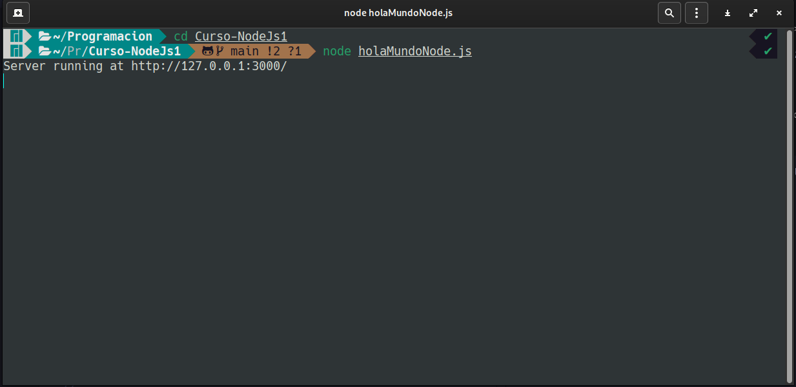
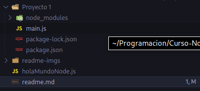

# Curso de NodeJs 

## Por Camilo Canclini

___

Este "curso" refleja mi propio aprendizaje con respecto a NodeJs. Ire recopilando todo lo que vaya aprendiendo y lo iré guardando en este repositorio. Me parece que es una forma interesante de estudiar y de demostrar como estudio. Sin mencionar que, por un lado, me sirve tener esta informacion guardada y documentada en un servicio online como github. Y, por otro lado, tambien soy consciente de que esto puede contruibuirle a alguna persona en el futuro.
Por eso ten en cuenta que los siguientes "apuntes" provienen de alguien autodidacta que solo esta estudiando y que quiere compartir el conocimiento que obtenido.
___

## Documentación Utilizada

Obviamente necesitamos tener algun tipo de documentación o trabajo previo sobre el cual basarnos a la hora de estudiar. En mi caso voy a recomendar, un video de YT, un roadmap y un libro. **Toda la información es gratuita y pública**

[](https://openlibra.com/es/book/node-js-notes-for-professionals)

[](https://www.youtube.com/watch?v=BhvLIzVL8_o)

[](https://www.youtube.com/watch?v=i3OdKwuBjeM&t=6027s)

[](https://roadmap.sh/nodejs/)

___

## Conceptos Previos

En mi caso ya tengo conocimientos, redes informaticas, modelo OSI, modelo cliente-servidor, hardware, funcionamiento interno de la pc, etc. Para empezar a trabajar con Node se recomienda tener un minimo de conocimiento en estos temas ya que, al ser una tecnología que trabaja en el backend, todo estos conocimientos son fundamentales para entender la manera en la cual opera y como trabaja Node. Tampóco me centraré en explicar conceptos propios de javascript, ya qué, se supone que se debe tener conocimientos minimos en js para empezar a ver Node.
___

## Introducción A NodeJS

> ### NodeJs es un entorno de ejecución para Javascript y un manejador de eventos asíncronos

Vamos a empezar a desglozar esto.

* **Entorno de ejecución**: Significa que haremos uso de un script o programa para poder ejecutar Javascript, esto quiere decir que no haremos uso del navegador para correr el codigo, este correra en nuestra maquina o servidor.
* **Manejador de eventos asíncronos:** Significa que esté será capaz de escuchar, eventos del sistema y peticiones de usuarios. Los eventos son instancias en las que el estado de algun componente que esta siendo "escuchado" cambia o "dispara" una alerta al servidor. Con asíncronos se refiere a que pueden ocurrir en cualquier momento de la ejeccución, no existe un tiempo que marque cuando puede dispararse un evento.

## ¿ Para que se usa Node ?

Node es utilizado para crear **aplicaciones web escalables**, esto quiere decir que estaremos creando un programa que pueda ser corrido desde nuestra propia pc o servidor y que ademas tendrá funcionalidades web. Con escalables se refiere a que la sintaxis y la forma en la que se construyen estas aplicaciones pueden cubrir necesidades basicas o mas complejas, ya que, el entorno se ajusta dependiendo de la complejidad de sus funciones. Ademas otra ventaja es que, gracias a la asincronía, el sistema no se bloquea, por lo que es mas facil trabajar con este tipo de aplicaciones.

## Requerimientos

Para empezar a trabajar con NodeJs primero necesitamos descargarlo desde la pagina oficial. [NodeJs.org](https://nodejs.org/en/)
La instalación realizará 2 cosas importantes que deberemos que tener en cuenta, la primera es que al instalar Node tambien estaremos instalando npm, y la segunda es que se integrará el comando "node" a nuestro PATH.

### ¿Qué es NPM?

NPM significa Node Package Manager o en español Gestor de Paquetes de Node. Este es un herramienta que permite la instalación de paquetes para nuestro entorno de ejecución. Los paquetes son, un conjunto de modulos o archivos javascript los cuales cumplen funcionalidades específicas, y pueden ser llamados desde nuestra aplicación de manera sencilla y práctica. Frameworks como React pueden ser integrados a traves de esta herramienta.

### ¿Qué es PATH?

El Path es el listado de las rutas a programas que pueden ser llamados desde nuestra terminal, o sea, en este caso, el programa o script "node" se utilizara desde la terminal.

___

## Hola Mundo en NodeJs

Recomiendo que para la proxima lección
Guardamos el siguiente codigo en un archivo holaMundoNode.js

```js

const http = require('http');

const hostname = '127.0.0.1';
const port = 3000;

const server = http.createServer((req, res) => {
    res.statusCode = 200;
  res.setHeader('Content-Type', 'text/plain');
  res.end('Hello World');
});

server.listen(port, hostname, () => {
    console.log(`Server running at http://${hostname}:${port}/`);
});

```

Desde la terminal nos dirigimos a la carpeta donde guardamos el script anterior (`cd Curso-Nodejs`) y ejecutamos el comando `node holaMundoNode.js`

Luego nos dirigimos a la ruta que nos indica la aplicación en mi caso, `http://127.0.0.1:3000/`.

Deberiamos ver algo como esto...



## Desglozando el Hola Mundo

En este caso se hace uso del modulo `http`, es se utiliza para montar el servidor en nuestra pc y es el que permite responder a los usuarios con información.
`
Con respecto a los modulos hay algo que tenemos que remarcar y es el tipo de modulo al que se esta haciendo referencia, en este caso, el modulo `http` es un modulo que ya viene instalado con Node por lo que no es necesario hacer ningun llamado "especial" o descargarlo de npm por ejemplo. Este tipo de modulos se los conoce como **Modulos Core**, ya que vienen preinstalados. (Un poco más adelante veremos sobre módulos)

Una vez importado en la linea uno, se guardan en variables constantes los datos para configurar el servidor (`const hostname = '127.0.0.1';` y `const port = 3000;`)

Ahora bien, a continuación podemos ver uno de los conceptos mas importantes que se mencionaron anteriormente. Vease el siguiente fragmento...

```js

const server = http.createServer((req, res) => {
    res.statusCode = 200;
    res.setHeader('Content-Type', 'text/plain');
    res.end('Hello World');
});

```

Lo que esta ocurriendo aquí es que se esta guardando el resultado de un metodo del objeto `http` que importamos antes. Fijese como, por parametros estamos pasando una **función flecha**. Esto es fundamental, ya que, permite que el código siga ejecutandoce a pesar de que el proceso dentro del bloque de la función no haya terminado.

Esto es lo que hablamos antes, famosa **asincronía** de tareas o procesos,  evita que el programa se bloqueé y no pueda continuar. Si bien es un ejemplo sencillo, gracias a el podemos entender muchos otros conceptos y modulos.

Despues vemos como por parametros le pasamos a la función flecha 2 variables, que despues se transforman en objetos:

* `req` : es el objeto que permite manejar los mensajes entrantes (En este caso no se usa).

* `res` : es el objeto que permite manejar la respuesta que da el servidor al cliente que hace una petición. Este es el importante ya que setea el tipo de respuesta, el codigo de esta HTTP, y el mensaje (en este caso, hello world).

Para mas informacion, visita [NodeJs.Org | http.methods](https://nodejs.org/dist/latest-v18.x/docs/api/http.html#httpcreateserveroptions-requestlistener)

Por otro lado tenemos...

```js

server.listen(port, hostname, () => {
    console.log(`Server running at http://${hostname}:${port}/`);
});

```

Este metodo `server.listen()` es el que setea donde se esta ejecutando la aplicación web, en que dirección y que puerto. Y ademas nos permite realizar operaciones mietras que se incia. Ya qué, al igual que el anterior, esté acepta una función asíncrona, que en este caso arroja un mensaje por terminal que nos indica en que dirección se encuentra corriendo el servidor.
___

## Modularización

La modularización es un concepto de la programación que hace referencia al hecho de dividir el código en disntintos fragmentos y cada uno realice una tarea específica. Las ventajas de esta metodología son:

* Mejor organización
* Mejor mantenimiento
* Mejor rendimiento
* Reutilización de codigo

Hasta ahora vimos la utilización del modulo `http`, el cual es un fragmento de codigo que permite gestionar las peticiones por el protocolo http. Esto nos facilita esa tarea en concreto y hace que no tengamos que preocuparnos por crear nosotros esa funcionalidad.

Otra ventaja, es que si pensamos los modulos como piezas que encastran entre si, podemos decir que a la hora de construir un proyecto seremos capaces de elegir que piezas utilizar en nuestro proyecto y cuales no.

### El objeto `module` En NodeJS

El objeto `module` es un objeto que se comparte entre modulos, este guarda atributos y metodos que se mantienen durante la ejecución del programa.

Veamos como se compone:

```js
Module {
  id: '.',
  path: '/home/camilocanclini/Programacion/Curso-NodeJs1',
  exports: {},
  filename: '/home/camilocanclini/Programacion/Curso-NodeJs1/holaMundoNode.js',
  loaded: false,
  children: [],
  paths: [
    '/home/camilocanclini/Programacion/Curso-NodeJs1/node_modules',
    '/home/camilocanclini/Programacion/node_modules',
    '/home/camilocanclini/node_modules',
    '/home/node_modules',
    '/node_modules'
  ]
}
```

Entre las propiedades mas importantes que guarda se encuentra `exports`, que guarda un objeto. A continuación veremos para que se utiliza...

### Tipos de módulos en JS

#### CommonJS modules

Es la forma original en la cual el modulo se preparaba para ser importado, es el que viene por defecto integrado en el lenguaje de JS.

Vease el siguiente ejemplo:

Supongamos que el siguiente modulo es un archivo llamado `foo.js`

```js
module.exports.add = function(a, b) {
        return a + b;
} 

module.exports.subtract = function(a, b) {
        return a - b;
} 
```

Lo que esta ocurriendo aqui es que se esta haciendo uso del objeto global `module`. Debido a la característica ya mencionada este permite que se "comparta" su propiedad `exports` entre modulos. Por ejemplo, el siguiente modulo, que denominaremos `main.js`

```js
const {add, subtract} = require('./foo')

console.log(add(5, 5)) // 10
console.log(subtract(10, 5)) // 5
```

Resaltemos algo importante, notece como en la declaración de `const {add, subtract} = require('./foo')` las constantes estan encerradas entre `{}`, esto es una funcionalidad que se agregó en ES6.

Esta permite asignarle a las constantes los valores del objeto en el orden en el que se declararon. Por ejemplo, si en `foo.js` primero declaré la función `add`, entonces cuando yo importe el modulo en mi `main.js` la primera constante que yo escriba se le va a asignar la función `add`, en este caso tambien se llama "add".

Ademas notece una última cosa, fijese que al momento de pasar por parametro en `require()` la ubicación del modulo que queremos importar, este comienza con un `./`

Esto significa que estamos buscando el modulo **desde la misma carpeta** que el "archivo llamador", en este caso seria desde la carpeta o directorio donde se encuentra `main.js`

#### EMACASript modules (ES Modules)

Por otro lado tenemos los ES Modules, que son modulos de javascript que se encuentran estandarizados. Esto quiere decir que estos tienen una estructura o sintaxis diferentes que los hace poseer mejores ventajas que los CommonJS Modules. Vease el anterior codigo pero esta vez como la metodologia de un ES Module...

```js
export function add(a, b) {
        return a + b;
}

export function subtract(a, b) {
        return a - b;
}
```

Fijese que ahora la sintaxis es mucho mas limpia y agradable a la vista.
Algo que tenemos que aclarar es que el codigo de arriba **NO** lo guardaremos como `foo.js` **SINO** como `foo.mjs`.

Esto permite que Node identifique que el modulo se trata del tipo estandarizado. Pero ahora bien, como seria el archivo `main.js`?, vease el siguiente codigo...

```js
import {add, subtract} from './foo.mjs'

console.log(add(5, 5)) // 10
console.log(subtract(10, 5)) // 5
```

Vease que la forma de importar tambien cambia.

### Diferencias (import and require)

* Los `import` solo pueden ser llamados desde el principio del archivo (`main.js`), mientras que los `require()` pueden ser llamados en cualquier momento, por ejemplo.

```js
if(user.length > 0){
   const userDetails = require(‘./userDetails.js’);
  // Do something ..
}
```

* Los `import` son **ASINCRONOS** y los `require()` son **SINCRONOS**, lo que quiere decir que, los `require()` esperan a que se terminen de cargar todas las funciones para poder continuar la ejecución. Esto puede perjudicar al rendimiento en grandes aplicaciones.

### El objeto `global` En NodeJS

El objeto `global`, es similar al objeto window, los 2 almacenan los objetos y metodos que comunmente usamos cuando trabajos con JS, por ejemplo:

* `console`

* `setInterval()`

* `setTimeout()`

La diferencia es que `window` se usa cuando js se esta ejecutando en el navegador y el otro se utliza en Node.

### Los tipos de variables `var` en Node

Algo importante a tener en cuenta cuando hablamos de módulos es que el comportamiento que toman las variables del tipo `var` cambia, ya que en node, su **scope** es el modulo desde donde se declaran. A diferencia del navegador que se comparte entre archivos porque se almacena en el objeto `window`.
___

## NPM ( Node Package Manager )

Ahora vamos a ver en mayor profundidad NPM. Como digimos anteriormente, este sirve para instalar paquetes que son consumidos por nuestra aplicación para realizar tareas especificas.

### Preparando proyecto

Para empezar a utilizar NPM se recomienda que empecemos con el siguiente comando.

```bash
npm init
```

Este comando lo que hará sera hacernos una serie de preguntas relacionadas con los metadatos del proyecto entero, posteriora esto creará un primer archivo para mantener esta configuración, llamado `package.json`.

### Como instalar paquetes

Una vez instalado nodejs y npm, tan solo bastaria con abrir la terminal y navegar hasta la carpeta del proyecto para escribir el siguiente comando

```bash
npm install <NombreDelPaquete>
```

Este comando instalara el paquete indicado, creando una carpeta en la raiz de nuestro proyecto llamada `node_modules`. Aquí se almacenaran todos los paquetes.

#### package.json y package-lock.json



Estos 2 se crean al momento de empezar a instalar paquetes o dependencias, como dijimos `package.json` es el archivo donde se guarda la configuración de la carpeta raiz, en mi caso Proyecto1. Mientras que el `package-lock.json` es el archivo donde se va a guardar el listado de módulos descargados, asi como un historial de versiones de los mismos.

### Como instalar dependencias

Si nosotros bajamos un proyecto y necesitamos instalar *todos* los paquetes necesarios para que este funcione, tan solo bsataria, ir a la terminal, dirigirnos al directorio raiz del mismo proyecto y escribir el siguiente comando:

```bash
npm install
```

Esto lo que hara sera descargar todos los paquetes listados en el directorio (Que se supone que existe)

### Como actualizar paquetes

Para un actualizar paquete usamos

```bash
npm update <NombreDelPaquete>
```

Para actualizar **TODOS** los paquetes

```bash
npm update 
```

### Como importar paquetes

```js
require(<NombreDelPaquete>)
```

Con el metodo `require()` podemos hacer uso de los paquetes instalados en el proyecto. **No es necesario especificar ninguna ruta, solo indicar el nombre.**

> Al integrar estos paquetes estos pasan a convertirse en **dependencias** que nuestra aplicación necesita para funcionar.

### NPM Tasks

Si miramos el archivo `package.json` deberiamos ver algo parecido a lo siguiente:

```json
{
  "name": "proyecto-1",
  "version": "1.0.0",
  "description": "Este es el primer proyecto del curso",
  "main": "main.js",
  "scripts": {
    "test": "echo \"Error: no test specified\" && exit 1"
  },
  "keywords": [
    "curso"
  ],
  "author": "Camilo Canclini Stephano",
  "license": "ISC",
  "dependencies": {
    "colors": "^1.4.0"
  }
}
```

Si nos fijamos en la parte de `scripts` podremos ver que se esta almacenando un objeto (keys y values). Este objeto, en mi caso, se encuentra guardando la siguiente entrada: `"test": "echo \"Error: ..."`.

Gracias a la estructura que brinda este archivo para el apartado de `"scripts"` es que somos capaces de guardar diferentes scripts, y **personalizados**. Esto nos permite generar una serie de comandos predefinidos que pueden ser leidos y ejecutados a traves de npm con la finalidad de poder ejecutar ciertas acciones en nuestro paquete o proyecto que estemos creando, como por ejemplo: configurar e iniciar el servidor, crear archivos iniciales, ejecutar testeos, entre otras cosas.

#### Ejecutar Scripts con NPM

Con el siguiente comando seremos capaces de ejecutar los scripts que esten definidos en nuestro `package.json`.

```bash
npm run <NombreDelScript>
```

___

### NPX

npx es un comando que se integró con npm para poder realizar la ejecución de comandos basandoce en el **contexto de los paquetes**. Con contexto nos referimos a la **forma** en la que **tienen** que ser **accedidos** estos paquetes para funcionar.

Hay veces que los paquetes requieren estar instalados de manera **global** en el equipo, pueden requerir **privilegios de administrador** para ejecutar cierta función, o bien pueden necesitar ser ejecutados mediante la aplicación que estemos desarrollando directamente. NPX surge para solucionar todo esto.

NPX lo que hace es realizar todas las operaciones necesarias en un segundo plano para poder cumplir con el comando que queramos ejecutar. Un ejemplo muy sencillo podria ser el siguiente.

```bash
npx create-react-app prueba
```

`create-react-app` es un comando propio del framework de **React** que lo que hace es realizar las operaciones internas de la libreria para crear la estructura de una app con React. Obviamente para que funcione requiero tener instalado React en mi proyecto, pero si uso npx, esto no es necesario. Al ejecutarlo nos preguntará si queremos instalar React, y si seleccionamos que si, entonces npx lo instalará de forma temporal y lo posicionara basandose en el contexto de nuestro proyecto. Lo "instalará" manera local, en otras palabras.

Podemos concluir con que NPX es un comando que permite saltarse ciertos requerimientos como, por ejemplo, tener que declarar un comando en especifico en el `package.json` para ejecutar cierto modulo.
___

## Errors Handling

Tambien conocidos como manejadores de errores, son las formas en las cuales se tratan los errores. Como dijimos antes, nuestra aplicación podrá ser accedida por muchos usuarios, y si esta escala requerirá de mas archivos y funcionalidades.

Este tipo de aplicaciones no deberian ser detenidas por un simple error de codigo, esta tiene que poder responder siempre, aunque sea arrojando un mensaje de error. Se tiene que evitar detener la ejecución e impedir que los usuarios que disparen algun error sigan repercutiendo en el resto del sistema.

### Tipos de errores

Existen 2 grandes tipos de errores:

#### Errores de Programador

Estos son el tipo de errores que se encuentran en el codigo y que dependen exclusivamente de la forma en la cual se programó la aplicación. Estos pueden ser manejados simplemente optimizando y depurando el codigo.

#### Errores Operacionales

Estos son los mas complejos, ya que, dependen de **factores externos** a la programación de la aplicación. Son inesperados y se disparan a gracias a las operaciones que realizan los usuarios con nuestra aplicación o tambien debido a la forma en la que las disitintas partes de nuestra aplicación se comunican entre si.

Por ejemplo, un usuario podria estar intentando leer un archivo que se encuentra vacio, podria ingresar información que puede generar vulnerabilidades en el sistema, o un script podria ejecutar alguna operación sobre un archivo que no existe aun.

### El objeto `Error`

En Nodejs existe el objeto `Error`, el cual permite crear instancias para "lanzar" errores en la aplicación.

```js
new Error("Aquí va el mensaje personalizado")
```

Algunos de sus priopiedades son:

* `name`: Guarda el nombre del error
* `message`: Guarda un texto que describé el error que a ocurrido
* `stack`: Guarda el camino que a recorrido el error hasta ser arrojado, esto es sumamente útil, porque permite analizar función por función y bloque por bloque lo que se estaba ejecutando al momento de dispararse el error, esto tambien es conocido como **stack trace**.

### Formas de manejar Errores

A continuación vamos a presentar algunas formas de manejar errores:

#### Bloque Try and Catch

Los bloques `try`, `catch` y `finally` son sentencias muy parecidas a los `if` de la toda la vida, la diferencia radica en que son especiales para errores y evitan que se termine la ejecución del proceso actual.

Veamos un ejemplo:

```js
var fs = require('fs')

try {
const data = fs.readFileSync('/Users/user/file.txt')
} catch (err) {
  console.log(err)
}
finally{
  console.log('Finally will execute every time')
}
```

Vamos por partes:

* `try`: va a ejecutar un fragmento del código, si este arroja cualquier tipo de error, **no detiene la ejecución** y en cambio "le pasa" el error a la sentencia `catch`, si no occurre un error no arroga nada.
En este caso hace uso del modulo `fs` para leer un archivo(la veremos mas adelante). Como es evidente la lectura puede fallar por causas externas a la aplicación, por esa razon se coloca dentro de `try` para ser "evaluada".

* `catch (err)`: Esta sentencia recibe el error arrojado por la sentencia `try`, y realiza algun tipo de operación en consecuencia del mismo. En este caso devuelve el error por consola (Pero no se detiene la aplicación).

* `finally`: Este bloque se ejecutará **independientemente del resultado anterior**, no es necesario agregarlo.

Recordemos que en este caso tenemos que evitar a toda costa que la aplicación se bloqueé, ya que, necesitamos que, este disponible siempre para los usuarios, y que opere de manera autónoma.

#### Funciones Callbacks

Las funciones callbacks son aquellas que pueden ser pasadas como argumentos de otra función.
En este caso, las usaremos para realizar operaciones si aparece un error.

Generalmente estas se pasan como argumento *final* de la función principal, estas son llamadas cuando la funcion desde la que se llama a la callback espera necesita un resultado, o cuando se dispara un error. Actuan como manejadores de errores porque permiten ejecutar operaciones si existe un error. Por ejemplo:

```js
function operacionLargaConError(callback) {
  setTimeout(() => {
    const error = Math.random() < 0.5;
    if(error){
        callback(new Error('Ocurrio un error!'));
    }else{
        callback();
    }
  }, 1000);
}

function manejarError(error) {
  if (error) {
    console.error(error);
  } else {
    console.log('La operacion finalizo correctamente');
  }
}

operacionLargaConError(manejarError);
```

En el codigo anterior se le pasa a la función `operacionLargaConError()` como argumento la funcion `manejarError(error)` que a su vez tambien recibe un parametro  que es el error disparado, en la función anterior.

Esta forma de operación permite separar la logica de principal del manejo de errores. Haciendo que el código sea modular y mas legible a la vista.

Las callbacks son utilizados para seguir con la ejecución del codigo y tener que esperar al resultado de una función o metodo que tiene que devolver algo. Ya qué, en NodeJs y JS la mayoría de procesos son asíncronos, necesitamos realizar varios procesos en simultaneo y que el codigo siga ejecución.

### Promesas - Promises

Una promesa es un objeto que representa la terminación de una operación asíncrona, se utilizan para manejar tareas asincrónicas como las que venimos viendo, a diferencia de las callbacks estas son mas sencilla de entender y de visualizar. La promesa tiene 3 estados:

* pending (pendiente)

* fulfilled (cumplida)

* rejected (fallida)


Una vez que cambia su estado a fulfilled o rejected no se puede volver para atras.

El objeto promesa tiene dos métodos que se usan para manejar los resultados de una promesa:

* `.then`: este método recibe una función que se ejecuta si la promesa se cumple.
* `.catch`: este método recibe una función que se ejecuta si la promesa falla.

Veamos un ejemplo:

```js
const promesa = new Promise((resolve, reject) => {
  setTimeout(() => {
    if (Math.random() < 0.5) {
      resolve("Todo bien");
    } else {
      reject(new Error("Algo salió mal"));
    }
  }, 1000);
});

promesa.then(response => console.log(response))
promesa.catch(error => console.error(error));
```

Como podemos apreciar, primero se instancia el objeto promesa con `new Promise((resolve, reject) => {});`, la función que ejecuta la promesa se llama `executor` y sus argumento son los objetos: `resolve` y `reject`. Estos se asocian con los 2 metodos que mencionamos arriba.

Luego se empieza una función flecha y adentro un `setTimeout` en el cual vuelven a aparecer `resolve` y `reject`. Aqui es donde se hacen las operaciones para resolver la promesa. Recordemos que la promesa tiene solo 2 resultados posibles, `resolve(response)` para cuando todo sale bien y se pasa algun valor como parametro, y `reject(Error)` cuando ocurré algo que pueda ser considerado un error, en este último se pasa por parametro un objeto `Error`.

Dependiendo de lo ocurrido en el bloque del `setTimeout` se ejecutan los metodos `.then` y `.catch`, para cuando todo sale bien y para cuando ocurrió un error respectivamente.

Por último, tambien existe el método .finally, que al igual que con `try` y `catch`, se ejecuta, independientemente del la resolución de la promesa. Aqui un ejemplo:

```js
let promise = new Promise((resolve, reject) => {
    setTimeout(() => {
        resolve('La operación ha sido completada');
    }, 1000);
});

promise
    .then((result) => {
        console.log(result);
    })
    .catch((error) => {
        console.log(error);
    })
    .finally(() => {
        console.log('Se ha completado la promesa INDEPENDIENTEMENTE del resultado');
    });
```

#### Ventajas de usar promesas

* A la hora de manejar errores el codigo se vuelven mas legible. Evitamos los "callbacks hell"

* Se pueden concatenar varias promesas, vease el siguiente ejemplo:

```js
let promise1 = new Promise((resolve, reject) => {
    setTimeout(() => {
        resolve('Resultado de la operación 1');
    }, 1000);
});

let promise2 = new Promise((resolve, reject) => {
    setTimeout(() => {
        resolve('Resultado de la operación 2');
    }, 2000);
});

promise1.then((result) => {
    console.log(result);
    return promise2;
}).then((result) => {
    console.log(result);
});
```

Podemos ver como se resuelve la segunda promesa solo si antes se resolvió la primera.

* Realizar varias operaciones asincronas en paralelo, vease el siguiente ejemplo:

```js
let promise1 = new Promise((resolve, reject) => {
    setTimeout(() => {
        resolve('Resultado de la operación 1');
    }, 1000);
});

let promise2 = new Promise((resolve, reject) => {
    setTimeout(() => {
        resolve('Resultado de la operación 2');
    }, 2000);
});

Promise.all([promise1, promise2]).then((results) => {
    console.log(results);
});
```

Aquí hacemos uso del metodo `.all` del objeto `Promise`, este recibe como parametro un arreglo con las promesas y si todas se realizaron correctamente, entonces se continua con la ejecución con `.then`. Recordemos que esto no detiene la aplicación en ningun momento, ya que son procesos asíncronos.

* Concatenar varios `.then`, Utilización del metodo `fetch()`

```js
fetch('https://api.example.com/data')
    .then((response) => {
        return response.json();
    })
    .then((data) => {
        console.log(data);
    });
```

En este ejemplo, utilizamos la función `fetch` para realizar una solicitud HTTP asíncrona a una URL específica. El resultado de la solicitud se devuelve como un objeto llamado `response`. y a su vez el metodo devuelve una promesa, por lo que podemos hacer uso de los metodos propios de las promesas.

Como podemos ver, la lógica detras de esto esta en que, al resolver el primer `.then` se devuelve un promesa, y esa es sobre la que trabaja el segundo `.then`, con la promesa resuelta del primero.

### Async y Await

La palabra reservada `async` se utiliza para definir funciones asíncronas, estas son, bloques de código que se ejecutan en "segundo plano", que no traban la ejecución del programa entero, y que **siempre** retornan una promesa. Al retornar una promesa se pueden aprovechar todas las ventajas mencionadas anteriormente. He aquí un ejemplo:

```js
async function getData() {
    return new Promise((resolve) => {
        setTimeout(() => {
            resolve('Datos obtenidos');
        }, 1000);
    });
}

getData().then((result) => {
    console.log(result);
});

console.log('Esto se ejecuta primero')
```

En este ejemplo podemos ver que la palabra `async` se pone antes de `function`, lo que convierte al bloque de codigo en una función asíncrona. Ademas vemos que cuando se llama a la función, inmediatamente se accede a la promesa (una vez que se resuelva en 1000ms) con `.then`.
Por último, fijemonos que la ultima línea es un `console.log()`, esta linea se ejecutará **antes** que la función, por mas que la funcion haya sido llamada antes. Como sabemos que la función devuelve una promesa, podemos ejecutar todo el codigo que queramos sin necesidad a espera a que la función entregue un resultado.

Por otro lado tenemos al `await`. Este lo que hace es **detener la ejecución de la función asíncrona** hasta qeu se resuelva una promesa, vease el siguiente ejemplo:

```js
async function getData() {
    let result = await fetch('https://api.example.com/data');
    let json = await result.json();
    return json;
}

getData().then((data) => {
    console.log(data);
});
```

Miremos que el `await`, en este caso, va a esperar a que el método `fetch` retorne una promesa como respuesta, hasta que esto no ocurrá no se realizara la linea siguiente.
Vuelvo a recalcar, solo detiene la ejecucion **de la función**, lo que quiere decir que todo el codigo que se encuentré afuera de la misma seguirá su ejecución normalmente.

> El `await` solo esta habilitado en funciones asíncronas.