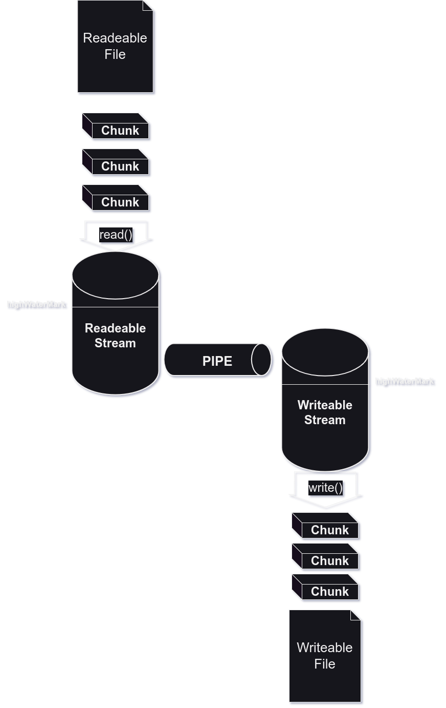
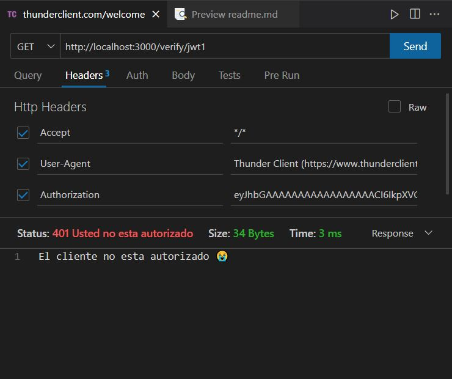
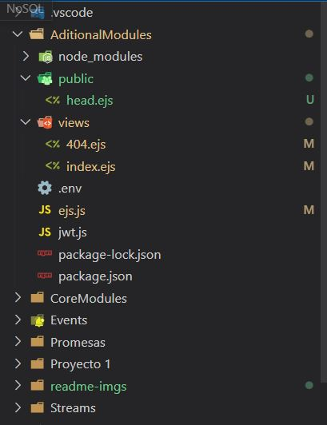
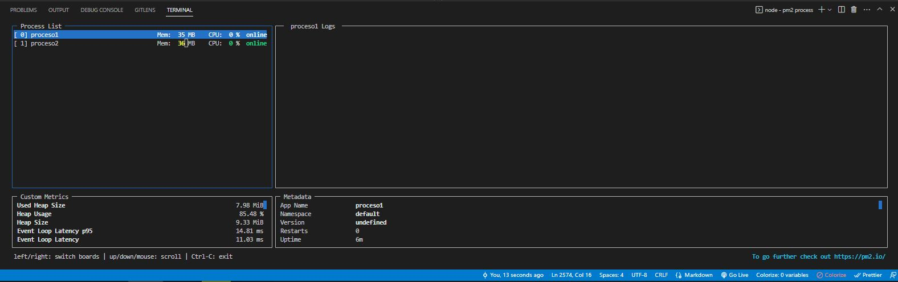
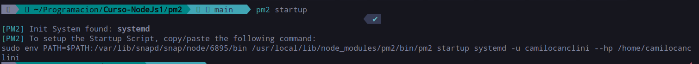
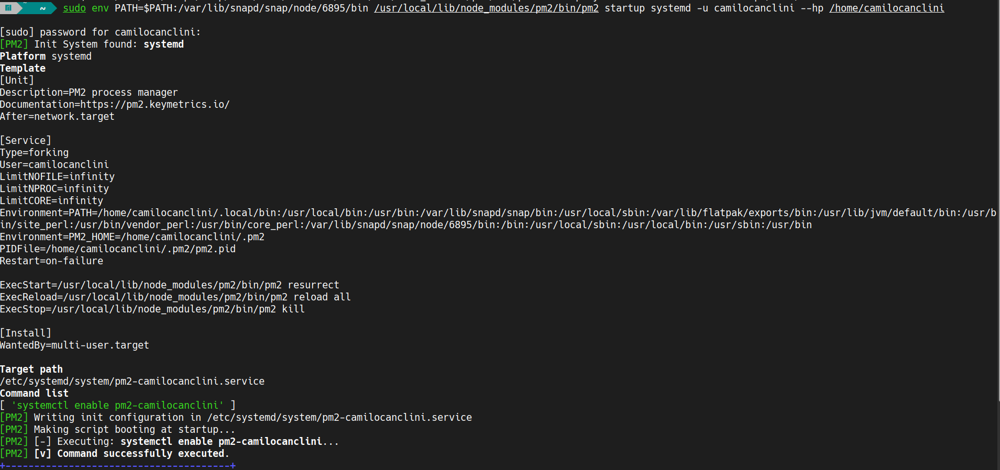
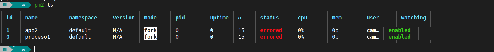
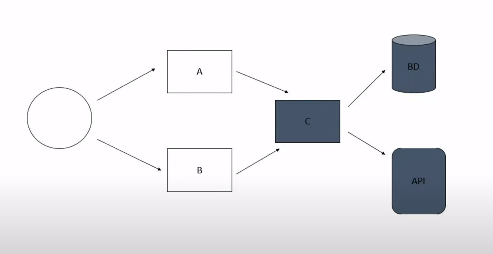
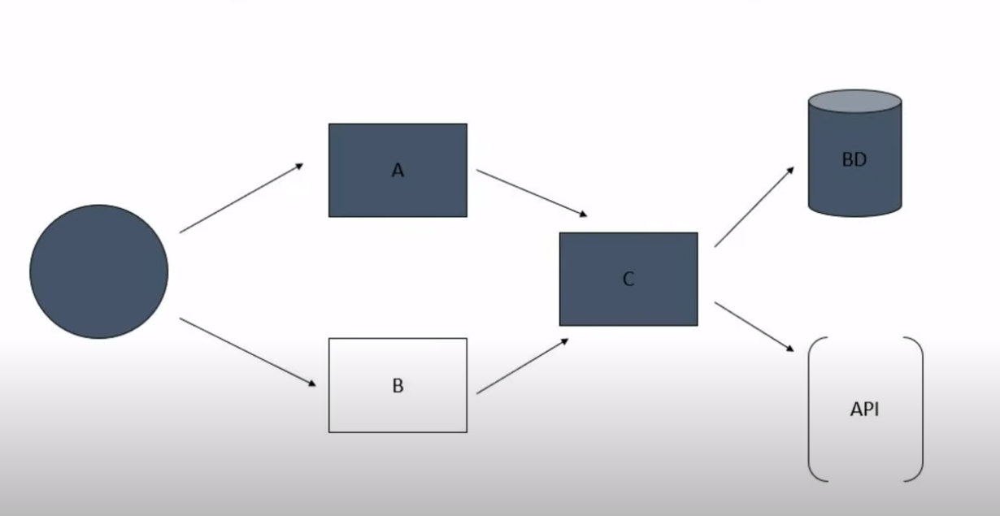

# Curso de NodeJs 

## Por Camilo Canclini

___

Este "curso" refleja mi propio aprendizaje con respecto a NodeJs. Ire recopilando todo lo que vaya aprendiendo y lo iré guardando en este repositorio. Me parece que es una forma interesante de estudiar y de demostrar como estudio. Sin mencionar que, por un lado, me sirve tener esta informacion guardada y documentada en un servicio online como github. Y, por otro lado, tambien soy consciente de que esto puede contruibuirle a alguna persona en el futuro.
Por eso ten en cuenta que los siguientes "apuntes" provienen de alguien autodidacta que solo esta estudiando y que quiere compartir el conocimiento que obtenido.
___

## Documentación Utilizada

Obviamente necesitamos tener algun tipo de documentación o trabajo previo sobre el cual basarnos a la hora de estudiar. En mi caso voy a recomendar, un video de YT, un roadmap y un libro. **Toda la información es gratuita y pública**

[](https://openlibra.com/es/book/node-js-notes-for-professionals)

[](https://www.youtube.com/watch?v=BhvLIzVL8_o)

[](https://www.youtube.com/watch?v=i3OdKwuBjeM&t=6027s)

[](https://roadmap.sh/nodejs/)

[](https://chat.openai.com/chat)

___

## Conceptos Previos

En mi caso ya tengo conocimientos, redes informaticas, modelo OSI, modelo cliente-servidor, hardware, funcionamiento interno de la pc, etc. Para empezar a trabajar con Node se recomienda tener un minimo de conocimiento en estos temas ya que, al ser una tecnología que trabaja en el backend, todo estos conocimientos son fundamentales para entender la manera en la cual opera y como trabaja Node. Tampóco me centraré en explicar conceptos propios de javascript, ya qué, se supone que se debe tener conocimientos minimos en js para empezar a ver Node.
___

## Introducción A NodeJS

> ### NodeJs es un entorno de ejecución para Javascript y un manejador de eventos asíncronos

Vamos a empezar a desglozar esto.

* **Entorno de ejecución**: Significa que haremos uso de un script o programa para poder ejecutar Javascript, esto quiere decir que no haremos uso del navegador para correr el codigo, este correra en nuestra maquina o servidor.
* **Manejador de eventos asíncronos:** Significa que esté será capaz de escuchar, eventos del sistema y peticiones de usuarios. Los eventos son instancias en las que el estado de algun componente que esta siendo "escuchado" cambia o "dispara" una alerta al servidor. Con asíncronos se refiere a que pueden ocurrir en cualquier momento de la ejeccución, no existe un tiempo que marque cuando puede dispararse un evento.

## ¿ Para que se usa Node ?

Node es utilizado para crear **aplicaciones web escalables**, esto quiere decir que estaremos creando un programa que pueda ser corrido desde nuestra propia pc o servidor y que ademas tendrá funcionalidades web. Con escalables se refiere a que la sintaxis y la forma en la que se construyen estas aplicaciones pueden cubrir necesidades basicas o mas complejas, ya que, el entorno se ajusta dependiendo de la complejidad de sus funciones. Ademas otra ventaja es que, gracias a la asincronía, el sistema no se bloquea, por lo que es mas facil trabajar con este tipo de aplicaciones.

## Requerimientos

Para empezar a trabajar con NodeJs primero necesitamos descargarlo desde la pagina oficial. [NodeJs.org](https://nodejs.org/en/)
La instalación realizará 2 cosas importantes que deberemos que tener en cuenta, la primera es que al instalar Node tambien estaremos instalando npm, y la segunda es que se integrará el comando "node" a nuestro PATH.

### ¿Qué es NPM?

NPM significa Node Package Manager o en español Gestor de Paquetes de Node. Este es un herramienta que permite la instalación de paquetes para nuestro entorno de ejecución. Los paquetes son, un conjunto de modulos o archivos javascript los cuales cumplen funcionalidades específicas, y pueden ser llamados desde nuestra aplicación de manera sencilla y práctica. Frameworks como React pueden ser integrados a traves de esta herramienta.

### ¿Qué es PATH?

El Path es el listado de las rutas a programas que pueden ser llamados desde nuestra terminal, o sea, en este caso, el programa o script "node" se utilizara desde la terminal.

___

## Hola Mundo en NodeJs

Recomiendo que para la proxima lección
Guardamos el siguiente codigo en un archivo holaMundoNode.js

```js

const http = require('http');

const hostname = '127.0.0.1';
const port = 3000;

const server = http.createServer((req, res) => {
    res.statusCode = 200;
  res.setHeader('Content-Type', 'text/plain');
  res.end('Hello World');
});

server.listen(port, hostname, () => {
    `Server running at http://${hostname}:${port}/`);
});

```

Desde la terminal nos dirigimos a la carpeta donde guardamos el script anterior (`cd Curso-Nodejs`) y ejecutamos el comando `node holaMundoNode.js`

Luego nos dirigimos a la ruta que nos indica la aplicación en mi caso, `http://127.0.0.1:3000/`.

Deberiamos ver algo como esto...


## Desglozando el Hola Mundo

En este caso se hace uso del modulo `http`, es se utiliza para montar el servidor en nuestra pc y es el que permite responder a los usuarios con información.
`
Con respecto a los modulos hay algo que tenemos que remarcar y es el tipo de modulo al que se esta haciendo referencia, en este caso, el modulo `http` es un modulo que ya viene instalado con Node por lo que no es necesario hacer ningun llamado "especial" o descargarlo de npm por ejemplo. Este tipo de modulos se los conoce como **Modulos Core**, ya que vienen preinstalados. (Un poco más adelante veremos sobre módulos)

Una vez importado en la linea uno, se guardan en variables constantes los datos para configurar el servidor (`const hostname = '127.0.0.1';` y `const port = 3000;`)

Ahora bien, a continuación podemos ver uno de los conceptos mas importantes que se mencionaron anteriormente. Vease el siguiente fragmento...

```js

const server = http.createServer((req, res) => {
    res.statusCode = 200;
    res.setHeader('Content-Type', 'text/plain');
    res.end('Hello World');
});

```

Lo que esta ocurriendo aquí es que se esta guardando el resultado de un metodo del objeto `http` que importamos antes. Fijese como, por parametros estamos pasando una **función flecha**. Esto es fundamental, ya que, permite que el código siga ejecutandoce a pesar de que el proceso dentro del bloque de la función no haya terminado.

Esto es lo que hablamos antes, famosa **asincronía** de tareas o procesos,  evita que el programa se bloqueé y no pueda continuar. Si bien es un ejemplo sencillo, gracias a el podemos entender muchos otros conceptos y modulos.

Despues vemos como por parametros le pasamos a la función flecha 2 variables, que despues se transforman en objetos:

* `req` : es el objeto que permite manejar los mensajes entrantes (En este caso no se usa).

* `res` : es el objeto que permite manejar la respuesta que da el servidor al cliente que hace una petición. Este es el importante ya que setea el tipo de respuesta, el codigo de esta HTTP, y el mensaje (en este caso, hello world).

Para mas informacion, visita [NodeJs.Org | http.methods](https://nodejs.org/dist/latest-v18.x/docs/api/http.html#httpcreateserveroptions-requestlistener)

Por otro lado tenemos...

```js

server.listen(port, hostname, () => {
    `Server running at http://${hostname}:${port}/`);
});

```

Este metodo `server.listen()` es el que setea donde se esta ejecutando la aplicación web, en que dirección y que puerto. Y ademas nos permite realizar operaciones mietras que se incia. Ya qué, al igual que el anterior, esté acepta una función asíncrona, que en este caso arroja un mensaje por terminal que nos indica en que dirección se encuentra corriendo el servidor.
___

## Modularización

La modularización es un concepto de la programación que hace referencia al hecho de dividir el código en disntintos fragmentos y cada uno realice una tarea específica. Las ventajas de esta metodología son:

* Mejor organización
* Mejor mantenimiento
* Mejor rendimiento
* Reutilización de codigo

Hasta ahora vimos la utilización del modulo `http`, el cual es un fragmento de codigo que permite gestionar las peticiones por el protocolo http. Esto nos facilita esa tarea en concreto y hace que no tengamos que preocuparnos por crear nosotros esa funcionalidad.

Otra ventaja, es que si pensamos los modulos como piezas que encastran entre si, podemos decir que a la hora de construir un proyecto seremos capaces de elegir que piezas utilizar en nuestro proyecto y cuales no.

### El objeto `module` En NodeJS

El objeto `module` es un objeto que se comparte entre modulos, este guarda atributos y metodos que se mantienen durante la ejecución del programa.

Veamos como se compone:

```js
Module {
  id: '.',
  path: '/home/camilocanclini/Programacion/Curso-NodeJs1',
  exports: {},
  filename: '/home/camilocanclini/Programacion/Curso-NodeJs1/holaMundoNode.js',
  loaded: false,
  children: [],
  paths: [
    '/home/camilocanclini/Programacion/Curso-NodeJs1/node_modules',
    '/home/camilocanclini/Programacion/node_modules',
    '/home/camilocanclini/node_modules',
    '/home/node_modules',
    '/node_modules'
  ]
}
```

Entre las propiedades mas importantes que guarda se encuentra `exports`, que guarda un objeto. A continuación veremos para que se utiliza...

### Tipos de módulos en JS

#### CommonJS modules

Es la forma original en la cual el modulo se preparaba para ser importado, es el que viene por defecto integrado en el lenguaje de JS.

Vease el siguiente ejemplo:

Supongamos que el siguiente modulo es un archivo llamado `foo.js`

```js
module.exports.add = function(a, b) {
        return a + b;
} 

module.exports.subtract = function(a, b) {
        return a - b;
} 
```

Lo que esta ocurriendo aqui es que se esta haciendo uso del objeto global `module`. Debido a la característica ya mencionada este permite que se "comparta" su propiedad `exports` entre modulos. Por ejemplo, el siguiente modulo, que denominaremos `main.js`

```js
const {add, subtract} = require('./foo')

add(5, 5)) // 10
subtract(10, 5)) // 5
```

Resaltemos algo importante, notece como en la declaración de `const {add, subtract} = require('./foo')` las constantes estan encerradas entre `{}`, esto es una funcionalidad que se agregó en ES6 llamada "destructuring assignment".

Lo que permite la "asignación de destructuración" es acceder directamente a las propiedades o metodos de una objeto (en este caso) ignorando todas las que no sean especificadas. En el código dado anteriormente el objeto es `module`, el cual, *solo* contiene las 2 funciones que importamos desde `./foo.js`, entonces si yo al momento de declarar las constantes las declaro entre { } lo que va a ocurrir es que solo se hará uso de esas 2 funciones. En el caso de que el objeto `module` contenga mas funciones ademas de `add()` y `subtract()`, estas seran **"ignoradas"** y solo se importaran las que especifiquemos.

Ademas notece una última cosa, fijese que al momento de pasar por parametro en `require()` la ubicación del modulo que queremos importar, este comienza con un `./`

Esto significa que estamos buscando el modulo **desde la misma carpeta** que el "archivo llamador", en este caso seria desde la carpeta o directorio donde se encuentra `main.js`

#### EMACASript modules (ES Modules)

Por otro lado tenemos los ES Modules, que son modulos de javascript que se encuentran estandarizados. Esto quiere decir que estos tienen una estructura o sintaxis diferentes que los hace poseer mejores ventajas que los CommonJS Modules. Vease el anterior codigo pero esta vez como la metodologia de un ES Module...

```js
export function add(a, b) {
        return a + b;
}

export function subtract(a, b) {
        return a - b;
}
```

Fijese que ahora la sintaxis es mucho mas limpia y agradable a la vista.
Algo que tenemos que aclarar es que el codigo de arriba **NO** lo guardaremos como `foo.js` **SINO** como `foo.mjs`.

Esto permite que Node identifique que el modulo se trata del tipo estandarizado. Pero ahora bien, como seria el archivo `main.js`?, vease el siguiente codigo...

```js
import {add, subtract} from './foo.mjs'

add(5, 5)) // 10
subtract(10, 5)) // 5
```

Vease que la forma de importar tambien cambia.

### Diferencias (import and require)

* Los `import` solo pueden ser llamados desde el principio del archivo (`main.js`), mientras que los `require()` pueden ser llamados en cualquier momento, por ejemplo.

```js
if(user.length > 0){
   const userDetails = require(‘./userDetails.js’);
  // Do something ..
}
```

* Los `import` son **ASINCRONOS** y los `require()` son **SINCRONOS**, lo que quiere decir que, los `require()` esperan a que se terminen de cargar todas las funciones para poder continuar la ejecución. Esto puede perjudicar al rendimiento en grandes aplicaciones.

### El objeto `global` En NodeJS

El objeto `global`, es similar al objeto window, los 2 almacenan los objetos y metodos que comunmente usamos cuando trabajos con JS, por ejemplo:

* `console`

* `setInterval()`

* `setTimeout()`

La diferencia es que `window` se usa cuando js se esta ejecutando en el navegador y el otro se utliza en Node.

### Los tipos de variables `var` en Node

Algo importante a tener en cuenta cuando hablamos de módulos es que el comportamiento que toman las variables del tipo `var` cambia, ya que en node, su **scope** es el modulo desde donde se declaran. A diferencia del navegador que se comparte entre archivos porque se almacena en el objeto `window`.
___

## NPM ( Node Package Manager )

Ahora vamos a ver en mayor profundidad NPM. Como digimos anteriormente, este sirve para instalar paquetes que son consumidos por nuestra aplicación para realizar tareas especificas.

### Preparando proyecto

Para empezar a utilizar NPM se recomienda que empecemos con el siguiente comando.

```bash
npm init
```

Este comando lo que hará sera hacernos una serie de preguntas relacionadas con los metadatos del proyecto entero, posteriora esto creará un primer archivo para mantener esta configuración, llamado `package.json`.

### Como instalar paquetes

Una vez instalado nodejs y npm, tan solo bastaria con abrir la terminal y navegar hasta la carpeta del proyecto para escribir el siguiente comando

```bash
npm install <NombreDelPaquete>
```

Este comando instalara el paquete indicado, creando una carpeta en la raiz de nuestro proyecto llamada `node_modules`. Aquí se almacenaran todos los paquetes.

#### package.json y package-lock.json


Estos 2 se crean al momento de empezar a instalar paquetes o dependencias, como dijimos `package.json` es el archivo donde se guarda la configuración de la carpeta raiz, en mi caso Proyecto1. Mientras que el `package-lock.json` es el archivo donde se va a guardar el listado de módulos descargados, asi como un historial de versiones de los mismos.

### Como instalar dependencias

Si nosotros bajamos un proyecto y necesitamos instalar *todos* los paquetes necesarios para que este funcione, tan solo bsataria, ir a la terminal, dirigirnos al directorio raiz del mismo proyecto y escribir el siguiente comando:

```bash
npm install
```

Esto lo que hara sera descargar todos los paquetes listados en el directorio (Que se supone que existe)

### Como actualizar paquetes

Para un actualizar paquete usamos

```bash
npm update <NombreDelPaquete>
```

Para actualizar **TODOS** los paquetes

```bash
npm update 
```

### Como importar paquetes

```js
require(<NombreDelPaquete>)
```

Con el metodo `require()` podemos hacer uso de los paquetes instalados en el proyecto. **No es necesario especificar ninguna ruta, solo indicar el nombre.**

> Al integrar estos paquetes estos pasan a convertirse en **dependencias** que nuestra aplicación necesita para funcionar.

### NPM Tasks

Si miramos el archivo `package.json` deberiamos ver algo parecido a lo siguiente:

```json
{
  "name": "proyecto-1",
  "version": "1.0.0",
  "description": "Este es el primer proyecto del curso",
  "main": "main.js",
  "scripts": {
    "test": "echo \"Error: no test specified\" && exit 1"
  },
  "keywords": [
    "curso"
  ],
  "author": "Camilo Canclini Stephano",
  "license": "ISC",
  "dependencies": {
    "colors": "^1.4.0"
  }
}
```

Si nos fijamos en la parte de `scripts` podremos ver que se esta almacenando un objeto (keys y values). Este objeto, en mi caso, se encuentra guardando la siguiente entrada: `"test": "echo \"Error: ..."`.

Gracias a la estructura que brinda este archivo para el apartado de `"scripts"` es que somos capaces de guardar diferentes scripts, y **personalizados**. Esto nos permite generar una serie de comandos predefinidos que pueden ser leidos y ejecutados a traves de npm con la finalidad de poder ejecutar ciertas acciones en nuestro paquete o proyecto que estemos creando, como por ejemplo: configurar e iniciar el servidor, crear archivos iniciales, ejecutar testeos, entre otras cosas.

#### Ejecutar Scripts con NPM

Con el siguiente comando seremos capaces de ejecutar los scripts que esten definidos en nuestro `package.json`.

```bash
npm run <NombreDelScript>
```

___

### NPX

npx es un comando que se integró con npm para poder realizar la ejecución de comandos basandoce en el **contexto de los paquetes**. Con contexto nos referimos a la **forma** en la que **tienen** que ser **accedidos** estos paquetes para funcionar.

Hay veces que los paquetes requieren estar instalados de manera **global** en el equipo, pueden requerir **privilegios de administrador** para ejecutar cierta función, o bien pueden necesitar ser ejecutados mediante la aplicación que estemos desarrollando directamente. NPX surge para solucionar todo esto.

NPX lo que hace es realizar todas las operaciones necesarias en un segundo plano para poder cumplir con el comando que queramos ejecutar. Un ejemplo muy sencillo podria ser el siguiente.

```bash
npx create-react-app prueba
```

`create-react-app` es un comando propio del framework de **React** que lo que hace es realizar las operaciones internas de la libreria para crear la estructura de una app con React. Obviamente para que funcione requiero tener instalado React en mi proyecto, pero si uso npx, esto no es necesario. Al ejecutarlo nos preguntará si queremos instalar React, y si seleccionamos que si, entonces npx lo instalará de forma temporal y lo posicionara basandose en el contexto de nuestro proyecto. Lo "instalará" manera local, en otras palabras.

Podemos concluir con que NPX es un comando que permite saltarse ciertos requerimientos como, por ejemplo, tener que declarar un comando en especifico en el `package.json` para ejecutar cierto modulo.
___

## Errors Handling

Tambien conocidos como manejadores de errores, son las formas en las cuales se tratan los errores. Como dijimos antes, nuestra aplicación podrá ser accedida por muchos usuarios, y si esta escala requerirá de mas archivos y funcionalidades.

Este tipo de aplicaciones no deberian ser detenidas por un simple error de codigo, esta tiene que poder responder siempre, aunque sea arrojando un mensaje de error. Se tiene que evitar detener la ejecución e impedir que los usuarios que disparen algun error sigan repercutiendo en el resto del sistema.

### Tipos de errores

Existen 2 grandes tipos de errores:

#### Errores de Programador

Estos son el tipo de errores que se encuentran en el codigo y que dependen exclusivamente de la forma en la cual se programó la aplicación. Estos pueden ser manejados simplemente optimizando y depurando el codigo.

#### Errores Operacionales

Estos son los mas complejos, ya que, dependen de **factores externos** a la programación de la aplicación. Son inesperados y se disparan a gracias a las operaciones que realizan los usuarios con nuestra aplicación o tambien debido a la forma en la que las disitintas partes de nuestra aplicación se comunican entre si.

Por ejemplo, un usuario podria estar intentando leer un archivo que se encuentra vacio, podria ingresar información que puede generar vulnerabilidades en el sistema, o un script podria ejecutar alguna operación sobre un archivo que no existe aun.

### El objeto `Error`

En Nodejs existe el objeto `Error`, el cual permite crear instancias para "lanzar" errores en la aplicación.

```js
new Error("Aquí va el mensaje personalizado")
```

Algunos de sus priopiedades son:

* `name`: Guarda el nombre del error
* `message`: Guarda un texto que describé el error que a ocurrido
* `stack`: Guarda el camino que a recorrido el error hasta ser arrojado, esto es sumamente útil, porque permite analizar función por función y bloque por bloque lo que se estaba ejecutando al momento de dispararse el error, esto tambien es conocido como **stack trace**.

### Formas de manejar Errores

A continuación vamos a presentar algunas formas de manejar errores:

#### Bloque Try and Catch

Los bloques `try`, `catch` y `finally` son sentencias muy parecidas a los `if` de la toda la vida, la diferencia radica en que son especiales para errores y evitan que se termine la ejecución del proceso actual.

Veamos un ejemplo:

```js
var fs = require('fs')

try {
const data = fs.readFileSync('/Users/user/file.txt')
} catch (err) {
  err)
}
finally{
  'Finally will execute every time')
}
```

Vamos por partes:

* `try`: va a ejecutar un fragmento del código, si este arroja cualquier tipo de error, **no detiene la ejecución** y en cambio "le pasa" el error a la sentencia `catch`, si no occurre un error no arroga nada.
En este caso hace uso del modulo `fs` para leer un archivo(la veremos mas adelante). Como es evidente la lectura puede fallar por causas externas a la aplicación, por esa razon se coloca dentro de `try` para ser "evaluada".

* `catch (err)`: Esta sentencia recibe el error arrojado por la sentencia `try`, y realiza algun tipo de operación en consecuencia del mismo. En este caso devuelve el error por consola (Pero no se detiene la aplicación).

* `finally`: Este bloque se ejecutará **independientemente del resultado anterior**, no es necesario agregarlo.

Recordemos que en este caso tenemos que evitar a toda costa que la aplicación se bloqueé, ya que, necesitamos que, este disponible siempre para los usuarios, y que opere de manera autónoma.

___

## Programación Asíncrona

### Funciones Callbacks

Las funciones callbacks son aquellas que pueden ser pasadas como argumentos de otra función.
En este caso, las usaremos para realizar operaciones si aparece un error.

Generalmente estas se pasan como argumento *final* de la función principal, estas son llamadas cuando la funcion desde la que se llama a la callback espera necesita un resultado, o cuando se dispara un error. Actuan como manejadores de errores porque permiten ejecutar operaciones si existe un error. Por ejemplo:

```js
function operacionLargaConError(callback) {
  setTimeout(() => {
    const error = Math.random() < 0.5;
    if(error){
        callback(new Error('Ocurrio un error!'));
    }else{
        callback();
    }
  }, 1000);
}

function manejarError(error) {
  if (error) {
    console.error(error);
  } else {
    'La operacion finalizo correctamente');
  }
}

operacionLargaConError(manejarError);
```

En el codigo anterior se le pasa a la función `operacionLargaConError()` como argumento la funcion `manejarError(error)` que a su vez tambien recibe un parametro  que es el error disparado, en la función anterior.

Esta forma de operación permite separar la logica de principal del manejo de errores. Haciendo que el código sea modular y mas legible a la vista.

> Las callbacks son utilizados para seguir con la ejecución del codigo y tener que esperar al resultado de una función o metodo que tiene que devolver algo. Ya qué, en NodeJs y JS la mayoría de procesos son asíncronos, necesitamos realizar varios procesos en simultaneo y que el codigo siga ejecución.


Como podemos ve en el dibujo anterior al momento de ejecutar el `main.js`, se guarda en `var1` el resultado de una función, y esta tiene un callback que va a ejecutar operaciones en segundo plano (sector rojo).

Por otro lado, mientras el `callback1` ejecuta sus operaciones, se estara definiendo, `var2`, la cual tambien depende del resultado de una función, y esta a su vez tambien posee un callback que estara ejecutando operaciones en segundo plano.

Alfinal las 2 variables se definiran casi a la par. Antes hubiesemos tenido que esperar a que se defina completamente `var1` para poder empezar a definir `var2`, con las callbacks esto ya no representa un problema.

### Promesas - Promises

Una promesa es un objeto que representa la terminación de una operación asíncrona, se utilizan para manejar tareas asincrónicas como las que venimos viendo, a diferencia de las callbacks estas son mas sencilla de entender y de visualizar. La promesa tiene 3 estados:

* pending (pendiente)

* fulfilled (cumplida)

* rejected (fallida)


Una vez que cambia su estado a fulfilled o rejected no se puede volver para atras.

El objeto promesa tiene dos métodos que se usan para manejar los resultados de una promesa:

* `.then`: este método recibe una función que se ejecuta si la promesa se cumple.
* `.catch`: este método recibe una función que se ejecuta si la promesa falla.

Veamos un ejemplo:

```js
const promesa = new Promise((resolve, reject) => {
  setTimeout(() => {
    if (Math.random() < 0.5) {
      resolve("Todo bien");
    } else {
      reject(new Error("Algo salió mal"));
    }
  }, 1000);
});

promesa.then(response => response))
promesa.catch(error => console.error(error));
```

Como podemos apreciar, primero se instancia el objeto promesa con `new Promise((resolve, reject) => {});`, la función que ejecuta la promesa se llama `executor` y sus argumento son los objetos: `resolve` y `reject`. Estos se asocian con los 2 metodos que mencionamos arriba.

Luego se empieza una función flecha y adentro un `setTimeout` en el cual vuelven a aparecer `resolve` y `reject`. Aqui es donde se hacen las operaciones para resolver la promesa. Recordemos que la promesa tiene solo 2 resultados posibles, `resolve(response)` para cuando todo sale bien y se pasa algun valor como parametro, y `reject(Error)` cuando ocurré algo que pueda ser considerado un error, en este último se pasa por parametro un objeto `Error`.

Dependiendo de lo ocurrido en el bloque del `setTimeout` se ejecutan los metodos `.then` y `.catch`, para cuando todo sale bien y para cuando ocurrió un error respectivamente.

Por último, tambien existe el método .finally, que al igual que con `try` y `catch`, se ejecuta, independientemente del la resolución de la promesa. Aqui un ejemplo:

```js
let promise = new Promise((resolve, reject) => {
    setTimeout(() => {
        resolve('La operación ha sido completada');
    }, 1000);
});

promise
    .then((result) => {
        result);
    })
    .catch((error) => {
        error);
    })
    .finally(() => {
        'Se ha completado la promesa INDEPENDIENTEMENTE del resultado');
    });
```

#### Ventajas de usar promesas

* A la hora de manejar errores el codigo se vuelven mas legible. Evitamos los "callbacks hell"

* Se pueden concatenar varias promesas, vease el siguiente ejemplo:

```js
let promise1 = new Promise((resolve, reject) => {
    setTimeout(() => {
        resolve('Resultado de la operación 1');
    }, 1000);
});

let promise2 = new Promise((resolve, reject) => {
    setTimeout(() => {
        resolve('Resultado de la operación 2');
    }, 2000);
});

promise1.then((result) => {
    result);
    return promise2;
}).then((result) => {
    result);
});
```

Podemos ver como se resuelve la segunda promesa solo si antes se resolvió la primera.

* Realizar varias operaciones asincronas en paralelo, vease el siguiente ejemplo:

```js
let promise1 = new Promise((resolve, reject) => {
    setTimeout(() => {
        resolve('Resultado de la operación 1');
    }, 1000);
});

let promise2 = new Promise((resolve, reject) => {
    setTimeout(() => {
        resolve('Resultado de la operación 2');
    }, 2000);
});

Promise.all([promise1, promise2]).then((results) => {
    results);
});
```

Aquí hacemos uso del metodo `.all` del objeto `Promise`, este recibe como parametro un arreglo con las promesas y si todas se realizaron correctamente, entonces se continua con la ejecución con `.then`. Recordemos que esto no detiene la aplicación en ningun momento, ya que son procesos asíncronos.

* Concatenar varios `.then`, Utilización del metodo `fetch()`

```js
fetch('https://api.example.com/data')
    .then((response) => {
        return response.json();
    })
    .then((data) => {
        data);
    });
```

En este ejemplo, utilizamos la función `fetch` para realizar una solicitud HTTP asíncrona a una URL específica. El resultado de la solicitud se devuelve como un objeto llamado `response`. y a su vez el metodo devuelve una promesa, por lo que podemos hacer uso de los metodos propios de las promesas.

Como podemos ver, la lógica detras de esto esta en que, al resolver el primer `.then` se devuelve un promesa, y esa es sobre la que trabaja el segundo `.then`, con la promesa resuelta del primero.

### Async y Await

La palabra reservada `async` se utiliza para definir funciones asíncronas, estas son, bloques de código que se ejecutan en "segundo plano", que no traban la ejecución del programa entero, y que **siempre** retornan una promesa. Al retornar una promesa se pueden aprovechar todas las ventajas mencionadas anteriormente. He aquí un ejemplo:

```js
async function getData() {
    return new Promise((resolve) => {
        setTimeout(() => {
            resolve('Datos obtenidos');
        }, 1000);
    });
}

getData().then((result) => {
    result);
});

'Esto se ejecuta primero')
```

En este ejemplo podemos ver que la palabra `async` se pone antes de `function`, lo que convierte al bloque de codigo en una función asíncrona. Ademas vemos que cuando se llama a la función, inmediatamente se accede a la promesa (una vez que se resuelva en 1000ms) con `.then`.
Por último, fijemonos que la ultima línea es un `)`, esta linea se ejecutará **antes** que la función, por mas que la funcion haya sido llamada antes. Como sabemos que la función devuelve una promesa, podemos ejecutar todo el codigo que queramos sin necesidad a espera a que la función entregue un resultado.

Por otro lado tenemos al `await`. Este lo que hace es **detener la ejecución de la función asíncrona** hasta qeu se resuelva una promesa, vease el siguiente ejemplo:

```js
async function getData() {
    let result = await fetch('https://api.example.com/data');
    let json = await result.json();
    return json;
}

getData().then((data) => {
    data);
});
```

Miremos que el `await`, en este caso, va a esperar a que el método `fetch` retorne una promesa como respuesta, hasta que esto no ocurrá no se realizara la linea siguiente.
Vuelvo a recalcar, solo detiene la ejecucion **de la función**, lo que quiere decir que todo el codigo que se encuentré afuera de la misma seguirá su ejecución normalmente.

> El `await` solo esta habilitado en funciones asíncronas.

### setImmediate y process.nextTick

Para entender el funcionamiento de setImmediate() y process.nextTick(), primero necesitamos conocer bien que es el event loop en javascript.

#### Event Loop de JS

El event loop es la forma en la cual Javascript ejecuta y da orden a las tareas asíncronas. Además este consta de varias "fases" o "ciclos" que se repiten de forma continua, cada una de las cuales se encarga de procesar un conjunto específico de tareas. Algunas de estas fases son:

* Fase de Entrada: en esta fase, el event loop revisa las colas de eventos para ver si hay algún evento nuevo para procesar, como por ejemplo, un evento de click en un botón.

* Fase de Ejecución: en esta fase, el event loop ejecuta las tareas correspondientes al evento detectado en la fase anterior. Por ejemplo, ejecutar la función asociada a un evento de click en un botón.

* Fase de Salida: en esta fase, el event loop limpia cualquier información o estado de las tareas ejecutadas en la fase anterior, para estar preparado para el próximo ciclo del event loop.

JavaScript es un lenguaje single-threaded, esto significa que solo puede ejecutar una tarea a la vez. Sin embargo, al usar el event loop, se logra simular la concurrencia permitiendo ejecutar varias tareas al mismo tiempo sin bloquear el hilo principal de ejecución, esto es el famoso 'paralelismo'.


* Call Stack: Es una estructura de datos que almacena las funciones y las variables en ejecución. Cada vez que se llama a una función, se añade una entrada al call stack, y cada vez que se regresa de una función, se elimina una entrada del call stack. El call stack es el lugar donde **se lleva a cabo la ejecución de las instrucciones del programa**.

* Event queue: es una estructura de datos que contiene los eventos y tareas que deben ser procesadas por el event loop. Por ejemplo, un evento de click en un botón o una petición HTTP. Cada vez que un evento ocurre, se agrega a la cola de eventos. El event loop revisa esta cola de forma continua y ejecuta las tareas correspondientes.

* Web API: Son las funciones y objetos proporcionados por el navegador (como el objeto setTimeout, setInterval, el objeto XMLHttpRequest). Cada vez que una función de la Web API es llamada, se ejecuta de manera asíncrona y una vez completada, agrega una tarea a la cola de eventos, para ser ejecutada por el event loop.

Ahora bien, `setImmediate()` y `process.nextTick()` son dos funciones que se utilizan para programar la ejecución de tareas en el futuro en Node.js. Sin embargo, existen algunas diferencias importantes entre ellas:

* setImmediate(): La función setImmediate() programa una tarea para ser ejecutada inmediatamente después de que todas las operaciones pendientes en el event loop actual hayan sido completadas. Es decir, setImmediate() se ejecuta en el siguiente ciclo del bucle de eventos.

* process.nextTick(): La función process.nextTick() programa una tarea para ser ejecutada en el siguiente ciclo del bucle de eventos, antes de que se ejecuten cualquier otra tarea programada con setImmediate(). **Es decir, process.nextTick() se ejecuta antes de que setImmediate() se ejecute.**

Un ejemplo sería:

```js
"Ejecutando tarea 1");

setImmediate(() => {
  "Ejecutando tarea 2 (setImmediate)");
});

process.nextTick(() => {
  "Ejecutando tarea 3 (process.nextTick)");
});

"Ejecutando tarea 4");

//SALIDA

// Ejecutando tarea 1
// Ejecutando tarea 4
// Ejecutando tarea 3 (process.nextTick)
// Ejecutando tarea 2 (setImmediate)

```

___

## Conceptos Importantes antes de ver los Core Modules

## File Descriptors y  El objeto `FileHandle`

Antes de empezar a explicar los metodos del módulo necesitamos aclarar los algunos conceptos. Al momento de interactuar con archivos se recurrirá a los binarios (programas) que ofrece el sistema operativo donde nos encontramos, ya qué en realidad, al momento de acceder a los archivos, necesitamos comunicarnos con el SO.

Cosas a tener en cuenta:

* Nuestra aplicación de NodeJs es tomada como un proceso para el sistema

* Cada proceso es administrado por el sistema opertivo, y este determina la distribución y acceso que este tendrá a los recursos del sistema.

* Cada vez que un proceso interactua con algun recurso, ya sea: hardware, software, perifericos u archivos(en este caso), el sistema reconocerá este consumo y limitará a nuestro proceso, para que no trabé a los demas.

* Es importante administrar nosotros mismos nuestra aplicación para que no abusé del consumo de los recursos que el sistema provee.

**File Descriptors:** Los descriptores de archivos son un **identificador único numérico** que el sistema operativo le determina a los recursos del tipo que estan siendo utilizados por un proceso. En otras palabras, son indices que le da el SO al proceso, para que este último pueda realizar sus tareas internas.

**FileHandle:** Es un objeto de NodeJs que se utiliza como representación del archivo que estamos operando y este guarda el **File Descriptor**. Al ser tratado como objeto este nos permite hacer uso de metodos. Ademas tambien permite, abrir un archivo, "guardarlo" en un objeto `FileHandle` y para luego pasarlo a otra función como parametro o argumento.

> El objeto FileHandle **Solo se crea y se utiliza** cuando usamos la **API de promesas** de Fs Módule

Por lo que, tenemos que tener en cuenta cuando estamos trabajando con FileDescriptor y un FileHandle, ya qué, si bien estan relacionados, tienen muchas diferencias.


## Buffers y Streams

Cuando hablamos de archivos y servidores, en nodejs, aparecen terminos como "buffer", "chunks" y "streams". En este curso no vamos a entrar en muchos detalles, porque son temas que se relacionan directamente con la electronica, la comunicacion y la logica computacional. Pero vamos a explicar lo necesario para entender como se aplican en el entorno de Node.

### Buffer

Un buffer es un **espacio fijo** en la memoria que almacena **datos binarios**. Es similar a un array o matriz. Con datos binarios nos referimos a que guarda los datos en "crudo" o mas básicos que puede entender la PC. Estos se utilizan para **representar** información como, texto o imágenes. Si hablamos de Node, podemos manejar esta estructura de datos con la clase `Buffer` que proporciona el lenguaje JS.

Documentacion de la Clase Buffer:

[](https://nodejs.org/api/buffer.html#class-fileF)

Si bien, el buffer, almacena datos binarios, estos se encuentran representados en hexadecimal. Esto para mejorar el rendimiento y visualización (Binario <==> Hexadecimal <==> Decimal)

En el caso de la módulo `fs`, al momento de leer los archivos, los datos llegan como un buffer en formato hexadecimal, esto podriamos tomarlo como datos en formato **RAW**.

```js
const fs = require('fs');

const dataRaw = fs.readFileSync('data/datos.txt');
console.log('dataRaw: ', dataRaw);
```


Siguiendo, una vez que llegan, tenemos que decodificar esta información a un sistema que nosotros entendemos (El Usuario / Programador), Aqui aparecen los formatos de códificacion, como **UTF-8**.

```js
const fs = require('fs');

const dataRaw = fs.readFileSync('data/datos.txt');
console.log('dataRaw: ', dataRaw);

const dataConverted = dataRaw.toString('utf-8');
console.log(dataConverted);
```


Los formatos de codificación son los que convierten los datos del binario a las letras de nuestros respectivos lenguajes, dependiendo del lenguaje que hablemos deberemos traducirlos para un formato u otro. En Occidente el estandar es UTF-8. Siempre se recomienda establecer un formato en común para facilitar el trabajo.


### Streams Y Chunks

Al momento de leer y escribir tenemos que ser conscientes del tamaño de los datos que estamos manejando, ya qué, si los datos son demasiado grandes, la aplicación del servidor tenderá a ir mas lento. La forma de solucionar esto es haciendo uso de 'Streams'.

Los 'Streams' son flujos de datos, pueden ser de entrada, de salida o ambos, estos permiten recibir y enviar información en fragmentos de datos, o comunmente llamados, 'Chunks'.

Los Streams tambien tienen una clase que los representa dentro de NodeJS y nos permite operar con ellos

Documentacion de la Clase Stream:

[](https://nodejs.org/api/stream.html)


Debido a cuestiones de rendimiento, no sería eficiente enviar toda la información de un archivo grande ni tampoco procesarla toda de un tiron. Por eso nos conviene fragmentar el archivo total en 'Chunks' e ir procesando de a poco. Un ejemplo super claro es el de YT.

Al momento de reproducir videos, YT nos envia el video de a poco para que ya podamos ir visualizandolo


## El objeto Stream en Nodejs

Como dijimos anteriormente, un stream es un flujo de dato o un canal, pueden ser de entrada, de salida o ambos. Estos permiten recibir y enviar información en fragmentos de datos, o comunmente llamados, 'Chunks'.

Tenemos que aprender sobre este objeto, ya que hay mucahs librerías que trabajan con instancias del objeto stream. A su vez este objeto es una instancia de `EventEmitter`, que tambien es otra clase que se utiliza muchisimo en el entorno de Node.

> *Cabe acalarar que los streams tienen una API para trabajar con promesas. Esto se vera mejor en el módulo de FS*

### Importanción

```js
const stream = require('stream');
```

### Tipos de Streams

* Writable: Streams que pueden escribir la `data`.
* Readable: Streams que pueden Leer la `data`.
* Duplex: Streams que pueden escribir y leer la `data`.
* Transform: Streams que pueden escribir y leer la `data`, ademas pueden modificarla a medida que la lee o escribe.

### Concepto de Buffering en Streams

Imaginemos que los streams son tanques de agua que se llenan con información y además como sabemos los `buffers` son un tipo de estructura de datos con **tamaño fijo**, por ende, este tanque de agua requiere un tope o límite. Este límite se conoce como `highWaterMark`(Marca de tope de agua).

Ahora bien, en un proceso necesitamos que los streams se comuniquen entre si para que el sistema entero funcione, para comunicarlos utilizaremos los `pipelines`. Estos no son mas que un metodo propio de la libreria `stream` que permite conectar dos streams.



Si los visualizamos como tanques de agua, el concepto se ve entiende a simple vista. Al momento de que se alcanzan los `highWaterMarks` los streams se regulan por si solos, dependiendo del modo en el que se encuentren trabajando, esto para no abusar de la memoría y para sincronizarce con su par para mantener un flujo de datos aceptable.

A continuación vamos a ver cada tipo de stream con sus metodos y eventos correspondientes, he aqui un pequeño resumen de los mismos y seguido, un lista de las los objetos que los utilizan.


Antes de explicar cada uno de los streams, recorda que la clase `Stream` esta directamente relacionada con la clase `EventEmiter`. (Comparten métodos)

### Writable Streams

#### Instanciación manual

#### Eventos Writable Streams

* `close`: Este evento cuando el archivo que estamos escribiendo se cierra, esto lo veremos mejor en el módulo fs.

* `drain`: Este evento se dispara cuando podemos continuar la escritura con `write()`, recordemos el concepto del buffering.

* `error`: Como su mismo nombre indica, y vimos, se dispara cuando ocurre un error de escritura o al "conectar" un pipe.

* `pipe`/`unpipe`: Estos 2 eventos son opuestos, el primero se dispara cuando por ejemplo un `Stream Readable` se "conecta" con un pipe a nuestro `Writable Stream`, y el segundo se dispara cuando el pipe se "desconecta".
  
* `finish`: Este evento se dispara cuando se escribe el ultimo pedazo de información, concretamente despues de que se utiliza el método `writable.end()`

#### Métodos Writable Streams

*Writable = Stream.Writable instanciado*
*Recorda que cuando un método o función tiene sus argumentos encerrados entre corchetes quiere decir que estos son opcionales*

* ``writable.write(chunk[, encoding][, callback])``: Este método permite escribir los datos entrantes **en el Stream**. Tiene un callback que permite ingresar el argumento `err` para manejar erroes.

* ``writable.end([chunk[, encoding]][, callback])``: Este método permite escrbir un ultimo dato en el stream , **despues de ser llamado NO se puede llamar de vuelta a `writable.write()`**

* ``writable.cork()``: Este método lo que hace es almacenar todos los datos **siguientes** que se escriban con `.write()` en memoría. Esto se usa para almacenar los chunks pequeños entrantes, ya que estos pueden relentizar en flujo de datos y por ende, tal vez, es mejor procesarlos despues.

* ``writable.uncork()``: Es el método que saca lo datos almacenados previamente en memoría por `.cork()`. Si `cork()` fue llamado multiples veces, entonces `uncork()` debe ser llamado el mismo numero de veces.

### Readable Streams

Para empezar este tipo a streams tienen 2 modos:

* El `Flowing Mode`: Los datos se leen automatica e inmediatamente, y además se utilizan events emitters

* Y el `Paused Mode`: Para leer los datos se necesita usar stream.read() manualmente.

Todos los streams de este tipo comienza en `Pause Mode`. Para convertirlos a `Flowing Mode` tenemos 3 formas:

1. Usando el Event `data`, lo vemos a continuación.

2. Ustando el método `stream.resume()`, lo vemos a continuación.

3. Usando `stream.pipe(writableStream)`, lo vemos a continuación.

y para pasar a `Paused Mode`:

1. Usando el método `stream.pause()`

2. Desconectando todos los pipes del stream, con el método `stream.unpipe()`

Ademas cada`readableStream` posee 3 estados internos, los cuales controlan indican el flujo de datos, esta propiedad se llama `readableFlowing`.

* `readable.readableFlowing === null`: Este estado significa que no hay fuentes para leer los datos o que no hay destino a donde enviarlos.
  
* `readable.readableFlowing === true`: Este estado significa que sí hay una fuente (event listener para `data`), destino (`readable.pipe()`) o si se llamó a `readable.resume()` y se encuentra a la espera de datos.
  
* `readable.readableFlowing === false`: Este estado signifca que hay fuente y/o destino para los datos pero llamó a `readable.pause()`, `readable.unpipe()`
  
#### Eventos Readable Stream

* `data`: Este evento se dispara cuando se detecta que hay información esperando por ser leida (Chunks)

* `end`: Este evento se dispara cuando **ya no hay mas datos** que consumir
  
* `close`: Este evento cuando el archivo que estamos leyendo se cierra, esto lo veremos mejor en el módulo fs.

* `error`: Como su mismo nombre indica, y vimos, se dispara cuando ocurre un error de escritura o al "conectar" un pipe.

* `readable`: Este evento se dispara cuando hay datos que leer o cuando se llega al final. Si ya no hay nada que leer `stream.read()` devuelve null

#### Métodos Readable Stream

* ``readable.read([size])``: Este método lee los datos del buffer interno y los retorna, si no hay ninguna codificación seteada entonces devuelve un buffer. Podemos ver tambien que su argumento opcional es ``size``, este representa la cantidad de bytes maximos que leera, pero de vuelta, es opcional.

* ``readable.pipe(destination[, options])``: Permite conectar un ``writableStream``, este cambiará al ``Flowing Mode`` y administrará el envio de los datos almacenados a el nuevo destino. Por otro lado, tambien retornará el ``writableStream``, esto para poder concatenar otros metodos seguido de este. *Es posible conectar un readableStream a varios writableStreams*.

Cuando ocurre un error en el ``readableStream``, el ``writableStream`` seguira abierto, por lo que, es necesario cerrarlo manualmente.

* ``readable.unpipe([destination])``: Para desconectar los pipes que establecimos con el anteriormente usamos este método. Además, como podemos ver, admite un solo argumento que es opcional, aquí va el ``writableStream`` que queremos desconectar, si no especificamos nada se van a desconectar todos los pipes conectados.

* ``readable.unshift(chunk[, encoding])``: Este método permite ingresar datos al principio del buffer interno de un readableStream.

* `readable.pause()`: Este método hace que el stream dejé de emitir el evento `data` y cambia al Pause Mode. Algo a acalarar es que, si se escucha el evento `readable`, este método no hará efecto.

* `readable.resume()`: Este método hace lo opuesto al anterior. Tampoco tendrá efecto si se dispara el evento `readable`.

## Los Eventos (Event Handlers - Event Emitters - Events Listeners)

### Documentación Oficial Events

Aquí se encuentra toda la información del módulo:

[](https://nodejs.org/dist/latest-v18.x/docs/api/events.html#eventtarget-error-handling)

### Paradigma de Eventos

A la hora de programar en JS tenemos que ser conscientes de que gran parte de los metodos y objetos que manejamos en este lenguaje tienen propiedades o se relacionan con los eventos.

Este paradigma de la programación hace referencia a un modelo ASÍNCRONO en el cual existen objetos o entidades que DISPARAN EVENTOS en la aplicación y otros los cuales quedan a la ESCUCHA de estos, estos 2 grupos se conocen como: `Event Emitters` y `Event Listeners` respectivamente.

En Node tenemos que conocer aunque sea el concepto y los métodos basicos que se utilizan en este modelo, ya que como dijimos, muchos módulos y objetos que se utilizan en Node hacen uso de eventos.

### Clase EventEmitter

Para crear un disparador de eventos, podemos hacerlo usando instanciando un objeto con la clase `EventEmitter`

```js
import { EventEmitter } from 'node:events';
```

### EventEmitter

Y para emitir un evento usamos `myEmitter.emit(nombreDelEvento,[,args])`. Como podemos ver, el método permite pasar tantos argumentos como veamos necesarios.

```js
myEmitter.emit('elEvento', 'arg1', 'arg2', 'argFina');
```

### EventListeners

Ahora, para escuchar los eventos emitidos podemos hacer uso de los métodos:

* `myEmitter.on(event,callback)`: Ejecuta una función callback **cada vez** que se detecta un evento, el evento que especifiquemos tiene que ser con un string.

* `myEmitter.once(event,callback)`: Ejecuta una función callback la **primera vez** que se dispara el evento.

* `myEmitter.addListener`: Hace exactamente lo mismo que `myEmitter.on()`, son sinonimos.

### Ejemplo de Código

```js
//Importación y declaracion de Emitter
const {EventEmitter} = require('events');
const myEmitter = new EventEmitter();

myEmitter.on('saludar',(arg1,arg2)=>{
    console.log('Hola!, ',arg1 ,arg2);
});
myEmitter.on('despedir',(arg1,arg2)=>{
    console.log('Chau!, ',arg1 ,arg2);
})

// Emisión de Eventos y Pasando Argumentos para las funcioens
myEmitter.emit('saludar','Camilo','Canclini');
myEmitter.emit('despedir','Camilo','Canclini');

console.log(myEmitter.eventNames());// Muestra los eventos escuchados en el emitter
console.log(myEmitter.listeners('saludar'));// Muestra las funciones Listeners asociadas a este evento

// Despues de un tiempo le saca la escucha de un evento y vuelve a ejecutar las emisiones
setTimeout(()=>{

    //Remueve todas las funciones Listener Asociadas al evento saludar
    myEmitter.removeAllListeners('saludar');
    
    myEmitter.emit('saludar','Camilo','Canclini');
    myEmitter.emit('despedir','Camilo','Canclini');
    
},1000)

```

### Diferencias de eventos entre NodeJS y JS ejecutado en la web(JSDOM)

Tenemos que saber diferenciar las formas de operar de cada uno, porque los eventos, como concepto, tienen propiedades diferentes dependiendo el contexto.

Por ejemplo, cuando nos referimos al DOM del navegador, existe una jerarquía que relaciona a todos los elementos de la pagina que estamos desarrollando.

Al momento de dispararse un evento, este se propaga entre los diferentes elementos  relacionados con el `target`. El `target` no es ni mas ni menos que el objeto que dispara esta notificación.

Cada objeto se basa en la interfaz de eventTarget, con la cual cada uno define sus propios eventos, metodos y propiedades.

Ahora cuando hablamos de NodeJS, esta propagación no existe, porque no existe una jerarquía, entre objetos. Ademas los objetos que definimos que disparan eventos son instancias de la clase `EventEmitter`.

En conclusión, son modelos diferentes, que se utilizan para contextos diferentes, ya que, no es lo mismo estar trabajando con los objetos del DOM que con objetos propios creados desde el entorno de NodeJS.

Igualmente cabe recalcar que Node ofrece en su módulo de `events` una clase que permite emular, por asi decirlo, a los eventTarget del DOM, la clase se llama: `nodeEventTargets`.
___

## Core Modules NodeJS

Ahora vamos a ver los modulos principales que vienen integrados con Node, estos son las bases de lso frameworks y demas librerías que se utilizan hoy en dia. Estos nos van a permitir, acceder a los recursos del sistema directamente desde JS.
**De cada módulo se mostraran los métodos mas relevantes y ademas habrá en la carpeta 'Core Modules' un ejemplo de uso de cada uno**

### OS Module

Este modulo nos permite obtener datos del hardware y software del equipo que esta ejecutando nuestro script:

#### Documentación Oficial OS

Aquí se encuentra toda la información del módulo: [](https://nodejs.org/docs/latest-v17.x/api/os.html)

#### Importación OS

```js
const os = require('os');
```

#### Métodos OS

```js

os.totalmem() //Devuelve INT de la memoria total
os.freemem() // Devuelve INT de la memoria libre
os.getPriority() // Devuelve un INT con el valor de PRIORIDAD del proceso actual
os.homedir() //Devuelve un STRING de la ruta del directorio del usuario 
os.tmpdir() //Devuelve un STRING de la ruta del directorio temporal 
os.hostname() //Devuelve un STRING con el nombre del equipo
os.platform() //Devuelve un STRING con el nombre del sistema operativo
os.uptime() //Devuelve un ENTERO del tiempo que a estado corriendo la maquina desde que se encendió
os.networkInterfaces() //Devuelve un OBJETO con la informaciónd del adaptador de red
os.userInfo() //Devuelve un OBJETO con la información del usuario actual
```

### PATH Module

Este módulo permite trabajar con las rutas de directorios y archivos del sistema operativo en el que nos encontremos. Recordemos que NodeJS, es multiplataforma, puede estarce ejecutando tanto en un windows como en un linux, por lo que, las formas y privilegios para acceder a los disntintos recursos del SO cambian, entre uno y otro.

#### Documentación Oficial PATH

Aquí se encuentra toda la información del módulo: [](https://nodejs.org/docs/latest-v17.x/api/path.html)

#### Importación PATH

```js
const path = require('path');
```

#### Métodos PATH

```js
const path = require('path');

//Devuelve un STRING con el separador que utiliza el SO para los PATHS
// WINDOWS --> \
// LINUX --> /
path.sep;

//Retorna un STRING de la última parte de un path
path.basename('/home/camilocanclini/Documents/hola.txt'); 
//Retorna un STRING pero recortando lo que indiquemos en el segundo argumento
path.basename('/home/camilocanclini/Documents/hola.txt', '.txt');
//Devuelve un STRING del path sin la ultima parte
path.dirname('/home/camilocanclini/Documents/hola.txt');


//Devuelve un STRING con el separador que usa el OS para separar los paths 
// WINDOWS --> ;
// LINUX --> :
path.delimiter;

//Devuelve un STRING  que indica la extensión del path 
path.extname('hola.txt');

//Devuelve un STRING, este genera un PATH haciendo uso de los argumentos que pasemos
path.join('/foo', 'bar', 'baz/asdf', 'quux', '..'); 

//Devuelve un STRING, este genera un PATH NORMALIZADO para el SO en que nos enconetremos
//Que este normalizado quiere decir que es valido, que puede ser reconocido por nuestro SO
path.normalize('/foo/bar//baz///asdf/quux/..');

//Devuelve un OBJETO con las propiedades del PATH que pasemos como argumento
path.parse('/home/user/dir/file.txt');
const pathObj = path.parse('/home/user/dir/file.txt');

//Hace la operacion opuesta que path.parse
path.format(pathObj);

/*
Hace lo mismo que path.join pero ademas tienen en cuenta
si los argumentos pasados son PATHS ABSOLUTOS o RELATIVOS

PATH ABSOLUTO --> /hola/como/estas
PATH RELATIVO --> hola/como/estas ó ./hola/como/estas

Este metodo analiza de derecha a izquierda
Si es absoluto se toma  ese path y desde ahi, hacia la derecha se unen los demas paths
Si NO HAY PATHS ABSOLUTOS se agrega el PATH total y se unifica con los pasados por Argumentos
*/ 
path.resolve('hola/pepe','argentina/moni');
path.resolve('/hola/pepe','argentina/moni');
path.resolve('hola/pepe','/argentina/moni');
```

### Constantes del modulo: `__filename` y `__dirname`

La constantes del modulo son parecidas a los `global objects`, ya que cada modulo o script puede llamarlas, pero el valor dependera del script que la llame.

En concreto, las que presentaremos a continuación, son para trabajar con los PATHs del script en cuestion.

* `__filename`: Esta devuelve el PATH ABSOLUTO o RUTA ABSOLUTA del archivo.
* `__dirname`: Esta devuelve el PATH ABSOLUTO o RUTA ABSOLUTA del directorio que contiene al archivo

Ejemplos:

Codigo:

```js
console.log('\n__filename:', __filename);
console.log('__dirname:', __dirname,'\n');
```

Resultado:


Estas costantes se suelen utilizar a la hora de confeccionar PATHS o para el manejo de archivos.

### FS Module

Este módulo nos permite interactuar con los archivos del sistema, nos da las herramientas para modificarlos. Para comenzar tenemos que saber que este módulo nos pertmite interactuar con los archivos de 3 formas diferentes, dentro del entorno se las conoce como API (Aplication Program Interface | Interfaz de Programacion de la Aplicación), estas no son como las APIs WEB que comunmente se utilizan hoy en dia. Simplemente pensemos que son las **formas en las cuales podemos interactuar con los archivos**

A continuación vamos a presentar 3 ejemplos en los cuales se importa la misma función con la forma de EMACScript6(`import { unlinkSync } from 'node:fs';`). En el primero vamos a trabajar de forma sincrona(la mas simple, pero tambien la mas vulnerable), en la segunda, vamos a usar callbacks y en la tercera vamos a usar promesas. De estas 2 últimas ya hemos hablado en profundidad anteriormente.

API para Sincronía

```js
import { unlinkSync } from 'node:fs';

try {
  unlinkSync('/tmp/hello');
  console.log('successfully deleted /tmp/hello');
} catch (err) {
  // handle the error
}
```

API para Callbacks (Asincronía)

```js
import { unlink } from 'node:fs';

unlink('/tmp/hello', (err) => {
  if (err) throw err;
  console.log('successfully deleted /tmp/hello');
});
```

API para Promesas (Asincronía)

```js
import { unlink } from 'node:fs/promises';

try {
  await unlink('/tmp/hello');
  console.log('successfully deleted /tmp/hello');
} catch (error) {
  console.error('there was an error:', error.message);
}
```

Como podemos apreciar este módulo nos permite elegir si el método se ejecutará de manera asíncrona o síncrona. Como ya vimos, si trabaja de forma síncrona las lineas de código siguiente no se ejecutarán hasta que hayamos terminado la operación con el método indicado.

Por último algo a tener en cuenta es que cuando definimos la rutas de los archivos con los que interactuamos tenemos que saber que las rutas son relativas con respecto al **Working Directory** y no con respecto al archivo desde el cual estamos ejecutando. Por ejemplo, vease la siguiente estructura:


y ahora vea el siguiente codigo del archivo llamado `fs.js`

```js
const fs = require('fs');
console.log(fs.readFileSync('data/p.txt'));
```

Si yo ejecuto el script `fs.js` de la siguiente forma, voy a recibir un error:


¿Por qué ocurre esto?, porque al momento de yo ejecutar con `node ./CoreModules/fs.js` mi "Working Directory" es `.../Curso-NodeJS1/` por lo que cuando el script `fs.js` ejecuta la linea 2 (`console.log(fs.readFileSync('data/p.txt'));`) busca de la siguiente manera --> `/Curso-NodeJS1/data/p.txt` y esa ruta no existe, porque no pasa por la carpeta `CoreModules`. ¿Como se soluciona?, tenemos 2 formas:

1. O bien cambiamos la ruta del script quedandonos: `console.log(fs.readFileSync('CoreModules/data/p.txt'));`

2. O cambiamos el **Working Directory**: haciendo `cd CoreModules/` y despues ejecutamos node fs.js

En el caso del segundo ya se volveria valida la ruta que especificamos en la segunda linea.

#### Documentación Oficial FS

Aquí se encuentra toda la información del módulo: [](https://nodejs.org/api/fs.html)

#### Importación FS

```js
const fs = require('fs');
const fsPromise = require('fs/promises');
```

#### Abrir y Cerrar Archivos

Siguiendo con temas de optimización, al momento de abrir y cerrar archivos tenemos que ser conscientes que, la misma acción de abrir y cerrar, consume recursos. Por lo que cuando veamos a continuación los métodos, vamos a divirdirlos en 2 grupos:

* Los métodos del primer grupo son todos aquellos que abren y cierran el archivo al terminar de ejecutarse

* Y los metodos del segundo grupo, corresponden a los que necesitan que el archivo se encuentre abierto manualmente con el método `fs.open()`.

Los del segundo grupo serán mas eficientes, ya que nos permiten ejecutar varias operaciones en un archivo sin al necesidad de estar abriendo y cerrando cada vez que ejecutamos una operación.

En otras palabras, **solo se abre y se cierra una vez**. La unica contra es que, no debemos olvidar cerra el archivo con `fs.close()`

#### Métodos FS

Recordemos que las 3 maneras de programar con FS (Synchrounous, Callbacks y Promises) comparten la mayoría de los metodos y lo unico que cambia es la forma de llamar a ese método.

Para este caso vamos a presentar todos los métodos con la forma de callback:

Grupo de Metodos 1 (Abren y Cierran el archivo cada vez que se ejecutan)

```js
const fs = require('fs');
const { exit } = require('process');

// +-- " G R U P O 1 " --+

// Leer
fs.readFile('./data/elArchivo.txt', (err,data) => {
    if (err) console.log('Ocurrió un error al leer');
    console.log('1:',data);
    console.log('2:',data.toString());
    // Leer Archivos y convertirlos antes (UTF-8)
});


// Crear y Editar

// Se modifica el archivo entero
fs.writeFile('./data/nuevoArchivo.txt','Hola! Soy un archivo nuevo', (err)=>{
    if (err) throw Error('Hola che');
    console.log('3: el archivo fue creado si no existia, y se editó');
});

//Se agrega información nueva
fs.appendFile('./data/nuevoArchivo.txt', '\nHola!', (err)=>{
    if (err) console.log('Hola che');
    console.log('4: el archivo fue creado si no existia, y se agregó info nueva');
});

// Chequea si el archivo es accesible 
// (Si existe, si puede ser leido, escrito o ejecutado
// Se usan constants:
// F_OK: Verifica si el archivo existe
// R_OK: Verifica si el archivo puede leerse
// W_OK: Verifica si el archivo puede escribirse
// X_OK: Verifica si el archivo puede ejecutarse
fs.access('./data/datos.txt',fs.constants.F_OK, (err) =>{
if (err) {
    console.log('Ocurrió un error al verificar el acceso al archivo')
}else{
    console.log(' 5: El archivo existe (En este caso [F_OK])');
}
})

// Permite copiar archivos
// Este método tambien acepta constantes para cambiar el comportamiento del método
// (Ver las constantes en la documentacion oficial)
fs.copyFile('./data/elArchivo.txt','./data/elArchivoCopiado.txt', fs.constants.COPYFILE_EXCL,(err) => {
    if (err) {
        console.log('Ocurrió un error al copiar el archivo');
    } else {
        console.log('6: El archivo se copió');
    }
})

//Devuelve información (Metadatos) del archivo
fs.stat('./data/datos.txt',(err, stats)=>{
    if (err) {
        console.log('Ocurrio un error al obtener metadatos');
    } else {
        console.log('7: metadatos: ', stats);
        console.log('7: Tamaño del Archivo: ', stats.size, 'bytes');
    }
})

//Crea un directorio
fs.mkdir('./data/nuevoDirectorio',(err)=>{
    if (err) {
        console.log('Ocurrió un error al crear directorio');
    } else {
        console.log('8: El directorio se creó correctamente');
    }
})

// Abre un directorio
fs.opendir('./data',(err,dir)=>{
    if (err) {
        console.log('Ocurrió un error al abrir el directorio');
    } else {
        console.log('9: dir: ', dir);
    }
})

// Borra un archivo o un directorio
fs.rm('./data/nuevoArchivo.txt',(err)=>{
    if (err) {
        console.log('Ocurrió un error al borrar el directorio');
    } else {
        console.log('10: Se borró el directorio (nuevoArchivo)');
    }
})

// Trunca un archivo (Vacia el archivo, borra todo el contenido)
fs.truncate('./data/nuevoDirectorio/archivoTruncado.txt', (err)=>{
    if (err) {
        console.log('Ocurrió un error al truncar el archivo');
    } else {
        console.log('11: Archivo Truncado exitosamente');
    }
})

setTimeout(()=>{
    console.log('Empezando a observar el archivo');
    console.log('Realice algun cambio en el archivo (Tiene 10 seg)');


    // Dispara un evento cuando el archivo es alterado 
    // Es un loop, se queda escuchando si ocurren cambios en el archivo y ejecuta el callback
    fs.watch('./data/nuevoDirectorio/archivoObservado.txt', (event, file) =>{
        console.log('12: El archivo: ', file, 'Fué modificado');
        console.log('12: El evento que se disparó fue: ', event);

        console.log('Cerrando programa');
        process.exit();
    })


    setTimeout(()=>{
        console.log('\n\nNo se realizaron cambios en el archivo');
        console.log('Cerrando programa');
        process.exit();
    },10000);
},4000);
```

Grupo de metodos 2 ( `fs.open()`, se habren y se cierran 1 sola vez )

```js
// +-- " G R U P O 2 " --+

const fs = require('fs');

// Abriendo el Archivo
fs.open('./data/elArchivo.txt','r+',(err,fd)=>{
    if (err) {
        console.log('Fallo al abrir archivo: ',err.message)
    } else {

        // Leyendo el archivo abierto previamente
        fs.read(fd, (err,br,bufferobj)=>{
            if (err) {
                console.log('Fallo al leer archivo: ',err.message)
            } else {
                console.log(`\nSe leyeron ${br} bytes del buffer\n`);
                console.log(`El buffer traducido:\n${bufferobj}\n`);
                console.log(bufferobj.byteLength);
                
                // Una vez leido se escribe el archivo
                fs.write(fd, 'Escribiendo...',(err,bw,buffer)=>{
                    if (err) {
                        console.log('Fallo al escribir archivo: ',err.message)
                    } else {
                        console.log(`\nSe escribieron ${bw} bytes del buffer\n`);
                        console.log(`El buffer traducido:\n${buffer}\n`);

                        // Una vez que se terminó de escribir se cierra el archivo
                        fs.close(fd, ()=>{
                            console.log('El archivo se cerró');
                        });

                    }
                });


            }
        });

        
    }
});
```

Miremos que en el segundo grupo de métodos se esta haciendo uso del fileDescriptor (`fd`). Ademas miremos que al momento de abrir el archivo con `fs.open(path, options[flag, ...], callback)`, podemos pasar como argumento una `flag` o `mode` de apertura.

Esto lo que indica es el tipo de operaciones o el alcance de las mismas, que tenemos para realizar las operaciones una vez abierto el archivo, vease la siguiente tabla:


### PROCESS MODULE

Este módulo permite obtener información y controlar el proceso actual que genera nuestra aplicación en el sistema operativo.

#### Que es CLI y Command Line Apps

El concepto CLI significa Command Line Interface, esta es simplemente la forma mediante la cual el usuario se comunica con el sistema operativo vía la linea de comandos. Dependiendo del Sistema Operativo estas varian, por ejemplo en Windows se utilza powershell y en linux bash, aunque estas pueden cambiar.

Gracias a CLI es que podemos ejecutar comandos como `node app.js`, lo que ocurre aqui es que, le estamos diciendo a la consola de comandos que queremos usar el programa `node` y le pasamos un argumento que es la ruta del script que va a procesar.

Esta forma simple de trabajar e interactuar con el sistema permite la crear aplicaciones que trabajen haciendo uso de la consola. Aqui aparecen las Command Line Apps, que basicamente son, aplicaciones que reciben instrucciones o argumentos desde la consola y ejecutan alguna tarea en base a esos parametros, o pueden responder con texto via la misma interfaz de comandos.

NodeJS permite la creación de este tipo de aplicaciones. El siguiente módulo permitira tener un acercamiento con este concepto.

> Este módulo permite manejar eventos que ocurren durante la ejecución del proceso, vea la sección de métodos

#### Enviroment Variables

Cuando hablamos de consola y en general de sistemas operativos, aparecen las variables de entorno. Para no entrar en muchos detalles diremos que son, variables que almacenan información de configuracion para la sesion en la que nos encontramos. Por ejemplo, en el sistema operativo, estas guardan:

* El nombre del usuario actual

* Las rutas a las carpetas importantes del sistema

* Datos del sistema operativo

* Crendeciales de usuario y de programas

Se utilizan a traves del modulo process y otros paquetes, para almacenar y recuperar información para nuestra aplicación. Por ejemplo, podriamos obtener el nombre del usuario desde el sistema y saludarlo con un mensaje personalizado.

Para el proposito de este curso las utilizaremos para recuperar información de configuracion de nuestra aplicación, esto sera visto mas adelante.

#### Las entradas y Salidas (Standard)

Otro concepto que aparece cuando hablamos de consola son los flujos de datos estándar, estos no son mas que Streams (Los que vimos antes) proporcionados por el sistema operativo. Se dice que son estándar ya que todos los sistemas lo tienen. Concretamente son, interfaces que nos permiten ingresar información y sacar información de un proceso o aplicación. Si son Streams, tambien aparcen los famosos "Pipes".

Un ejemplo que ilustra bastante bien esto son los programas de consola de linux, los cuales permiten conectar procesos, ¿Cómo?, simplemente uniendo la salida de un proceso con la entrada del otro, usando un pipe


Para lo que nosotros los podemos usar es para crear Aplicaciones de Consola, o para enviar comandos a nuestra aplicación que se encuentra ejecutandose ahora mismo.

#### Documentación Oficial PROCESS

Aquí se encuentra toda la información del módulo:

[](https://nodejs.org/docs/latest-v17.x/api/process.html)

#### Importación PROCESS

```js
const process = require('process');
```

#### Métodos PROCESS

```js
console.log('\n P R O C E S S \n');

const { dir } = require('console');
const process = require('process'); //No es necesario, ya que es un objeto global

//console.log(process);

//Devuelve el directorio en el que se encuentra situada la CLI
// Es similar a __dirname, pero la diferencia es que el anterior es relativo al script o archivo desde donde se llama y .cwd() depende de la consola
console.log(`\nWorking Directory:\n ${process.cwd()}\n`);

//Devuelve un Arreglo con los parametros que enviamos al momento de ejecutar nuestra aplicación con:
// node app.js arg1 arg2 ... argn
console.log('\nargv:');
dir(process.argv);

// Devuelve las Environment Variables del sistema donde nos encontramos
console.log('\nenv:');
dir(process.env);


//Algunas Environment Variables Importantes
console.log('\nenv.LANG:');
dir(process.env.LANG);
console.log('\nenv.TEMP:');
dir(process.env.TEMP);
console.log('\nenv.Path:');
dir(process.env.Path);
console.log('\nenv.USERNAME:');
dir(process.env.USERNAME);

// Devuelve el Process IDentifier, este es un numero que el sistema operativo le asigna a nuestro proceso de Node
console.log('\nprocess.pid:');
console.log(process.pid);

// Entrada de datos por consola
//console.log('\n stdin:');
//console.log(process.stdout.write('holaaaaa\n'));

// Event Listener


//  Como dijimos antes, el módulo permite manejar eventos que ocurren durante la ejecución del proceso o programa
// En este caso el metodo process.on es un event listener y el evento 'exit' se queda esperando a que el proceso haya realizado todas las tareas para ejecutar una callback

process.on('exit', (code) => {
    console.log(`Codigo de Salida: ${code}`);
    console.log('Saliendo del Programa, estas es la ultima linea');
})
 
// Metodos para terminar el proceso

// 1. Utilizando un event Listener (Como vimos antes)

//2. process.exit(code): este metodo termina el proceso abrutamente, permite pasar por parametro un codigo que sera devuelto al sistema para indicar porqué terminó. Vease la tabla de codigos de salida.

/* process.exit(1); */

// 3. process.kill(pid,signal): Este método envia una señal al proceso que coincida con el PÏD que pasamos como argumento, las señales indican eventos, por lo que el proceso puede realizar logica en base a la señal que reciba

/* process.kill(process.pid,'SIGKILL'); */

// La señal se maneja con process.on(event,callback)

/* process.on('SIGKILL', ()=>{
    console.log('Lo recibí che');
}) */

// 4. process.abort(): Funciona como exit pero la diferencia es que este devuelve un core file. El core file es un instancia representada en texto que muestra las variables que se encontraban en memoría hasta el momento de la finalizacion.

/* process.abort() */

// ESCRIBIR Y LEER EN CONSOLA (P R O C E S S)
// Tenemos que saber que las propeidades que vamos a ver para realizar estas operaciones devuelven objetos streams y es con esos con los que operamos al final

// Escribir por Consola
console.log('\nprocess.stdout:');
process.stdout.write('Hola Che');
console.log('\n\n+------------+ \n');

// Leer por consola
process.stdin.on('data', (data)=>{
    process.stdout.write(`process.stdout.write(): ${data}`);

    // Errores por consola
    process.stderr.write('Error: esto es un error por consola :D')
})
```

### HTTP MODULE

Antes de entrar de explicar el modulo como tal y sus métodos necesitamos enteder y conocer varios conceptos relacionados con redes y protocolos.

#### Modelo OSI

Debido a la cantidad de fabricantes que existen en el mercado informatico, tanto de software, como de hardware, es que se necesitó crear algun tipo de regla para la comunicación entre los disntintos componentes.

Cuando hablamos de redes informaticas, hoy en dia estas se basan en distintos protocolos para comunicar disntintos tipos de componentes y distintos formas de infomación.

> "El modelo de interconexión de sistemas abiertos (ISO/IEC 7498-1), conocido como “modelo OSI”, (en inglés, Open Systems Interconnection) **es un modelo de referencia** para los protocolos de la red (no es una arquitectura de red)"

Como su propia definicion indica, es un modelo de referencia, por lo que, los fabricantes no estan obligados a adoptarlo, aunque hoy en dia ya esta siendo utilizado por la mayoria de companias.

Este agrupa protocolos, formas de organizar, llamar y tratar a la información. He aqui un pequeño esquema:


El modelo trabaja de la siguiente manera: Se organiza por capaz o niveles, de los cuales el primero es el de mayor complejidad y el primero es mas sencillo o parecido a nuestro lenguaje. Cada nivel tiene su propia forma de tratar y nombrar a la información con la trabaja (Unidad de datos).

Cada nivel trabaja con sus propios protocolos y dispositivos de red. Por ejemplo en el nivel físico, aparecen los bits, las señales electricas, los cables de ethernet, y cualquier otro medio que se utilicé para el envio de datos binarios.

Mientras que en el nivel de aplicación, como su nombre lo indica, aparecen los protocolos que usamos comunmente


Con respecto a los paquetes de información, podemos decir que este sistema es similar a los sistemas de envios de cartas de la ***vida real***. En el que cada nivel añade su parte de información que debera ser tratada en el nivel par, esto quiere decir que, si nivel de red del TRANSMISOR añade al paquete, la IP del destinatario, entonces cuando el paquete llegué al RECEPTOR su nivel de red debera realizar las operaciones pertinentes para verificar que esa IP se corresponde con la de la maquina actual.


Mas información:
[](https://es.wikipedia.org/wiki/Modelo_OSI)

#### El Protocolo TCP/IP

> El modelo TCP/IP es usado para comunicaciones en redes y, como todo protocolo, describe un conjunto de guías generales de operación para permitir que un equipo pueda comunicarse en una red. TCP/IP provee conectividad de extremo a extremo especificando cómo los datos deberían ser formateados, direccionados, transmitidos, enrutados y recibidos por el destinatario.

TCP/IP está compuesto por dos protocolos principales: el Protocolo de Control de Transmisión (TCP) y el Protocolo de Internet (IP).

1. TCP/IP: Es el encargado de controlar la integridad y el orden en el que llegan los datos, fragmenta el mensaje en pequeños paquetes y si algún paquete se pierde en la transmisión, el TCP lo detecta y lo vuelve a enviar.

2. IP: Es el encargado de enviar los paquetes a traves de la red, determina la ruta, y asegura que el paquete llegue al destino.

Otros protocolos que forman parte de TCP/IP son:

* DNS(Domain Name System): Que permite traducir los nombre de dominios alojados en los distintos servidores DNS. Los nombres de dominios son direcciones de texto que se corresponden a una direccion IP en especifico. Por ejemplo *www.google.com* = *64.233.191.255*, la primera es el nombre de dominio y la segunda la dirección IP.

* FTP: (File Transfer Protocol): Como su nombre lo indica permite transferir archivos, algo a destacar es que este protocolo no se encuentra cifrado, por lo que no es seguro. En cambio podemos utilizar SFTP (Secure File Transfer Protocol) o FTPS (File Transfer Protocol sobre SSL/TLS).

* UDP: (User Datagram Protocol): Este protocolo sería el opuesto al TCP, no controla la integridad ni el flujo de los paquetes de datos, al no verificar la integridad de los paquetes que llegan ni el orden, no podemos confiar que los datos lleguen de la forma correcta, pero esto lo compensa con su alta velocidad a la hora de realizar la transmisión de los paquetes.

El modelo TCP/IP tambien se divide por capas o niveles, al igual que el modelo OSI. Existe una relación entre las capas del modelo OSI y el TCP/IP, ya que comparten protocolos.

;

En el caso del TCP/IP, las capas son:

1. Interfaz de Red o Acceso: Esta capa establece el tipo de conexión entre 2 dispositivos, si la conexión sera por Ethernet, WiFi o PPP.

2. Red: Se encarga de realizar conexion entre redes diferentes y ademas es la que verifica que el paquete llegué a destino. Aqui aparece el protocolo IP.

3. Transporte: Es la que controla el flujo, detección, corrección de errores, segmentación y reensamblado de los paquetes. Aqui aparece TCP y UDP.

4. Aplicación: En esta capa se define la estructura del mensaje a enviar, los servicios a utilizar y la forma de transmisión. En ella se incluyen HTTP (Hypertext Transfer Protocol), SMTP (Simple Mail Transfer Protocol) y FTP (File Transfer Protocol).

Ahora, una vez que conocemos las "reglas" de la web e internet, estamos habilitados para hablar del protocolo que nos va a permitir realizar las operaciones escenciales que forman parte de las paginas web.

#### El Protocolo HTTP

Páginas Interesantes: [MDN](https://developer.mozilla.org/es/docs/Web/HTTP/Overview#%C2%BFqu%C3%A9_se_puede_controlar_con_http), [WIKIPEDIA](https://es.wikipedia.org/wiki/Protocolo_de_transferencia_de_hipertexto#C%C3%B3digos_de_respuesta)

Como indicamos antes, este protocolo forma parte de la capa de aplicación (tanto de OSI como de TCP/IP), y como mencionamos en esta se nos habilita a estructurar la forma de los mensajes que enviamos. Pues bien, este protocolo lo que nos permite es realizar la transmisión de documentos hipermedia o hipertexto.

Hipermedia o hipertexto es una estructura **no secuencial** que permite crear, agregar, **enlazar** y compartir información de **diversas fuentes** por medio de **enlaces** asociativos y redes sociales. La forma más habitual de hipertexto en informática es la de hipervínculos o referencias cruzadas automáticas que van a otros documentos (lexías).

Basandonos en la definición anterior podemos darnos cuenta, que nos referimos a archivos HTML y XML. Ahora bien, no necesariamente tienen que ser este tipo de documentos, tambien podemos enviar imagenes, audio, y otros.

El protocolo HTTP se basa en el **MODELO CLIENTE-SERVIDOR**, este no es mas ni menos que la forma en la cual se comunican los dispositivos. Normalmente cuando lo utilizamos realizamos peticiones (HTTP REQUESTS) a un servidor web, el cual procesa la petición y nos devuelve una respuesta (HTTP RESPONSE). Algo importante a marcar es que en este modelo, **SIEMPRE** la comunicación la inicia el cliente. Mas adelante presentaremos otro método que nos permitira realizar peticiones en ambas direcciones.


Las 2 entidades que se presentan en este modelo son: el cliente, que lo llamaremos Agente de Usuario, y el Servidor Web.

* El Agente de Usuario: Es cualquier herramienta o interfaz que le permita la usuario realizar las peticiones al servidor, por lo general este es el **navegador**, aunque bien podria ser, por ejemplo, **Postman**. Si utilizamos un navegador, este se encargará de realizar varias peticiones para traer todos los elementos necesarios para mostrar o utilizar para el recurso al que estamos accediendo (La Pagina Web).

* El Servidor Web: Como dijimos, es aquel que procesa las peticiones y el que se encarga de enviar los datos al Agente de Usuario.

#### Características de HTTP

* Sencillez: Conceptualmente y Estructuralmente es un protocolo simple de procesar y de entender. Por lo que no tiene muchos requisitos para ser utilizado, ya sea, por distintos agentes o aplicaciones.

* Extensible: Gracias a su estructura este puede ser facilmente utilizado para distintos propositos y permite **añadir nuevas funcionalidades**.

* Existen Sesiones pero No Estados: Esto quiere decir que entre las distintas peticiones de un misma sesion, HTTP no guarda información, un ejemplo sencillo es el caso de los carritos de compras en los e-commerce. Pero si permite crear dichas sesiones para dar un cierto contexto a las páginas (Cookies).

* Conexiones: Ya que es un protocolo de la capa de aplicación, este puede hacer uso de TCP, para controlar el flujo de datos y para la deteccion de errores en los mensajes.

#### Como trabaja HTTP

A continuación vamos a describir el modo en el que opera HTTP.

1. Usamos TCP para establecer o reutilizar conexiones existentes con el Servidor con el se comunicará

2. Realizar la petición HTTP (Request)

3. Esperar la respuesta del servidor (Response)

4. Se cierra la conexión TCP o se rehusa

#### Estructura HTTP

```SHELL
GET / HTTP/1.1 Host: developer.mozilla.org Accept-Language: fr
```

```SHELL
HTTP/1.1 200 OK
Date: Sat, 09 Oct 2010 14:28:02 GMT
Server: Apache
Last-Modified: Tue, 01 Dec 2009 20:18:22 GMT
ETag: "51142bc1-7449-479b075b2891b"
Accept-Ranges: bytes
Content-Length: 29769
Content-Type: text/html

<!DOCTYPE html... (here comes the 29769 bytes of the requested web page)
```


Las Peticiones (Requests) y Respuestas (Response) de HTTP tienen una estructura que se divide en:

**Primera Línea:** Es la que lleva la información del protocolo y la información fundamental para realizar la operación, en el caso de que sea una petición se aclara la version de HTTP, el METODO HTTP y el recurso al que se quiere acceder (Ruta). Y en el caso de las respuestas se muestra la version de HTTP y el CODIGO de la RESPUESTA.

**Encabezados/Cabeceras:** Aqui se guardan los metadatos del mensaje, cada cabecera tiene un nombre y un valor asignado, al ser una estructura tan simple esta puede mutar y pueden aparecer nuevos datos. Algunos de los datos que pueden aparecer son:

* Cabeceras que indican las capacidades aceptadas por el que envía el mensaje: Accept (indica el MIME aceptado), Accept-Charset (indica el código de caracteres aceptado), Accept-Encoding (indica el método de compresión aceptado), Accept-Language (indica el idioma aceptado), User-Agent (para describir al cliente), Server (indica el tipo de servidor), Allow (métodos permitidos para el recurso)
Cabeceras que describen el contenido: Content-Type (indica el MIME del contenido), Content-Length (longitud del mensaje), Content-Range, Content-Encoding, Content-Language, Content-Location.
* Cabeceras que hacen referencias a URIs: Location (indica donde está el contenido), Referer (Indica el origen de la petición).

* Cabeceras que permiten ahorrar transmisiones: Date (fecha de creación), If-Modified-Since, If-Unmodified-Since, If-Match, If-None-Match, If-Range, Expires, Last-Modified, Cache-Control, Via, Pragma, Etag, Age, Retry-After.

* Cabeceras para control de cookies: Set-Cookie, Cookie

* Cabeceras para autentificación: Authorization, WW-Authenticate

* Cabeceras para describir la comunicación: Host (indica máquina destino del mensaje), Connection (indica como establecer la conexión)
Otras: Range (para descargar solo partes del recurso), Max-Forward (límite de cabeceras añadidas en TRACE).

**Cuerpo/Body:**  Esto representa la respuesta como tal por parte del servidor, al cliente. Aqui pueden aparecer tanto HTML, XML, JSON, PLAINTEXTS como archivos MULTIMEDIA.


#### Métodos HTTP

Los métodos HTTP indican el tipo de acciones y las caracteristica de la petición HTTP. Debido a las caracterísiticas mencionadas anteriormente, los cantidad de métodos tambien han aumentado a lo largo del tiempo. Pero ahora vamos a presentar los mas importantes:

* GET: Pide un recurso en especifico, solo recupera datos.

* POST: Envia datos para ser procesados por un recurso (un recurso puede ser un archivo o programa corriendo en el servidor), además los datos se incluyen en el cuerpo de la peticion y no en la URL (Como si ocurre con GET).


* PUT: Tambien envia datos, pero no se hace referencia al recurso que lo procesara en la URL. Además esta orientado a actualizar datos ya existentes, a diferencia de POST, que esta orientado a crear nuevos datos.

* DELETE: Como su nombre lo indica, borra un recurso especificado por la URL.

* OPTIONS: Espera los métodos HTTP que soporta la URL que indicamos

* HEAD: Funciona como un GET, pero omite el cuerpo, solo trae las cabeceras (Sirve para "simular" un GET).

Hay muchos mas métodos pero estos son los mas importantes, si desea verificar o conocer los demas, visite la documentacion oficial:

[](rfc-editor.org/rfc/rfc2616#page-54)


#### Códigos de respuestas HTTP

Los codigos de respuestas funcionan "Pre-Respuesta" para el cliente. Estos indican el estado de la petición que se realizó, como desarrolladores nos permite conocer que fué lo que ocurrió con la petición, y en caso de haber algun error o advertencia, saber desde donde se disparó.


* Códigos con formato 1xx: Respuestas informativas. Indica que la petición ha sido recibida y se está procesando.
* Códigos con formato 2xx: Respuestas correctas. Indica que la petición ha sido procesada correctamente.
* Códigos con formato 3xx: Respuestas de redirección. Indica que el cliente necesita realizar más acciones para finalizar la petición.
* Códigos con formato 4xx: Errores causados por el cliente. Indica que ha habido un error en el procesado de la petición a causa de que el cliente ha hecho algo mal.
* Códigos con formato 5xx: Errores causados por el servidor. Indica que ha habido un error en el procesado de la petición a causa de un fallo en el servidor.

* 300: Significa que la petición enviada tiene multiples respuestas, y el usuario debe elegir una.

* 301: Significa que la URL a la que estamos accediendo a cambiado PERMANENTEMENTE, por lo que nuestro agente deberia "desagendar" esta ruta y enviar una nueva solicitud a la nueva ruta devuelta por el servidor (la cual viene en el encabezado con el codigo 301)

* 302: Significa que la URL a la que estamos accediendo a cambiado TEMPORALMENTE, por lo que, en este caso, nuestro agente NO "desagenda" la ruta original pero vuelve enviar una nueva solicitud con la nueva ruta devuelta por el servidor (la cual viene en el encabezado con el codigo 302). Por ejemplo, se utiliza para cuando la pagina principal esta en mantenimiento y necesitamos redirigir a los clientes a una pagina secundaria.

* 304:  Es un código de respuesta utilizado para indicar que un recurso solicitado no ha sido modificado desde la última vez que se solicitó. Cuando un cliente envía una solicitud a un servidor, a menudo incluye un encabezado "If-Modified-Since" o "If-None-Match" que especifica la fecha y la hora de la última vez que se solicitó el recurso o la identificación de la versión del recurso. Si el recurso no ha cambiado desde la última vez que se solicitó, el servidor devuelve una respuesta con un código de estado HTTP 304. La respuesta HTTP 304 no incluye el cuerpo de la respuesta, ya que el cliente ya tiene una copia actualizada del recurso en su caché.

* 401: El usuario no esta logeado o no tiene permisos para acceder al recurso, o sea, faltan credenciales. Se puede solucionar logueandose.

* 403: El usuario peude estar logueado, pero el servidor rechaza enviarle una respuesta.

* 404: De los mas comunes, indica que el recurso al que queremos acceder no existe, puede deberse a un error de tipeo de la URL que enviamos como petición o el recurso puede haber sido borrado del servidor.

#### Versiones de HTTP

 Video Interesante: [HTTP/1 to HTTP/2 to HTTP/3 | ByteByteGo](https://www.youtube.com/watch?v=a-sBfyiXysI)

Debido a que HTTP es un protocolo que apareció en los inicios de la web, este se a ido actualizando para cumplir con las demandas del mercado, gracias a su naturaleza es que se la podido añadir nuevas funcionalidades.

Vamos a divirdir esta seccion en 2, por un lado hablaremos de HTTPS y encriptación, y por el otro, hablaremos del protocolo como tal (HTTP1,HTTP2 y HTTP3)

#### HTTPS

Seguramente este nombre te resulte familiar, y es que estas siglas son las que comunmente aparecen en las páginas que visitamos dia a dia, y cuando no estan, el navegador advierte que la página es insegura.

Pero por qué ocurre esto?

Pensemos en el siguiente ejemplo:

* El protocolo HTTP nos permite enviar y recibir información de un servidor.
  
* Y ademas sabemos que el paquete tiene que a travesar varios nodos de internet para llegar al destino.
  
Ahora, imaginemos que estamos comunicandonos con el servidor de un banco o un e-commerce, ¿ Qué pasaria si nosotros enviamos una petición con las credenciales de nuestra tarjeta de credito al servidor sin ningun tipo de encriptación previa?.
Pues bien, ya que el paquete viaja por internet, y en internet no todos son buenas personas, podria ocurrir que el paquete sea interceptado por un atacante y este descubra esa información confidencial.


Para solucionar esto, es que aparece la **encriptación de paquetes**.

#### SSL y TLS

Si hablamos de encriptación, podemos hablar largo y tendido, pero para este curso vamos a centrarnos en lo básico. Cuando queremos que nuestra comunicación sea segura y queremos hacer uso de las funcionalidades de HTTP, podemos utilizar HTTPS (HiperText Transfer Protocol Secure). Este no es más que el protoclo HTTP sumado a algun protocolo de encriptación, en este caso, SSL/TLS.


Ahora, ¿Qué es **SSL** y **TLS**?. Los 2 son protocolos que se utilizan para la encriptación de datos que seran enviados por la web, el cómo lo hacen y el proceso lo explicaremos a continuación, pero primero te diremos la diferencia. La diferecia entre SSL (Secure Sockets Layer) y TLS (Transport Layer Security) es que el segundo es la versión actualizada del primero, ya que el SSL tenía vulnerabilidades en su diseño es que se decidió reinventar y mejorar en TLS, ofreciendo este, mejoras en sus algoritmos de encriptación y autenticidad, entre otras cosas.
Lo que tiene que quedar claro son 2 cosas:

1. SSL/TLS: Se podria decir que son **casi** el mismo protocolo.
2. Hoy en dia se usa TLS, ya que ofrece una más seguridad.

#### Encriptación con Claves Simétricas y Asimétricas

El proceso de encriptación que vamos a presentar, es uno de las conocidos, pero no es el único. Las claves no son mas que llaves que desbloquean datos cifrados, como si esto ultimo fuera un candado. Ahora bien tenemos 2 formas de operar, Claves Simétricas o Asimétricas.

**Claves SIMÉTRICAS**
Las 2 entidades que establecen comunicación (Cliente y Servidor), tienen la misma llave. Se ponen de acuerdo y establecen una llave en comun y cifran los datos basandoce en esa clave. ¿El problema?, Si un atacante se encuentra escuchando en el momento que establecemos la clave o si la descifra, la comunicación se vuelve vulnerable.
.

**Claves ASIMÉTRICAS**
Para solucionar la vulnerabilidad anterior y mejorar la seguridad, cuando hablamos de ASIMETRÍA nos estamos refiriendo a que usaremos 2 claves y 2 candados para realizar la encripatción. Imaginemos que, ahora, el cliente tiene 2 claves

* **Clave Publica**: Todos pueden verla y todos la conocen (Incluido un Atacante) pero solo sirve para CIFRAR el dato.

* **Clave Privada**: Solo puede verla y conocerla la persona que la genera (en este caso, el cliente), y además esta es la ÚNICA que puede DESCIFRAR los datos CIFRADOS por la **clave pública**.

**Estas 2 claves se generan juntas y se encuentran relacionadas una con la otra**

Ahora, por otro lado, el servidor tambien tiene una clave publica y privada, que funcionan exactamente igual que las del cliente. Con el agregado de que este poseé un certificado de autenticación, el cual es un archivo que entregado por una autoridad de confianza que certica que el servidor es seguro. Este certificado contiene la llave pública del servidor

¿Cómo Funciona?

1. **Handshake Inicial**: El cliente y el servidor intercambian información sobre los protocolos de seguridad que soportan y el tipo de cifrado que se utilizará. El servidor envía su certificado con la clave pública para establecer la confianza.

2. **Verificación del Certificado**: El cliente verifica la validez del certificado del servidor utilizando una autoridad de certificación (CA) que se encuentra en su lista de confianza. La verificación incluye el nombre del servidor, la fecha de validez y la autoridad de certificación que lo emitió.

3. **Intercambio de Claves**: Una vez que se ha establecido la confianza, el cliente utiliza la **clave pública del servidor** para cifrar la información, y le envia la clave su propia clave pública (La del cliente).  A partir de este momento, **si el servidor es el autentico**, podra decifrar el mensaje, ya que los datos que le han llegado estan cifrados con **su clave pública**, y como **solo él** conoce porque tiene su clave privada.

4. **Cifrado de Datos**: Ahora solo resta que el servidor envié los datos que el cliente solicité, **cifrándolos con la clave púlica del cliente**, por ende, **si el cliente es el autentico**, podra ser descifra la información su **propia clave privada**.


**Video Interesante:** [Encriptación (Cifrado) Simétrica y Asimétrica - Explicado Fácilmente | PROFE SANG](https://www.youtube.com/watch?v=wDpqrasDmxM)

#### HTTP 1.0, 2.0, 3.0

* HTTP/0.9: La primera versión de HTTP, lanzada en 1991. Es muy simple y sólo permite la solicitud y recepción de archivos HTML.

* HTTP/1.0: Lanzada en 1996, esta versión agregó cabeceras y un formato más completo para las solicitudes y respuestas HTTP.

* HTTP/1.1: Lanzada en 1999, esta versión introdujo muchas mejoras importantes, como:
  
  1. **Conexiones persistentes**: permite que los clientes mantengan una conexión abierta con el servidor para realizar múltiples solicitudes sin tener que establecer una conexión para cada una. Esto reduce significativamente la sobrecarga en la red y mejora la eficiencia.

  2. **Caché de respuestas:** permite que los clientes almacenen copias locales de respuestas que han sido previamente descargadas para evitar tener que descargar la misma información varias veces.

  3. **Mejora de la gestión de errores:** HTTP/1.1 introdujo una serie de nuevos códigos de estado HTTP para ayudar a los clientes y servidores a manejar errores de manera más efectiva.

  4. **Condiciones de solicitudes y respuestas:** permite que los clientes y servidores interactúen más eficientemente al solicitar y recibir información, utilizando cabeceras adicionales y códigos de estado HTTP.

  5. **Enrrutamiento (Pipelining)**: Este característica quiere decir que el cliente puede realizar una petición incluso si la petición anterior no ha sido contestada aun.

* HTTP/2: Lanzado en 2015, HTTP/2 es una versión totalmente nueva y más eficiente de HTTP. Introduce conceptos como el multiplexado de solicitudes, la compresión de cabeceras y la mejora de la carga de trabajo del servidor.
  1. **Multiplexado de solicitudes:** Permite a los clientes enviar múltiples solicitudes en una sola conexión sin tener que esperar a que se reciban las respuestas antes de enviar la siguiente solicitud. Ademas tampoco importa el orden en el que se responden las solicitudes.

  2. **Compresión de cabeceras:** Reduce la cantidad de datos transmitidos en las cabeceras HTTP, lo que mejora la eficiencia de la red.

  3. **Server push:** Permite que el servidor envíe información adicional al cliente que será almacenada como cache antes de que se haya solicitado, lo que mejora la velocidad y la eficiencia de la aplicación.

  4. **Mejora de la gestión de errores:** HTTP/2 introduce una serie de mejoras en la gestión de errores para ayudar a los clientes y servidores a manejar errores de manera más efectiva.


* HTTP/3: Por otro lado tenemos la última version de este protocolo, existente hasta el dia de la fecha. Esta nueva versión fue desarrollada por Google, con el fin de mejorar la eficiencia de trasmisión de datos. Gracias a los estudios realizados por la compañia es que apareció el protocolo **QUIC**, el cual a dia de hoy, ya es considerado un estandar de la industria y ha comenzado a utilizarce en disntintos servicios de Google.

    **¿Qué es QUIC?**

    Básicamente es un protocolo que se basa en UDP, de ahí su nombre, **Quick UDP Internet Connections**. Si recordamos, UDP es un protocolo utilizado para la transmisión de datos, que en contraposición a TCP, este no verifica la integridad de los datos que recibe, por lo que se vuelve suceptible a errores de trasmisión, pero nos recompensa con una alta velocidad.

    Ahora, QUIC, si bien esta basado en UDP, esta integrado con con funcionalidades que lo vuelven aun mas rapido y mas seguro. Algunas de sus caracteristicas son:

    1. **Cifrado por defecto:** QUIC proporciona una seguridad mejorada, ya que todas las comunicaciones se cifran de forma predeterminada.

    2. **Multiplexado de solicitudes:** QUIC permite que los clientes realicen múltiples solicitudes simultáneamente a través de una única conexión, lo que mejora la eficiencia y reduce la sobrecarga en la red.

    3. **Mejor recuperación de errores:** QUIC incluye mejoras en la recuperación de errores y la gestión de congestión en comparación con TCP.

    4. **Mejor rendimiento:** QUIC es más rápido y eficiente que TCP y UDP, ya que utiliza un enfoque de multiplexación de solicitudes y un mecanismo de reenvío de paquetes más avanzado.

    
    
    Video de HTTP/3 Interesante: [INTERNET MÁS RÁPIDO: Todo lo que tienes que saber sobre HTTP/3 | Xataka Basics](https://www.youtube.com/watch?v=jWe_Zf9bxnk&t=1s)

**Página Interesante:** [DEV-MOZILLA | Evolución del Protocolo](https://developer.mozilla.org/es/docs/Web/HTTP/Basics_of_HTTP/Evolution_of_HTTP)
**Video Interesante:** [HTTP/1 to HTTP/2 to HTTP/3 | ByteByteGo](https://www.youtube.com/watch?v=a-sBfyiXysI)

#### Sockets

Antes de pasar a ver el módulo como tal, vamos a presentar un último tema que es redundante cuando hablamos de redes infromaticas, y que además, es utilizado por diferentes aplicaciones web. Los **sockets**, o en español enchufes, son mecanismos o *interfaces* de red que permiten a 2 **procesos** o programas disntitos comunicarse, aun si estos se encuentran en disntintas computadoras.


Anteriormente, cuando hablamos del módelo cliente-servidor, dijimos que una de las desventajas de este, es que para que el servidor pueda enviar datos al usuario, este último tiene que solicitárcelos a traves de una petición. Pues bien, una de las principales características de los sockets es que, una vez establecida la conexión entre los procesos, la comunicación se vuelve bidireccional, por lo que, el servidor puede enviar datos, sin tener que esperar a que el usuario la pida.


Con respecto al funcionamiento este es bastante sencillo, para que funcione los, programas, aplicaciones y procesos deben estar alojados en un puerto de nuestra pc. Los puertos vienen de la mano de las direcciones IP.

> ### SOCKET = IP + PORT

Un ejemplo muy sencillo, en donde se utilizan sockets, es en las aplicaciones de mensajeria como WhatsApp, en la cual, nosotros no necesitamos, obligatoriamente, realizar una petición cada vez que nos envian un mensaje, ya que, al utilizar sockets, el servidor nos NOTIFICA cuando hay información y desde ahi, nuestra APLICACION CLIENTE (o el agente) descarga la información.

Por ultimo, los sockets pueden ser de 2 tipos:

* Sockets Streams (TCP): Son sockets que utilizan el TCP para el envio, recepcion y control de paquetes.

* Sockets Datagrams (UDP): Son sockets que utilizan el protocolo UDP, para el envio y recepcion de paquetes.

[Pagina Para Verificar y Conocer Puertos | WIKIPEDIA](https://en.wikipedia.org/wiki/List_of_TCP_and_UDP_port_numbers)

**Dato importante:** Cada protocolo que hemos visto hasta ahora, son programas que corren en nuestras computadoras, y por ende, cada uno tiene un puerto especifico, de ahi que cuando utilizamos puertos tenemos que verificar si estos no estan ocupados por otras aplicaciones. Un ejemplo sencillo es el caso del protocolo HTTP, que recide en el puerto 80. Si cerracemos este puerto desde consola, por ejemplo, nos quedariamos sin forma de navegar por la web, por lo menos hasta que lo reabramos.


#### Documentación Oficial HTTP

Aquí se encuentra toda la información del módulo:

[](https://nodejs.org/dist/latest-v18.x/docs/api/http.html)

#### Importación HTTP

```js
const http = require('http');
```

#### Características del módulo HTTP

* Al igual que con el módulo FS, con el módulo HTTP trabajamos los mensajes, peticiones, y respuestas HTTP con Streams y Buffers.

* El mensaje de la petición cuando llega a nuestro servidor llega en forma de objeto, conceptos como el header o cabecera de la peticion puede ser representado de la siguiente manera:

    ```js
    { 
    'content-length': '123',
    'content-type': 'text/plain',
    'connection': 'keep-alive',
    'host': 'example.com',
    'accept': '*/*' 
    }
    ```

* Hay mas versiones de este módulo como `http/2` y `https`, pero para fines de este curso tan solo nos centraremos en http, entre los 3 comparten muchos métodos y clases, y como por sus nombres ya podemos intuir que caracteristicas os diferencian.

* El módulo principal trae distintas clases que representan que actuan como interfaz para realizar las operaciones del protocolo http.

Las clases que nos ofrece el módulo son las siguientes:

* **http.Agent:** Representa un conjunto de conexiones HTTP que se pueden reutilizar para realizar solicitudes HTTP. Puedes usar un agente para mejorar la eficiencia de tus solicitudes HTTP, evitando la creación de nuevas conexiones TCP para cada solicitud y reutilizando las conexiones existentes en su lugar.

* **http.ClientRequest:** Representa una solicitud HTTP enviada desde un cliente. Puedes utilizar esta clase para enviar solicitudes HTTP a un servidor y manejar la respuesta que recibes.

* **http.IncomingMessage:** Representa una respuesta HTTP. Puedes usar esta clase para acceder a los detalles de la respuesta, como el encabezado y los datos de la respuesta.

* **http.OutgoingMessage:**: Representa la una petición HTTP, al igual que con la clase anterior, esta nos permite configurar los 'headers' y body de la petición.

* **http.Server:** Representa un servidor HTTP. Puedes usar esta clase para crear un servidor HTTP que acepte solicitudes de clientes y envíe respuestas. Podriamos decir que esta es la clase principal del módulo http de NodeJs, porque es la que permite que nuestra aplicación se comporte y actue como un servidor web.

* **http.ServerResponse:** Representa una respuesta HTTP que se enviada desde el servidor.

Si ha estudiado el concepto de programación orientada a objetos, debe saber que una clase puede heredar propiedades y métodos de otras clases, Pues bien, las clases que presentamos anteriormente se "basan" o heredan las propiedades y metodos de los `streams`

Es por esta razon que, no profundizaremos, tanto, en cada objeto del módulo, ya que, como dijimos, ***los objetos del módulo http, estan basados en los Streams.***

Vease el siguiente diagrama para entender las dependencias de cada clase (quién se basa en quién)


Como podemos observar, exiten 2 métodos principales (los verdes) los cuales crean a los objetos principales del modulo, el servidor y el agente. El primero representa la entedidad de un servidor y el segundo representa la entidad de un cliente.

Ademas cada entidad posee otros objetos que utiliza para operar (`request`, `http.serverResponse`, `http.ClientRequest`), los cuales se basan, ya si, en las clases de los Streams.

Algo a destacar, la clase `http.OutGoingMessage`, tiene 2 posibles contextos:

1. Si lo utiliza el servidor, este lo utilizará para responder a los clientes, por eso, se traduce como: "mensaje de salida".

2. Si lo utiliza el agente, como este representa a un cliente, entonces esta clase funciona como receptora de la respuesta que espera el agente, una vez que ya hizo la petición a algun servidor web. (Este puede ser una API, por poner un ejemplo).

#### Metodos HTTP MODULE

```js
const http = require('http');

const server = http.createServer((req, res) =>{
    // console.log(res); // res = http.ServerResponse
    // console.log(req); // req = IncomingMessage

    console.log('La dirección del cliente es: ',req.socket.localAddress);
    console.log('El tipo de conexion del cliente es: ',req.socket.remoteFamily);
    console.log('El puerto del cliente es: ',req.socket.remotePort);

    console.log('\n--- PAQUETE HTTP ---');
    console.log('\n- METODO -\n');
    console.log( req.method );
    console.log('\n- URL -\n');
    console.log( req.url );
    console.log('\n- CABECERA -\n');
    console.log( req.headers );
    console.log('\n- BODY -\n');
    req.on('data',(datos) => {
        const datosConvertidos = datos.toString('utf-8');
        console.log(datosConvertidos)
    });
    
    res.writeHead(200, 'Todo en orden',) // setea el header de la respuesta con un codigo http y un mensaje
    res.write('Este es el mensaje del servidor: ')
    res.end(`Hola Cliente, Hola Mundo!`)
})

server.listen(3000,'localhost',() => console.log('servidor escuchando en: puerto 3000')); // Establece la direccion del servidor, tanto el port como el dominio.


console.log('El servidor se cerrará en 10 segundos...');
setTimeout(()=>{
    server.close();
},10000)

server.on('close', () =>{
    console.log('El servidor se cerró!');
})
```

Vamos a explicar la forma mas comun en la que se trabaja con el modulo http. Esta metodología se basa en crear un servidor y administrarlo mediante los objetos `request` y `response`, los cuales nos permiten recibir las peticiones, y enviar las respuestas, respectivamente.

``http.createServer([options][, requestListener])``: Este método es uno de los más importantes, permite crear una instancia de la clase `http.Server`. Este método acepta, de manera **opcional** un objeto `[options]`. No vamos a entrar en muchos detalles ya que, las opciones que nos ofrecen son muy puntuales (Mirar Documentación del método).

Por otro lado tambien acepta un ``[requestListener]``. Este no es mas que una función callback que se ejecutará cada vez que una petición llegue a nuestro servidor. Esta función nos permite extraer 2 parametros, `req` y `res`, estos representan la petición del cliente (request) y la respuesta que le devolvemos (response) respectivamente.

* `res` es una instancia del objeto `ServerResponse`.

* `req` es una instancia del objeto `IncomingMessage`.

`req` y `res` son objetos del tipo `streams`, por lo que soportan los eventos y métodos de los streams, como: `data`, `req.on()`, `res.write()`.

Gracias a esta herencia entre objetos es que estamos en condiciones de saltarnos varios conceptos y métodos, simplemente porque seria repetir lo dicho anteriormente. Pero solo si vimos el apartado de `Streams`, en caso contrario, regrese a los capitulo anteriores.

Algo que tiene que quedar muy claro es lo siguiente, si bien req y res funcionan como streams, **No podemos olvidar que son objetos independientes, que actuan como API o interfaz para facilitar el manejo del protocolo http**.

Ahora, exiten mas métodos dentro de este módulo que vale la pena remarcar, como por ejemplo la utilización de sockets y los agentes.

#### Sockets y HTTP Module

Los `sockets` son un concepto que tambien vimos en capitulos anteriores. En resumen un socket es una forma de comunicar 2 procesos, mediante la utilizacion de puertos. Una vez que se **ESTABLECE LA COMUNICACION** los procesos pueden realizar tanto, **ENVIO COMO RECEPCIÓN DE PAQUETES**.

Cuando en el **Módulo HTTP** aparece el termino `Socket`, este hará referencia al canal que se establecio previamente entre el servidor y el cliente, y que por ende, nos habilita a nosotros, como servidor, enviar y recibir informacion del cliente. Todo esto, haciendo uso de un solo objeto.

Un último parentesis antes de presentar el codigo, **los Sockets son considerados de bajo nivel**, a diferencia de `req` y `res` que son considerados de **Alto nivel**. Esto se debe a que, los sockets no estan ligados estrictamente al protocolo HTTP, lo que quiere decir que carece de metodos o funciones que necesitamos a la hora de comunicarnos via el protocolo http. **Esto no quiere decir que no puede utilizarlo**. Vease el siguiente código, para comprender mejor.

```js
const http = require('http');

const server = http.createServer().listen(3000,'localhost')

// Evento que se dispara cuando hay una nueva conexion
// y devuelve una funcion callback con un objeto socket como argumento.
server.on('connection', (socket)=>{
    console.log('Nueva Conexion!');
    
    socket.on('data',(datosCliente)=>{

        console.log('Datos Recibidos: ',datosCliente.toString());

        socket.write(
        'HTTP/1.1 200 OK\r\n' +
        'Content-Type: text/plain\r\n' +
        'Content-Length: 12\r\n' +
        '\r\n'+
        'Hola, mundo!');
    })

});
```

Si bien este código es muy sencillo, ya nos permite apreciar las diferencias entre usar `sockets` y `req`/`res`. En este ejemplo podemos ver que, **el `Socket` es un objeto que hereda las caracteristicas de un Duplex Stream**, por lo que, podremos leer y escribir (la característica principal del socket, que es la comunicación bidireccional).

Como podemos ver, en este caso, tenemos que especificar el mensaje entero, "a puro pulmon". Si utilizamos `res`, por ejemplo, podemos especificar los headers de al respuesta con el método `response.setHeader(name, value)`.

Las diferencias son muchas, pero no ahondaremos mucho mas, porque, como dijimos antes, estariamos redundando mucho en temas anteriores.

Para cerrar, el módulo http es difícil de entender al principio, ya que posee muchas clases las cuales se relacionan directamente con conceptos como Streams y Sockets, que tambien requieren un cierto grado de estudio. Por esa razon es recomndable conocer y entender muy bien estos conceptos fundamentales, si queremos entender a profundidad el módulo.

___
## Aditional Packages

Ya hemos terminado con los temas principales de NodeJs, hasta este momento hemos explicado, trabajado y comprendido, los conceptos mas basicos y fundamentales con los que nos encontramos a la hora de trabajar en el entorno de Node.

Ahora vamos a ver contenidos que, si bien no son estrictamente necesarios para desarrollar nuestras tareas como programadores de Node, si es muy buena idea conocerlos y, aunque sea, dejarlos por sentados en este curso.

### JSON Web Tokens (JWT)

Volviendon con las cuestiones de seguridad, vamos a ver un concepto llamado Json Web Tokens. Desglocemos:

* JSON: Como vimos antes, es una estructura de datos simple, que permite genera una formato de archivo que, hoy en dia, es ampliamente utilizado en distintas tecnologias de la web.

* WEB: Significa que se utiliza en internet.

* Tokens: Podemos definir este nuevo concepto como: **Una verificación que habilida la sesion de un cliente.** Esta verificación puede tener distintos formatos criptograficos.

Juntando todo podemos decir que, los JWT son: Un método de seguridad que tiene como finalidad, enviar credenciales (Claims) y verificar firmas, mediante el uso de JSON. Hagamos un enfasis en 'VERIFICAR FIRMAS'.

Este estandar de la seguridad web nos da las herramientas para asegurarnos de que el mensaje que recibimos o enviamos es que de quien dice ser. Este se basa en la utilización de firmas criptográficas.

#### Documentación Oficial JWT

[](npmjs.com/package/jsonwebtoken)

[](https://jwt.io/introduction)

### Instalación JWT (NPM)

```bash
npm install jsonwebtoken
```

Un JWT consta de tres partes codificadas en base64 separadas por puntos ( . ). La primera parte es el encabezado (header), la segunda es la carga útil (payload) y la tercera es la firma (signature).

* Header: contiene información sobre cómo se debe verificar el token y cómo se ha codificado. El tipo de token es JWT y el algoritmo de firma utilizado para codificar el token se especifica en el encabezado.

* Payload: contiene la información del usuario y los datos que se quieren transmitir. Esta información no está cifrada y puede ser leída por cualquier persona que tenga acceso al token. La carga útil contiene información como el ID del usuario, el tiempo de expiración y otros datos relevantes.

* Signature: es el resultado de la codificación del encabezado y la carga útil con una clave secreta conocida solo por el servidor. La firma se utiliza para verificar la autenticidad del token y garantizar que no ha sido modificado.

Una pagina que es muy interesante y útil para ver la composicion de los JWT es [jwt.io](https://jwt.io/)

Video Interesante: [JWT en 10 minutos - ¿Qué es JWT? ¿Para que sirve? ¿Cuando usarlo? ¿Cómo se usa?](https://www.youtube.com/watch?v=tWQobKFQLG0)


#### Características de JWT

Algunas caractreristicas importantes a remarcar son:

1. Si alguna cualquier parte del mensaje cambia, todo el token lo hara.
2. Podemos elegir disntintos tipos de cifrados
3. Permite enviar datos del usuario mediante el mismo token
4. Es un estandar, y ampliamente utilizado
5. Podemos trabajar con RSA, llaves publicas y privadas.

#### JWT con Criptografia Simétrica y Asimétrica

Como dijimos hace un momento, los JWT permiten la encriptación simétrica y asimétrica. Este concepto fue visto con anterioridad (Cuando vimos el protocolo http), pero vamos a refrescar la memoria con el siguiente esquema.


#### Código de ejemplo

Para el siguiente ejemplo, tomaremos como 'Working Directory' (Directorio Raiz o de Referencia) a la carpeta 'AditionalModules', ya que deberemos instalar cierta paqueteria con npm.


Este sera un ejemplo interesante, debido a que, nos permitira poner en practica varias cosas que hemos visto en el curso.

1. Vamos a descargar la paqueteria necesaria para el ejemplo:
   1. JWT - jsonwebtoken
   2. DOTENV - dotenv

   ```bash
   cd AditionalModules/
   npm i jsonwebtoken dotenv
   ```

2. Creamos un archivo con nombre '.env', este archivo almacenará variables para la configuración del servidor (Enviroment Variables).
3. Creamos y Accedemos al archivo ``jwt.js``
4. Pegamos el siguiente código:

   ```js
   /*Importamos Paquetes*/
    import jwt from "jsonwebtoken";
    import http from "http";
    import dotenv from "dotenv";

    dotenv.config() // Configuracion de dotEnv
    // Paquete para cargar Enviroment Variables desde un archivo '.env'

    /* SERVIDOR */
    http.createServer((req, res)=>{
        console.clear() // Se limpia la consola para que sea mas comodo
        const secretKeySym = process.env.SYM_KEY // Desde .env me traigo la variable para Simetrica

        if (req.url === '/get/jwt') {

            /*
            Armamos el Token que se enviara al cliente
            (Como no hay Base de Datos, nos inventamos el JSON a enviar)
            */
            const token = jwt.sign({
                info: {id:1, nombre:"Fulano", ocupacion:"Programador"},
                message: 'Aquí esta su Token'}
                ,secretKeySym)
            
            return res.end(token) // Se envia el toquen al cliente
        }
        if (req.url === '/verify/jwt') {
            console.log(req.headers.authorization); // Mostramos el token

            // Fijate que, el token, viene en la cabecera de "Authorization" del http request
            const clientToken = req.headers.authorization;
            
            // Comprobamos que el TOKEN y su SIGNATURE sean validos
            try {
                jwt.verify(clientToken,secretKeySym);
                res.writeHead(200, 'Todo Correcto');
                return res.end('Cliente Autorizado 😃');
            } catch (error) {
                // Si la comprobación falla le avisamos al cliente (codigo 401 desautorizado)
                console.log('No se pudó verificar el token');
                res.writeHead(401,'Usted no esta autorizado');
                return res.end('El cliente no esta autorizado 😭')
            }
        }
        res.write('Request: ')
        res.end(req.url)
        
    }).listen(3000)
   ```

Este código lo que hace es crear un servidor web, el cual espera las siguientes rutas, `http://localhost/get/jwt` y `http://localhost/verify/jwt`, donde la primera ruta nos respondera con un Json Web Token y la segunda espera que le enviemos ese token utilizando la cabecera `Authorization:`

Para comprobar el funcionamiento de este ejemplo, se recomienda utilizar, POSTMAN o THUNDERCLIENT (Si estamos en VsCode). Si no conoce estas herramientas, las simplificaremos diciendo que son, una herramienta para el desarrollo web que nos permite realizar y simular distintos tipos de peticiones HTTP, por ejemplo, podemos configurar una tanda de peticiones y cada una con un método http diferente (GET, POST, PUT, DELETE), a diferentes rutas, y con diferentes Headers. Esto último es lo que nos importa particularmente para este ejemplo.


Al realizar la petición anterior a la ruta donde se aloja el servidor, y al recurso que especificamos anteriormente, podemos ver que el mismo nos responde con el token que mencionamos antes (Aqui no es necesario setear la cabecera de `Authorization`)


Ahora al momento de que el servidor nos verifique, **necestimos enviar en alguna cabecera, en este caso usaremos 'Authorization:', el token que obtuvimos con la ruta anterior**. Si todo a ido bien recibiremos un mensaje de afirmacion.



Por el contrario, si alteramos el token, **En cualquier digito, ya sea, el header, el payload o la signature**, recibiremos un mensaje de error con un codigo 401, que como vimos, significa UNAUTHORIZED

### Nodemon

Nodemon es un paquete que permite resetear automaticamente nuestra aplicación cada vez que ocurre un cambio, asi como tambien monitorizarlos. Es una herramienta muy simple, pero muy útil durante el desarrollo.

Otras características que ofrece son:

* Detecta la extensión de archivo predeterminada para monitorear.
* Soporte predeterminado para el nodo pero fácil de ejecutar cualquier ejecutable, como python, ruby, make, etc.
* Ignorar archivos o directorios específicos.
* Ver directorios específicos.
* Funciona con aplicaciones de servidor o utilidades de ejecución única y REPL.
* Podemos utilizarlo en el codigo a traves de ``require()``.
* Código abierto y disponible en github.

#### Documentación

[](npmjs.com/package/nodemon)

#### Instalación Nodemon

```bash
npm install -g nodemon
```

Algo a remarcar es que, por lo general, este módulo se instala de manera global, directamente en nuestro PATH. Esto es asi porque, al momento de utilizarlo, debemos usar la palabra ``nodemon``(Igual que cuando ejecutamos ``node index.js``) para ejecutarlo.

Si lo instalacemos de manera "local", como dependencia, necesitariamos hacer uso de ``npx nodemon``, o usar un npm script como ``npm start``.

#### Utilización de Nodemon

Para iniciar un script con nodemon tenemos que usar la siguiente forma:

```bash
nodemon [options] [script.js] [args]
```

Como podemos ver, aunque iniciemos nuestra aplicación con nodemon, de igual forma podemos pasar argumentos a traves de la consola.


Una de las caracteristicas principales de esta herramienta, es la de reiniciar la ejecución de la aplicación si esta sufre algun cambio. Aunque, si por alguna razon necesitaramos reiniciar el proceso, podemos hacer manualmente escribiendo ```rs```.

Para concluir, debemos aclarar que, si bien esta herramienta es bastante simple de usar, ofrece diversas opciones de configuración, porque como vimos podemos configurar su comportamiento, para ignorar archivos, e incluso podemos utilizarla en otros lenguajes de programación.

### Template Engines

Ahora vamos a ver una herramienta muy importante dentro del desarrollo frontend. Los motores de plantillas son procesadores de codigo que nos permiten, modularizar o automatizar las plantillas HTML.

A la hora de crear sitios web, cuando trabajamos en el frontend, lo que buscamos es crear un diseño o estructura que nos permita representar información que proviene del backend. Estos datos por lo general vienen con un formato o patron similar, por lo que, al momento de construir las plantillas HTML, estas tienden a seguir un patron similar entre sus disntintos componentes.


Como dijimos, los Template Engines lo que permiten es **automatizar y modularizar este proceso**. Ya no vamos a requerir escribir siempre el mismo fragmento de código alterando solo un pedazo donde ira los datos del backend. Lo que haremos sera mezclar la logica, estructuras condicionales, y repetitivas de un lenguaje de programación como JS con la forma de estructurar la información que tiene HTML.

En este caso, veremos el motor de plantillas **EJS**. Pero tenemos que saber que **No es el único**.

### EJS

> ¿Para qué sirve la "E"? "¿Incorporado?" Podría ser. ¿Qué tal "Eficaz", "Elegante" o simplemente "Fácil"? EJS es un lenguaje de plantillas simple que le permite generar marcado HTML con JavaScript simple. Ninguna religiosidad sobre cómo organizar las cosas. Sin reinvención de la iteración y el flujo de control. Es simplemente JavaScript.

### Documentación Oficial EJS

[](https://ejs.co/#features)

### Características EJS

* Compilación y renderizado rápidos
* Etiquetas de plantilla simples: <% %>
* Delimitadores personalizados (por ejemplo, use [? ?] en lugar de <% %>)
* La subplantilla incluye
* Se envía con CLI
* Tanto el servidor JS como el navegador son compatibles.
* Almacenamiento en caché estático de JavaScript intermedio
* Caché estático de plantillas
* Cumple con el sistema de vista Express

### Instalación EJS

```bash
npm install ejs
```

### Funcionamiento de EJS

Para entender cualquier motor de plantillas debemos conocer el concepto de renderizado. La accion de RENDERIZAR algo tiene que ver con el hecho de establecer una relacion entre la logica y la estructura del documento. Por ejemplo:

Deseamos repetir un patron o componente una determinada cantidad de veces. Para eso debemos primero delimitar que se considera componente, que logica se va a aplicar y que datos van a ser COMPILADOS.

En el caso de EJS la sintaxis es la siguiente:

```js
<% if (user) { %>
  <h2><%= user.name %></h2>
<% } %>
```

Como podemos ver en el ejemplo, cuando escribimos sentencias o expresiones del lenguaje (Javascript) tenemos que abrir un bloque con ``<% %>``. Dentro de este bloque ira la logica de javascript. Como este motor acepta sintaxis de javascript simple, podemos utilizar `if`, `else`,`while`,`do while`, `for`, variables, objetos, entre otras cosas. Todo lo que se encuentre fuera de la logica sera lo que consideraremos como componentes estaticos.

Lo que hace el ejemplo anterior es, **Mostrar la etiqueta ``h2``, solo si, existe un objeto usuario instanciado**.

Como este ejemplo hay muchos, todo depende de la complejidad que le queramos dar a la plantilla.

### Utilización EJS

Al momento de escribir sintaxis de EJS tenemos que ser conscientes de que hay diferentes tipos de tags. Los tags son :``<% %>``, y como dijimos antes, estos separan el JS del HTML. A su vez sabemos que existe un "compilador" para este tipo de plantillas, el cual interpreta la sintaxis y devuelve una nueva plantilla renderiza como salida.

Ahora bien, tenemos que saber que existen distintos tipos de TAGS que cambian el comportamiento a la hora de renderizar la plantilla. Los tags de EJS son:

* ``<% y %>``>: Son los tags de apertura y cierre "Comunes" de código JavaScript en EJS. Todo lo que se escribe dentro de estos tags será interpretado como código JavaScript. Este tag se utiliza principalmente para estructuras de control, como condicionales, ciclos, funciones, entre otros.

* ``<%= %>``: Se utiliza para imprimir en la salida el resultado de una expresión JavaScript. Por ejemplo, si tenemos una variable nombre con el valor "Juan", podemos mostrarlo en la plantilla EJS de la siguiente manera: <%= nombre %>.

* ``<%- %>``: Este tag es similar al tag <%= %>, pero en este caso, la salida será interpretada como HTML en lugar de texto plano. Si tenemos una variable: ``descripcion = "<strong>Importante</strong>"``, podemos mostrarla en la plantilla EJS de la siguiente manera: <%- descripcion %>.

* ``<%# %>``: Este tag se utiliza para hacer comentarios en la plantilla EJS. Todo lo que se escriba dentro de estos tags no será interpretado como código JavaScript ni se mostrará en la salida.

* ``<% include nombreDeLaPlantilla %>``: Este tag se utiliza para incluir una plantilla EJS dentro de otra. Al utilizar este tag, la plantilla incluida será renderizada y su resultado se incluirá en la posición del tag. Por ejemplo, si tenemos una plantilla llamada ``cabecera.ejs`` que define la cabecera de la página, podemos incluirla en una plantilla llamada ``pagina.ejs`` de la siguiente manera: <% include cabecera %>.

* ``<% -%>``: Este tag se utiliza para eliminar el espacio en blanco y los saltos de línea entre el tag y el código JavaScript. Esto puede ser útil para evitar que se generen espacios innecesarios en la salida.

* ``<% _%>``: Este tag se utiliza para eliminar el espacio en blanco y los saltos de línea entre el código JavaScript y el tag que le sigue. Esto puede ser útil para evitar que se generen espacios innecesarios en la salida.

* ``<%# _%``>: Este tag se utiliza para hacer comentarios sin dejar espacios en blanco innecesarios.

```js
let template = ejs.compile(str, options); // Carga la plantilla .EJS, en forma de string
template(data); // Le "Envia" los datos con los que se renderizan la plantilla final
// => Rendered HTML string

ejs.render(str, data, options); // Hace lo anterior pero en un solo paso
// => Rendered HTML string

// Carga un archivo .EJS como entrada y lo renderiza con los datos especificados
ejs.renderFile(filename, data, options, function(err, str){
    //Tenemos una callback que verifica si hay errores

    // str => Rendered HTML string
});
```

**Aclaración Importante: "Rendered HTML string" quiere decir que el metodo devuelve un STRING de la plantilla de salida (ya renderizada)**

Antes de pasar con ejemplo final, debemos conocer unos de los métodos mas importantes de EJS y de los motores de renderizado, el ``include()``.

**``Include()``**: Este nos permite reciclar fragmentos de codigo o componentes entero de un plantilla. Podemos pensarlo como un "copiar y pegar". Por ejemplo, podemos reutilizar un unico header en varias plantillas, porque si lo pensamos, en el caso de los headers y footers, estos no varian entre plantillas, asi como tampoco las barras de navegación. En el caso de que no varien, estos se consideran **elementos staticos**.

El ``include(path[,data])`` permite enviar datos desde una plantilla a otra tambien, en el ejemplo siguiente, veremos como se "recicla" el ``<head>``, pero dependiendo desde donde se lo incluya, varia el ``<title>``.

Algo **Importante a tener en cuenta** es que, el ``path`` que nosotros le indicamos al  ``include(path)`` **ES RELATIVO AL ARCHIVO DESDE DONDE SE LLAMA EL INCLUDE**. Para comprender mejor vea el ejemplo siguiente.

#### Ejemplo de EJS

**Estructura del Directorio**



**head.ejs, este componente se repite en todas las plantillas**

```html
<head>
    <meta charset="UTF-8">
    <meta http-equiv="X-UA-Compatible" content="IE=edge">
    <meta name="viewport" content="width=device-width, initial-scale=1.0">
    <title><%= titulo %></title>
</head>
```

**Plantilla index.ejs**

```html
<!DOCTYPE html>
<html lang="en">
<%# Fijate que el path que pasamos, sale de la carpeta del archivo index.ejs... %>
<%- include('../public/head.ejs', {titulo: 'Principal'}) %>
<style>
    body{
        background-color: #111;
        color: #FFF;
        font-family: monospace;
        font-size: .8em;
    }
    h1{
        display: flex;
        align-items: center;
        justify-content: center;
    }
    div{
        display: flex;
        align-items: center;
        justify-content: center;
        background-color: #333;
        width: 80%;
        height: 60vh;
        margin: auto;
    }
</style>
<body>
    <h1><%= frase %></h1>
    <div><%= contenido %></div>
</body>
</html>
```

**Plantilla 404.ejs**

```html
<!DOCTYPE html>
<html lang="en">
    <%- include('../public/head.ejs', {titulo: '404'}) %>
<style>
    body{
        background-color: #111;
        color: #FFF;
        font-family: monospace;
        font-size: .8em;
    }
    h1{
        display: flex;
        align-items: center;
        justify-content: center;
    }
</style>
<body>
    <h1><%= frase %></h1>
</body>
</html>
```

**Archivo ejs.js, es el servidor que renderiza las 2 plantillas anteriores**

```js
import http from 'http'
import ejs from "ejs";

http.createServer((req, res)=>{
    res.setHeader('Content-Type', 'text/html'); // Indicamos al cliente que tipo de archivo vamos a enviarle
    if (req.url === '/') {
        const plantillaRenderizada = ejs.renderFile('./views/index.ejs',{frase:"LA PAGINA", contenido:" Contenido de la página"})
        return plantillaRenderizada.then((template)=>{
            return res.end(template);
        })
    }

   const render = ejs.renderFile('./views/404.ejs',{frase:"Error 404: El Recurso Solicitado No Existe 😥"})
    return render.then(template => {
            return res.end(template)
    })

}).listen(3000)
```

### PM2 Package

PM2 es uno de los paquetes mas importantes en el momento del despliegue de la aplicación en la web. Su funcion es la de administrar los procesos de nuestra aplicación, de hay su nombre **Process Manager**. Este nos permitirá:

* Reiniciar la aplicación cuando esta crasheé de manera **Automática**
* Monitorizar la aplicación
* Controlar y dividir la carga entre procesos
* Administrar la memoria
* Iniciar la aplicion cuando el servidor se reinicie
* Mantener la aplicación corriendo en segundo plano


#### Documentación Oficial

[](https://pm2.keymetrics.io/docs/usage/quick-start/)

#### Instalacion PM2

```bash
npm install pm2 -g
```

Al igual que con nodemon, PM2 requiere que lo instalemos de manera global en el pc, esto debido a que requiere privilegios del sistema para manejar los procesos, asi como tambien requiere estar instalado en nuestro PATH para poder ejecutar sus comandos

#### Métodos PM2

**Estructura del directorio**


**Iniciar, detener, resetear y reiniciar procesos**

```bash
pm2 start <app_name|json_conf>
pm2 stop <app_name|namespace|id|'all'|json_conf>
pm2 restart <app_name|namespace|id|'all'|json_conf>
pm2 delete <app_name|namespace|id|'all'|json_conf>
```

Como podemos ver, aparece un fragmento ``<app_name|namespace|id|'all'|json_conf>``, esto siginifica que podemos elegir cualquiera de las 4 opciones contenidas en el ``< >``. Cada una de las opciones significa:

* app_name: Representa el nombre o ruta del archivo.
* namespace: Representa "un grupo de procesos que se encuentra bajo el mismo espacio de nombres"
* id: Representa el id que le asigna PM2 al proceso que inciamos
* all: Representa todos los procesos que administra pm2
* json_config: Representa el nombre o ruta del archivo de configuracion

**Listar los procesos Admnistrados por PM2**
Ahora, imaginemos que inciamos 2 procesos :

```bash
pm2 list
```

Este comando nos permite mostrar una tabla por terminal que detalla el **ESTADO** de los procesos que administra PM2.


**Mostrar monitor de PM2**

```bash
pm2 monit
```

El monitor es una vista que abarca toda la terminal y que nos permite ver de forma **Muy Detalla** los procesos que adminsitra PM2



**Mostrar monitor WEB de PM2**

```bash
pm2 plus
```

Para esto vamos a requerir registrarnos en la página oficial

**Argumentos**

Como vimos hace un momento, el comando `pm2 list`, nos muestra una tabla con varias columnas que nos dan información acerca del proceso. Si nos fijamos hay una columna llamada "Watching".

Watching hace alución a que si, PM2 se encuentra "Mirando" si el proceso es alterado, en otras palabras, verifica si el código fuente a cambiado. Si detecta que el código ha cambiado, entonces reinicia el proceso y lo muestra con sus nuevos cambios

Para activarlo debemos pasar como argumento ``--watch`` al momento de iniciarlo:

```bash
pm2 start proceso1.js --watch
```

**Otros argumentos que podemos pasar al proceso:**

```bash
# Specify an app name
--name <app_name>

# Watch and Restart app when files change
--watch

# Set memory threshold for app reload
--max-memory-restart <200MB>

# Specify log file
--log <log_path>

# Pass extra arguments to the script
-- arg1 arg2 arg3

# Delay between automatic restarts
--restart-delay <delay in ms>

# Prefix logs with time
--time

# Do not auto restart app
--no-autorestart

# Specify cron for forced restart
--cron <cron_pattern>

# Attach to application log
--no-daemon
```

#### Config File (ecosystem.config.js)

Tenemos que saber que este permite crear un archivo de configuración llamado: `ecosystem.config.js`.

Este archivo se crea con el siguiente comando:

```bash
pm2 init simple
```

La función que cumple este archivo es la de pre-setear todas las configuraciones que tendran los procesos que administrara PM2. Nos permite definir en un archivo externo:

* El/los procesos que se iniciarán
* Que argumentos tendrá
* Que nombre tendrá
* El interprete que se usara
* Las varibles de entorno
* El entorno, ya sea, de desarrollo o de producción
* Cantidad de instancias que se crearán de los procesos que especifiquemos

Una vez creado deberiamos ver algo como esto:

```js
module.exports = {
  apps : [{
    name   : "app1",
    script : "./app.js"
  }]
}

```

Tambien podemos crear un `ecosystem.config.js` mas "complejo" con:

```bash
pm2 ecosystem
```

```js
module.exports = {
  apps : [{
    name: "app",
    script: "./app.js",
    env: {
      NODE_ENV: "development",
    },
    env_production: {
      NODE_ENV: "production",
    }
  }, {
     name: 'worker',
     script: 'worker.js'
  }]
}
```

Para iniciar con el archivo de "ecosystem" tan solo debemos ejecutar

```bash
pm2 start ecosystem.config.js
```

En este objeto podemos darle muchos argumentos o parametros para el inicio de las distintas aplicaciones que ejecutemos, no vamos a ahondar mucho mas, porque son muchas las configuraciones que podemos darle.

Documentación de Ecosystem File: [PM2 ECOSYSTEM FILE](https://pm2.keymetrics.io/docs/usage/application-declaration/).
Aquí podra encontrar de forma muy detallada todo sobre los ecosystem files de PM2.

#### El comando ``startup``

Para finalizar con PM2, explicaremos como usar una de las funciones mas importantes que proveé el módulo. Como dijimos antes, PM2 permite iniciar procesos de manera **Automática** cada vez que se reinicie el servidor donde esta alojada nuestra aplicación. Esto es sumamente útil porque nos permite desligarnos de administrar nosotros el servidor.

Antes de mostrar el comando cabe aclarar algo importante: Este comando no funcionará en Windows, o por lo menos no de "forma facil". Debido a que PM2 esta pensado para ser utilizado en servidores basados en Unix, o sea, Linux, es que Windows no tiene soporte para esta caracteristica por defecto. Aunque podemos instalar un programa aparte que complementa a PM2 y que si permite utilizar esta función. El respositorio del programa es: [PM2-Installer Github](https://github.com/jessety/pm2-installer).

Muy bien, una vez aclarado eso, veamos el comando.

```bash
pm2 startup
```

Este comando lo que nos permite es guardar una configuración de arranque de pm2 en nuestro sistema operativo. Concretamente este lo guarda en el PATH del sistema.

Cuando ingresamos el comando debería aparecernos algo como esto:



Lo que nos pedirá es que ingresemos el siguiente comando en nuestra terminal, una vez hechó eso pasaremos al siguiente sección:

:

En esta sección pm2 nos mostrara una guía de comandos que podemos usar para seguir configurandolo.

Ahora deberemos inciar los procesos que queremos que se ejecuten con el sistema operativo una vez que este sea reiniciado. En este caso, tenemos 2 procesos corriendo:



Una vez que hallamos terminado procedemos a ingresar el siguiente comando:

```bash
pm2 save
```


Si por alguna razon quisieramos sacar esta configuración de arranque, podemos hacerlo ingresando el siguiente comando:

```bash
pm2 unstartup
```
___
## Testing en Nodejs

El testing es el proceso probar y analizar los resultados que produce nuestra aplicación, es una practica que aplica en todos los lenguajes de programación.

Este nos permite conocer:

* El comportamiento del software que desarrollamos
* Los resultados que generan las distintas partes del sistema
* Probar el rendimiento de la aplicación
* Detectar y ayuda para solucionarlos errores

En resumen, nos permite asegurarnos que la aplicación funcione como esperamos.

Antes de seguir debemos aclarar que, el testing es una rama de la programación, que cumple determinadas funciones en el desarrollo de un proyecto, asi como lo hace un UX/UI Designer o un Backend Developer. Es un tipo de trabajo que requiere un estudio profundo, y nos algo concreto que podemos aprender como un tecnología, recordemos engloba tanto métodos como formas de trabajo. Sin embargo, para fines de este curso, es interesante dar un primer acercamiento a este mundo del testing.

### Piramide del Testing (Niveles de Testing)

Cuando uno comienza a estudiar testing, una de las primeras conceptos que aparece es la piramide del testing. Esta representa un diagrama de piramide, o a veces un cono, la cual permite distribuir los distintos tipos de pruebas de manera que exista un equilibrio con respecto a la estrategia que usaremos para testear el sistema.

Un estrategia abarca cuestiones como, el costo de realizar cierto tipo de prueba, la complejidad de la misma, el esfuerzo que requiere, el retorno de inversión que genera, entre otras cosas. En otras palabras, la piramide es una herramienta conceptual que funciona como guia o referencia para realizar el proceso de testing.


Como podemos ver en el esquema, la piramide se divide por capas las cuales a medida que nos acercamos a la punta de la piramide se vuelven mas sencillas, tecnicamente hablando, y mas costosas, con respecto al tiempo. Además, cuanto más cerca nos encontramos de la punta, la cantidad de pruebas que realizamos es menor.

1. Pruebas Unitarias: Estas son las más sencillas de realizar, nos ofrecen un feedback casi inmediato, y ademas son las bases de todo el sistema. Aquí testeremos los componentes propios de nuestro software o sistema informático de manera aislada y uno por uno.

    

2. Pruebas de Servicios: Estas son un poco más complejas porque integran ya no solo los componentes de nuestro sistema, sino además, componentes de terceros. En este nivel se probara la relación o comunicación que existe entre los componentes de nuestro sistema con bases de datos y/o API's externas.

    

3. Pruebas de UI o End to End (E2E): Estas son las mas complejas y costosas de realizar, porqué es recomendable que tengamos realizadas las pruebas de los anteriores niveles, Si bien en este nivel la cantidad de pruebas es menor, la complejidad es más alta. En este nivel se comprueba el sistema entero, por eso se le conoce como "End to End", de principio a fin probamos todas las funcionalidades que utilizará el usuario final, asi como tambien, si el sistema cumple con los requerimientos del cliente.

    

En algunas piramides aparece una nube o nivel conocido como **pruebas exploratorias**. Ese nivel se refiere a todas aquellas pruebas manuales en las cuales nosotros exploramos la aplicación entera en busqueda de errores o caracteristicas inesperadas.


### Herramientas de Testing

Cuando hablamos de herramientas, nos estamos refiriendo a aquellos software que emulan o procesan el código de nuestra aplicación basandose en disntintos parametros y en disntintos entornos. Para entender mucho mejor podemos clasificar a los disntitos software basandonos en la piramide:


En este caso podemos ver que cada software se especiliza en una cosa diferente, aunque algunos de estos pueden realizar diversas funciones para los distintos niveles. Para fines de este curso, vamos a estudiar estudiar mocha.
Como curiosidad podemos ver que aparece Postman, y es que si, Postman es una herramienta de desarrollo que nos permite probar las rutas http de nuestro servidor, por esa razon, se encontraría en las pruebas de servicio.

Las herramientas de testing podemos clasificarlas en 2 grupos:

* Frameworks de testing: Un framework de testing es una herramienta que te permite definir, escribir y ejecutar pruebas para tu aplicación. En Node.js, algunos de los frameworks más populares son Mocha, Jest y Jasmine.

* Herramientas de aserción: Las herramientas de aserción se utilizan en testing para comparar los resultados esperados con los resultados obtenidos. Por ejemplo, una herramienta de aserción puede verificar si un valor es verdadero (true) o falso (false), o si una variable tiene el valor esperado.

### Mocha

#### Documentación Oficial Mocha

[](https://mochajs.org/)

#### Instalación Mocha

```bash
npm init

npm install --save-dev mocha

npm test
```

Una vez que iniciamos npm e instalamos mocha el `package.json` debería parecerse a algo como esto:

```json
{
  "devDependencies": {
    "mocha": "^10.2.0"
  },
  "name": "testing",
  "version": "1.0.0",
  "main": "index.js",
  "directories": {
    "test": "test"
  },
  "dependencies": {
    /* Dependencias*/
  },
  "scripts": {
    "test": "mocha"
  },
  "author": "",
  "license": "ISC",
  "description": ""
}
```

Prestemos especial atención en el apartado `script`, en el cual figura la palabra "test" asociada a mocha, debemos asegurarnos que esto aparezca asi, por que de esta manera es como correremos mocha.

#### Métodos Mocha

**`describe():`**  Se utiliza para agrupar pruebas relacionadas en un bloque. Además permite anidar múltiples llamadas para crear una estructura jerárquica de pruebas. Su sintaxis es la siguiente:

```js
describe('nombre del bloque', function() {
  // pruebas relacionadas (it's)
});
```

**`it():`** Se utiliza para escribir pruebas individuales dentro de un bloque describe. El primer argumento de it es una descripción de la prueba, **que debe ser clara y concisa**. La función que sigue contiene las **aserciones** que se deben comprobar para que la prueba pase. Su sintaxis es la siguiente:

```js
it('descripción de la prueba', function() {
  // aserciones
});
```

Ahora bien, el siguiente código presenta un caso de testing en el cual se testeará si la función provista devuelve el resultado esperado:

```js
const { suma } = require('./funciones');
const assert = require('assert');

describe('Función de Suma', function() {
    describe('Cuando se le pasan dos números', function() {
      it('debería devolver la suma de los dos números', ()=>{
        assert.equal(suma(2, 3), 5);
      });
    });
  
    describe('cuando se le pasan argumentos no numéricos', function() {
      it('Debería devolver NaN', function() {
        assert.throws(function() {
          suma(2, '3');
        });
      });
    });
  }); 
```

En este caso podemos ver como se testea la misma función pero en 2 "escenarios" distintos, si la función se modificará, podriamos probarla rapidamente tan solo, volviendo a ejecutar el test con el comando `npm test`, luego de haber configurado el `package.json`.

Como podemos ver en el código anterior, se utiliza el modulo `assert`, para comprender este módulo debemos de conocer que son las Assertions y los Matchers.

Cuando hacemos testing existen paquetes que nos brindan funciones o métodos que nos simplifica enormemente la lógica. Estos se dividen en 2 grupos

* **Assertions:** Son funciones que se utilizan para comprobar si un valor o resultado es **igual** a lo que se espera. Un ejemplo podria ser:_

    ```js
    assert.equal(suma(2, 3), 5);
    ```

    Algunas otras bibliotecas populares de aserciones en JavaScript son Chai, Jest y Jasmine.

* **Matchers**: Son funciones que se utilizan para comprobar si un valor o resultado **cumple con una condición** específica. A diferencia de las aserciones, que se utilizan para comprobar si un valor es igual a otro, los matchers se utilizan para comprobar si un valor coincide con un patrón o condición específica. Un ejemplo podría ser:

    ```js
    assert.match('Hola Mundo!', /^Hola/);
    // OK
    ```

    En el ejemplo anterior el segundo argumento de la funcion `.match()` es una expresión regular. Las expresiones regulares son patrones que nos permiten buscar coincidencias dentro una cadena de caracteres. En este caso, la expresión busca la palabra "Hola" dentro del string "Hola Mundo!", si existe coincidencia devuelve que la prueba fué existosa.

#### Métodos de Assert

Para finalizar con el capitulo de testing vamos a presentar algunos de los métodos mas importante del módulo Assert. Cabe aclarar que, en la practica, por lo general se utilizan módulos de terceros como Jest o Chai.

**Documentación oficial:** [AssertModule](https://nodejs.org/dist/latest-v18.x/docs/api/assert.html#assertmatchstring-regexp-message)

* `assert(value, message):` Lanza un error si value es falso.
* `assert.deepEqual(actual, expected, message):` Verifica que actual y expected son valores idénticos, en profundidad.
* `assert.deepStrictEqual(actual, expected, message):` Similar a `assert.deepEqual()`, pero no convierte los tipos de los valores al compararlos.
* `assert.equal(actual, expected, message):` Verifica que actual y expected son iguales (==).
* `assert.fail(message)`: Lanza un error con el mensaje proporcionado.
* `assert.ifError(value)`: Lanza un error si value no es falso.
* `assert.notDeepEqual(actual, expected, message)`: Verifica que actual y expected no son valores idénticos, en profundidad.
* `assert.notDeepStrictEqual(actual, expected, message)`: Similar a assert.notDeepEqual(), pero no convierte los tipos de los valores al compararlos.
* `assert.notEqual(actual, expected, message)`: Verifica que actual y expected no son iguales (!=).
* `assert.notStrictEqual(actual, expected, message)`: Verifica que actual y expected no son estrictamente iguales (!==).
* `assert.ok(value, message)`: Lanza un error si value es falso.
* `assert.rejects(asyncFn, error, message)`: Verifica que una promesa asyncFn es rechazada con un error específico o una instancia de error específico.
* `assert.resolve(value, message)`: Verifica que una promesa es resuelta (no rechazada) con un valor verdadero.
* `assert.strictEqual(actual, expected, message)`: Verifica que actual y expected son estrictamente iguales (===).
* `assert.throws(fn, error, message)`: Verifica que fn arroja un error específico o una instancia de error específico.
___
## Logging en Nodejs

El logging en NodeJs se refiere a la acción de registra información relevante de nuestra aplicación. Esto nos permite realizar un seguimiento de los procesos que estamos ejecutando, nos permite conocer como estan funcionando los componentes. Gracias a esto, y otras técnicas como las de testing, es que podemos depurar (en ingles: Debbuging).

Una forma sencilla de realizar logging es con el objeto `console`, con métodos como:

* `console.log()`
* `console.warn()`
* `console.error()`
* `console.info()`

Algunos conceptos importantes que se trabajan en el logging, son los niveles de logging, los destinos de registro y el formateo de registros. Vamos uno por uno:

### Niveles de logging

Los niveles de logging no son ni mas ni menos que la forma en la cual se agrupan los distintos mensajes. Se Clasifican segun su importancia o gravedad, esto para identificar rapidamente el estado de la aplicación.


Como podemos ver en la imagen anterior, lso niveles de logging son:

1. **Debug:** Son los menos relevantes, indican registros de depuración, son los que nos permiten conocer que se esta ejecutando, que valor tienen ciertas variables, entre otras cosas.

2.**Info:** Son aquellos registros que indican el estado del rendimiento actual de la aplicación. Sirve tanto para usuarios finales, como para el programador.

3.**Warn (Advertencia):** Son aquellos registros que indican que algun componente de la aplicación podria generar problemas.

4: **Error:** Son aquellos registros que indican que ocurrió un problema y que debe ser resuelto para continuar.

5: **Fatal:** Son aquellos registros que indican que ocurrió un error critico, y que además podría perjudicar a la seguridad e integridad de la aplicación.

Sin embargo, esta forma ya no es tan eficiente una vez que nuestra aplicación crece. Por esa razón es que aparecieron librerias con módulos que ofrecen mas utilidades para realizar ese proceso.

### Destinos de Registros

Los destinos de registro son, simple y llanamente, los lugares en donde se almacenaran estos mensajes de deupación. Poder elegir el destino de donde iran a parar este tipo de mensajes nos permite, por un lado organizarnos, y por otro lado, nos da la posibilidad de restringir el acceso a esta información, la cual a veces, es mejor que no sea visible para el usuario final.

Los destinos mas comunes a los que podemos enviar los registros son:

* **Consola:** Los mensajes de registro se muestran en la consola del sistema. Estos son las básicos, este método es el que usa el objeto `console`, de ahí su nombre.

* **Archivos:** Los mensajes de registro se almacenan en archivos en el sistema de archivos. Un ejemplo de esto, puede ser cuando una aplicación crashea, a veces, esta genera un reporte que podemos guardar en un archivo externo.

* **Correo electrónico:** Los mensajes de registro se envían por correo electrónico a una dirección especificada.

* **Bases de datos:** Los mensajes de registro se almacenan en una base de datos como MySQL, MongoDB, o PostgreSQL. Este puede ser uno de los destinos mas seguros, ya que, nos permite agregar una capa de seguridad

* **Servicios de terceros:** Los mensajes de registro se envían a servicios de terceros como Splunk, Papertrail, o Loggly.

### Formateo de registros

El formato de registros se refiere a la estructura que toman los registros a la hora de ser mostrados en pantalla o guardados en algun destino. Dependiendo del formato en el que se encuentren, puede cambiar la forma en la cual, se muestran, la legibilidad, el acceso, entre otras cosas. Como en todo hay ventajas y desventejas.

Ahora, cuales son algunos de los formatos mas comunes cuando hablamos de registros:

* **Texto simple:** Los mensajes de registro se muestran como texto plano sin ningún formato adicional.

* **JSON:** Los mensajes de registro se muestran como objetos JSON estructurados, lo que facilita el análisis y el procesamiento por parte de herramientas de registro y análisis.

* **Colores:** Los mensajes de registro se muestran en diferentes colores según su nivel de registro. Por ejemplo, los mensajes de depuración pueden aparecer en verde, mientras que los mensajes de error pueden aparecer en rojo.

* **Formato personalizado:** Los desarrolladores pueden crear su propio formato personalizado para los mensajes de registro, lo que les permite controlar exactamente cómo se presentan los mensajes.


Muy bien, una vez aclarado lo básico, podemos pasar a explicar un módulo muy conocido y utilizado cuando depuramos.

### Winston Module

En este caso, veremos el módulo `Winston`, el cual es uno de los módulos mas populares para este tipo de tareas. Algunas de las utilidades que ofrecen son:

* Registrar información en diferentes destinos
* Como archivos de registro
* Bases de datos o servicios de terceros

Por su propia definición, sabemos que:

> winston está diseñado para ser una biblioteca de registro simple y universal con soporte para múltiples transportes. winston tiene como objetivo desacoplar partes del proceso de registro para hacerlo más flexible y extensible.

#### Documentación Winston

[](https://www.npmjs.com/package/winston)

#### Instalación Winston

```bash
npm install winston
```

### Uso Winston

Para emepzar a usar `winston` debemos crear el objeto `logger`. Este es el que nos permitira crear los registros. Este logger necesita ser configura utilizando el siguiente método:

```js
const logger = winston.createLogger({
  /* Aquí van las configuraciones*/
});
```

Este método recibe como argumento un objeto que contiene las configuraciones que posteriormente utilizará el logger. Algunas de las configuraciones que acepta son:

```js
{
    level: 'info', // Nivel máximo que puede alcanzar un log 
    format: winston.format.json(), // formato que tendra el log
    defaultMeta: { service: 'Log de Winston' },
    transports: [
        // Destinos de registro, con sus configuraciones
    ]
}
```

Cada una de las configuraciones puede ser personalizada al completo, aunque para este curso, solo mostraremos los valores predefinidos

Vamos a explicar cada atributo uno por uno:

* `level:` Este es el nivel máximo que acepta el log, si lo supera, no lo registra. Los niveles son (Siendo el de arriba el más crítico y el de abajo el menos):

  * error
  * warn
  * info
  * http
  * verbose
  * debug
  * silly

* `defaultMeta:` es un objeto que tambien recibe ciertos atributos, la función que cumple este objeto es la de agregar información adicional al registro que generamos. En este caso al final del registro va a decir que este registro fué generado por winston:

* `format:` Este es el atributo es el más complicado de explicar, asi que vamos por partes.

    Para empezar este atributo acepta distintas funciones, que vienen incluidas en `winston.format`.
    La forma sencilla de explicarlo sería decir que, **a medida que se agregan funciones al atributo `format:`, se va estilizando la estructura de salida.** Vea el siguiente ejemplo:

    ```js
    const winston = require('winston');

    const logger = winston.createLogger({
        level: 'info',
        format: winston.format.combine(
            winston.format.timestamp(),
            winston.format.colorize(),
            winston.format.align(),
            winston.format.printf((info)=>{
                return `[WinstonLogs - Nivel: ${info.level} - Timestamp: ${info.timestamp}] ${info.message}`
            })
        ),
        transports: [
            new winston.transports.Console(),
        ]
    });

    logger.info('Hello, world!');
    logger.error('Something went wrong');
    //[WinstonLogs - Nivel: info - Timestamp: 2023-03-02T19:40:10.320Z]       Hello, world!
    //[WinstonLogs - Nivel: error - Timestamp: 2023-03-02T19:40:10.322Z]      Something went wrong
    ```

    En el ejemplo anterior, el formato de salida es totalmente personalizado. Cada función que se agrega dentro de `winston.format.combine()` agrega un estilo o componente diferente a la salida. Por ejemplo:

    `.colorize():` Cambia el color dependiendo del nivel del mensaje, si es un error se muestra rojo y si es info se muestra en verde.

    `.align()`: Separa el cuerpo del mensaje de los "metadatos"

    `.timestamp()`: Agrega la hora a la cual se realizó el log como atributo de `info`

    y por último. `printf(callback(info))`: Acepta todo lo que se agregó anteriormente y permite generar la salida totalmente personalizada.

    Para entender mejor este atributo, se recomienda probar sacar y poner funciones para ver los "efectos" que se pueden conseguir

He aquí una lista de las **funciones** que ofrece `winston.format()`:

* `combine():` Combina varios objetos de formato en uno solo.
* `colorize():` Agrega colores a la salida de registro, según el nivel de registro.
* `json():` Crea un objeto JSON con la información del registro.
* `label():` Agrega una etiqueta personalizada al registro.
* `metadata():` Agrega metadatos personalizados al registro.
* `ms():` Convierte la marca de tiempo en una cadena de tiempo transcurrido en milisegundos.
* `padLevels():` Añade padding (relleno) a los niveles de registro.
* `prettyPrint():` Imprime el objeto de registro en formato JSON con indentación y saltos de línea.
* `printf():` Crea una función de formato personalizada utilizando una cadena de formato, similar a printf en C.
* `simple():` Crea una cadena de registro simple con solo el nivel de registro y el mensaje.
* `timestamp():` Agrega una marca de tiempo a los registros.

  * `Transports:` Este es el último atributo que ofrece el objeto `logger`, este acepta como valor un array que, a su vez, guarda objetos del tipo `winston.transport`:

  Los objetos de transport representan los destinos de los registros

  Algunos de los destinos mas comunes son:

  * `Console`: para enviar registros a la consola
  * `File`: para escribir registros en un archivo
  * `Http`: para enviar registros a través de una solicitud HTTP
  * `Syslog`: para enviar registros a un servidor syslog.

  También puedes crear tus propios destinos de registro personalizados utilizando la clase winston.Transport

  En el siguiente ejemplo se configuran un destino http y un archivo:

  ```js
  const winston = require('winston');
  const { format } = winston;

  const fileTransport = new winston.transports.File({
    filename: 'logs/app.log',
    level: 'info',
    format: format.combine(
      format.timestamp(),
      format.json()
    )
  });

  const httpTransport = new winston.transports.Http({
    host: 'example.com',
    port: 80,
    path: '/logs',
    auth: {
      username: 'user',
      password: 'password'
    },
    ssl: true,
    level: 'error',
    format: format.combine(
      format.timestamp(),
      format.json()
    )
  });

  const logger = winston.createLogger({
    transports: [ fileTransport, httpTransport ]
  });

  logger.info('Hello, Winston!');
  logger.error('Something went wrong!');
  ```

Y para finalizar con este módulo veamos como enviar los disntintos tipos de log. Simplemente utilizamos el `logger` configurado previamente y utilizamos la siguiente estructura:

```js
const logger = winston.createLogger({
    
});
//logger.[nivel](...)
// Métodos de registro disponibles en logger:
logger.log(level, message, [metadata], [callback]);
logger.error(message, [metadata], [callback]);
logger.warn(message, [metadata], [callback]);
logger.info(message, [metadata], [callback]);
logger.verbose(message, [metadata], [callback]);
logger.debug(message, [metadata], [callback]);
logger.silly(message, [metadata], [callback]);
```

___

## Threads

Cuando trabajamos con NodeJs se nos dice que este es un lenguaje que trabaja con un solo hilo, que es **Single Thread**. Esto significa que trabaja linea por linea con un "solo flujo". Si en este flujo aparece un obstaculo, como un proceso que requiere un cierto tiempo para terminar su ejecución, entonces la aplicación se bloquea.

Este "obstaculo", a veces, no se puede esquivar, por eso lo que se busca utilizar disntintas técnicas que permitan reducir el tiempo de espera, como por ejemplo, las callbacks o las promesas. Pero también existen situaciones en las cuales estas herramientas no son suficientes, vea el siguiente ejemplo.

```js
const express = require("express")
const app = express()

app.get("/a", (req, res) => {
  const startTime = new Date()
  const result = fibonacci(parseInt(req.query.number)) //parseInt is for converting string to number
  const endTime = new Date()
  res.json({
    number: parseInt(req.query.number),
    fibonacci: result,
    time: endTime.getTime() - startTime.getTime() + "ms",
  })
})

const fibonacci = n => {
  if (n <= 1) {
    return 1
  }

  return fibonacci(n - 1) + fibonacci(n - 2)
}

app.listen(3000, () => console.log("listening on port 3000"))
```

Como podra ver, en el ejemplo anterior usamos express, pero no se preocupe, solo usaremos funciones baásicas del framework, como poder escuchar ciertas rutas, y montar el servidor.

En el código anterior lo que hacemos  es crear un servidor web, que escucha en el puerto 3000 y responde a las rutas `https://localhost:3000/a`.

Los números de **Fibonacci** son una secuencia de números enteros en la que cada número es la suma de los dos números anteriores. La secuencia comienza con los números 0 y 1, y los siguientes números se calculan sumando los dos números anteriores (0, 1, 1, 2, 3, 5, 8, 13, 21, 34, 55, ...).
Por ejemplo, si se llama a fibonacci(6), la función devolverá el valor 8, ya que el sexto número de Fibonacci es 8 (la secuencia comienza con 0, 1, 1, 2, 3, 5, 8, ...).

Para poder pasar este valor a la función desde el navegador, lo hacemos con parametros vía url: ``https://localhost:3000/a?number=6``.

Ahora bien, esta función es peligrosa, porque dependiendo del numero que ingrese el usuario, al ser recursiva, esta deberá llamarse una y otra vez hasta encontrar el numero que le usuario pidió.

Y el problema aquí es que, si el numero es muy alto, el programa se bloqueará, y esto nos llevara a tener un alto consumo de recursos. Sin mencionar que, si el servidor debe atender otras cuestiones, estas funciones tambien se veran interrumpidas, ya que, como tenemos un solo hilo este debe terminar este tarea para continuar.


En un primer momento, uno pensaría que usando promesas esto tambien se solucionaría, pues bien, la respuesta es no. Esto se debe a que las promesas, por decirlo de alguna forma, internamente se manejan con callbacks, por lo que, el resultado no varía.

Gracias a la situación anterior cabe recalcar un concepto muy importante sobre las calbacks y promesas. Si bien su función es la de ejecutar tareas en segundo plano, **las tareas que ejecutan son aquellas que demandan tiempo, y no necesariamente procesamiento por parte de la CPU.**

Las tareas que comunmente se destinan a callback y promesas, son aquellas en las que, su realización, **depende de factores externos**, como la conexión de red, el procesamiento de una API o Base de Datos, etc.

Pero el problema que tenemos aquí es que, la tarea que estamos intentando realizar bloquea la aplicación entera por falta de velocidad procesamiento. Lo que nos lleva al siguiente asunto: Comó se soluciona?
Pues bien, la cuestión es la siguiente, la velocidad de procesamiento depende de varios componentes de la pc, pero en especial del **procesador** y de la administración del **sistema operativo**.

Con respecto a la CPU (el procesador), este internamente poseé distintos núcleos que son los que realizan los distintos procesos, y a su vez los procesos pueden tener hilos. Los hilos son como, partes de un mismo proceso, que cumplen diferentes tareas.

En este caso el ejemplo es mas que claro, Estamos intentando realizar una tarea que ocupa demasiados recursos, y qué debido, a la mala gestión, terminar por bloquear las demas tareas que tiene realizar la aplicación.

Realmente esto tiene disntitas formas de ser solucionado:

### Worker Threads

Como sabemos, Nodejs por defecto trabaja con un **Single Thread**, lo que quiere decir que existe un solo hilo principal o **Main Thread**, alojado en un unico proceso. Aqui es donde vuelve a aparece el concepto de Event Loop.


Pues bien, dentro de este único proceso podemos crear worker threads, que no son mas que "hilos adicionales" que trabajan en paralelo con el hilo principal.

Estos se útilizan para realizar tareas que consuman mucho tiempo en la CPU, Como la resolucion de algun problema matemático. Ademas estos hilos **comparten espacio de memoria**, lo que quiere decir que pueden comunicarse entre ellos usando lo que se conoce como ``ArrayBuffer``.


Nodejs, nos proveé un módulo para trabajar con los worker threads. Pero cabe aclarar, que este módulo no sera visto en mucha profundida.

#### Módulo Worker Threads

**Importación**

```js
const worker = require('worker_threads')
```

**Creación de Workers**

```js
// new Worker(__filename, {workerData: [var|array]});
const worker = new Worker('./worker.js', {workerData: variable});
```

**Métodos y propiedades del objeto worker**

* ``worker.postMessage(value)``: Método que se utiliza para enviar un mensaje al worker thread desde el hilo principal.

* ``worker.on('message', callback)`` Evento que se dispara cuando el worker thread envía un mensaje al hilo principal, y que permite ejecutar una función (callback) para procesar dicho mensaje.

* ``worker.on('error', callback)`` Evento que se dispara cuando ocurre un error en el worker thread, y que permite ejecutar una función (callback) para manejar dicho error.

* ``worker.terminate()`` Método que se utiliza para terminar el worker thread.

* ``worker.threadId`` Propiedad que contiene el ID del thread del worker.

* ``worker.isMainThread`` Propiedad que indica si el worker está corriendo en el hilo principal o en un thread distinto.

* ``worker.parentPort`` Propiedad que contiene una referencia al canal de comunicación entre el hilo principal y el worker, en el caso de que el worker esté corriendo en un thread distinto.

* ``worker.workerData`` Propiedad que contiene los datos que se pasaron al worker thread como segundo parámetro del objeto de opciones al momento de crear el worker mediante el constructor Worker().
  
#### Solución de Problema Con Worker Threads

main.js

```js
const { Worker } = require('worker_threads');

const app = require('express')()

app.get('/a',(req,res)=>{
    function fibonnaci(n) {
        return new Promise((resolve, reject) => {

            const worker = new Worker('./worker.js', { workerData: n });

            worker.on('message', resolve); // Se recibe el mensaje con el resultado del worker
            worker.on('error', reject); // Se recibe un error del worker

        });
    // Se Empieza pidiendo que calcule la suma de 0 a 1000000000
    }
    fibonnaci(req.query.number)// Como retorna una promesa...
      .then(result => res.send(`Fibonnaci: ${result}`))
      .catch(error => console.error(error));
});

app.get('/b',(req,res)=>{
    res.send('Hola').status(200)
})

app.listen(3636, () => console.log("Escuchando en puerto 3636"))
```

worker.js

```js
const { workerData, parentPort } = require('worker_threads');

const fibonacci = n => {
  if (n <= 1) {
    return 1
  }

  return fibonacci(n - 1) + fibonacci(n - 2)
}

parentPort.postMessage(fibonacci(workerData));
```

Con este método y utilizando 2 hilos, uno se "bloquea" intentando solucionar la operación matemática y el otro , el Main Thread, se queda a la escucha de otras peticiones, por lo que, la ejecución de la aplicación no se interrumpe.

### child_process

Otra forma de solucionar este problema seria la de **generar procesos hijos o secundarios**. Este método ya no solo creara un hilo, sino que ahora creara un **proceso independiente** que será hijo de nuestra aplicación de nodejs.

Los procesos secundarios son útiles porqué nos permiten ejecutar un script externo o ejecutar una aplicación externa a la nuestra. Además los procesos secundarios también son útiles cuando se necesita realizar operaciones que consumen muchos recursos, ya que, **Dato importante: Cada proceso secundario se ejecuta en su propio espacio de memoria y su propio hilo. Debido a que, como se dijo antes, son PROCESOS AISLADOS**.


Para todo esto, Node nos ofrece el módulo ``child_process``.

#### Módulo child_process

**Al igual que con el ``worker_threads``, este módulo no será presentado en profundida.**

Lo primero que tenemos que entender es que, cuando ``child_process`` crea un subproceso, este requerirá comunicarse con otros, aquí es cuando aparece el termino IPC.

**IPC (Inter-Process Communication)**: Es un término que se refiere a los mecanismos y técnicas utilizados para permitir la comunicación entre procesos en un sistema operativo.

Algunos de estos métodos pueden ser:

* Memoria compartida
* Pipes
* Sockets
* Colas de mensajes

Para este caso, donde tenemos un proceso padre y un proceso hijo, utilizaremos los **pipes**. Si, los mismos pipes de los **streams**. Y tambien, con esto volveremos a ver los streams: STDOUT, STDIN y STDERR.

Ahora, ``child_process`` ofrece varias formas de crear procesos secundarios, incluyendo la creación de un nuevo proceso mediante la invocación de un comando externo, la creación de un proceso secundario a partir de un archivo de script de Node.js, y la creación de un proceso secundario utilizando un archivo binario ejecutable.

**Métodos child_process**

* ``child_process.exec(command[, options][, callback])``: Ejecuta un comando en una **subshell** y devuelve los resultados de la ejecución como una cadena.
  
* ``child_process.execFile(file[, args][, options][, callback])``: Ejecuta un archivo binario y devuelve los resultados de la ejecución como una cadena. La diferencia con el anterior es que no crea una **subshell** nueva.
  
* ``child_process.spawn(command[, args][, options])``: Crea un nuevo proceso secundario y devuelve un objeto ChildProcess que permite interactuar con el proceso secundario a través de sus flujos de entrada y salida.
  
* ``child_process.fork(modulePath[, args][, options])``: Crea un nuevo proceso secundario  y devuelve un objeto ChildProcess que permite comunicarse con el proceso secundario a través de mensajes, utilizando `subprocess.send()`. Siguen siendo procesos independientes, pero ahora tienen un canal por el que comunicarse directamente entre padre e hijo, y no a traves de eventos.

**Cada uno de estos metodos devuelve un objeto ``ChildProcess``, el cual a su vez hereda métodos de la clase ``EventEmitter``.**


#### Solución al Problema con ChildProcess

main.js

```js
const express = require("express")

const app = express()
const { fork } = require("child_process")

app.get("/a", (req, res) => {
  const childProcess = fork("./forkedchild.js") //the first argument to fork() is the name of the js file to be run by the child process
  childProcess.send({ number: parseInt(req.query.number) }) //send method is used to send message to child process through IPC
  const startTime = new Date()
  childProcess.on("message", message => {
    //on("message") method is used to listen for messages send by the child process
    const endTime = new Date()
    res.json({
      ...message,
      time: endTime.getTime() - startTime.getTime() + "ms",
    })
  })
})

app.get("/b", (req, res) => {
  res.send("I am unblocked now")
})

app.listen(3636, () => console.log("listening on port 3636"))
```

forkedchild.js

```js
process.on("message", message => {
  //child process is listening for messages by the parent process
  const result = fibonacci(message.number)
  process.send(result)
  process.exit() // make sure to use exit() to prevent orphaned processes
})
  
const fibonacci = n => {
  if (n <= 1) {
    return 1
  }

  return fibonacci(n - 1) + fibonacci(n - 2)
}
```

Este método es mucho mas intuitivo que el anterior, Aqui creamos el proceso hijo con ``fork()``, luego le enviamos el parametro que llegó por url con ``childProcess.send(object)``, y dejamos un event listeners esperando la respuesta del subproceso.

## Cluster

Los Clusters son grupos de procesos que trabajan en paralelo, los cuales dividen las tareas a realizar, se organizan bajo una jerarquía y comparten un mismo puerto. La **Clusterización** Es una técnica que permite aprovechar significativamente el rendimiento y la capacidad de respuesta de una aplicación, especialmente en aplicaciones que realizan tareas intensivas en CPU.


Cada clúster consta de un proceso principal y uno o varios procesos secundarios. El proceso principal actúa como un coordinador y se encarga de distribuir el trabajo a los procesos secundarios. Aquí aparecen 2 formas de distribuir:

* **"Round-robin"**: Traducido, "turnos rotativos", se distribuye el trabajo de manera equitativa entre los procesos secundarios. Esto significa que cada proceso secundario tiene una oportunidad igual de realizar trabajo.

* **Escucha de socket**: En este el proceso master, crea un socket que puede ser escuchado por los demas workers, Y solo responde el worker que este desocupado.


La idea detrás de los clústeres es que, en lugar de tener un solo proceso que tenga que hacer todo el trabajo, se pueden crear varios procesos secundarios para dividir la carga de trabajo.

Con esto aprovechamos al máximo las ventajas de los anteriores métodos.

El funcionamiento detras de los clusters es el siguiente:

* Cuando se recibe una solicitud o tarea en el proceso principal, este selecciona un proceso secundario disponible (es decir, un proceso que no esté actualmente ocupado con otra tarea) y le asigna la tarea.
  
* El proceso secundario ejecuta la tarea y devuelve los resultados al proceso principal.

* El proceso principal luego envía los resultados al cliente que realizó la solicitud original.


Además, los procesos secundarios pueden comunicarse entre sí y con el proceso principal utilizando un mecanismo de comunicación de mensajes. Este mecanismo permite que los procesos compartan información y coordinen su trabajo.

### Módulo Cluster

**Este módulo tampoco será visto en demasiada profundidad**

Este módulo y `child_process` comparten métodos y propiedades, el módulo cluster también proporciona eventos que se pueden usar para controlar el comportamiento de los procesos secundarios, como el evento ``fork``, que se emite cuando se crea un nuevo proceso secundario, y el evento ``exit``, que se emite cuando un proceso secundario se cierra.

#### Métodos Cluster

``cluster.fork()``: Crea un nuevo proceso secundario que se ejecuta en paralelo al proceso principal.
``cluster.setupMaster([settings])``: Configura las opciones globales para todos los procesos secundarios.

**Propiedades:**

``cluster.isMaster``: Devuelve true si el proceso actual es el proceso principal, de lo contrario devuelve false.
``cluster.isWorker``: Devuelve true si el proceso actual es un proceso secundario, de lo contrario devuelve false.
``cluster.worker``: Proporciona una referencia al objeto worker para el proceso secundario actual.
``cluster.workers``: Proporciona un objeto que contiene todos los procesos secundarios que se han creado.

#### Solucionando el Problema con Cluster

```js
const cluster = require("cluster")
const numCPUs = require("os").cpus().length
const express = require("express")

function fibonacci(number=1){
  if (number <= 1) {
    return 1
  } else{
    return fibonacci(number - 1) + fibonacci(number - 2)
  }
}

if (cluster.isMaster) {

  const app = express()
  
  app.get("/a", (req, res) => {
    
    // Si se ingresa a la ruta '/a' y el proceso actual es el principal, creamos un worker
    const worker = cluster.fork()
    worker.send({ number: parseInt(req.query.number)})
    
    // Escuchamos el evento "message" del worker para recibir la respuesta del cálculo pesado
      worker.on("message", message => {
        //const endTime = new Date()
        res.send(message)
  
        // Enviamos un mensaje al worker para que se desconecte después de haber manejado la solicitud
        worker.send("disconnect")
      })
  
      // Enviamos un mensaje al worker con los datos de la solicitud
      //const startTime = new Date()

      
    })
    
    app.get("/b", (req, res) => {
      res.send("I am unblocked now")
    })
    
    app.listen(3636, () => console.log("listening on port 3636"))
    
  } else {

    // Escuchamos el evento "message" para recibir un mensaje de desconexión y cerramos el worker
    process.on("message", message => {
      
      if (message === "disconnect") {
        process.disconnect()
      }

      const result = fibonacci(parseInt(message.number))
      process.send({ result })

    })
}
```

Usando este método tenemos que remarcar algo, y es que, por definición, cuando usamos clusters lo que estamos haciendo es crear SUBPROCESOS, los cuales tienen un padre del que dependen. Al depender del proceso padre, este debe compartirles memoria y recursos.

Entre los recursos que se comparten, se encuentra la `call stack`. Este componente lo vimos anteriormente, cuando presentamos el Event Loop de Javascript.


Al compartir la misma pila, lo que ocurre es que, cuando se realizan operaciones recursivas, si la operación requiere demasiados llamados, el proceso entero termina por saturarce y arroja el error conocido como `Maximum call stack size exceeded`, que nos indica que hemos excedido el limite permitido, y por ende, el proceso se bloquea.

Para el caso del ejemplo anterior, si el número que se pasa como argumento para realizar la función de `fibonnaci(n)` no es muy grande, entonces el programa funcionará y la aplicación podra continuar su ejecución con normalidad.

## Diferencias entre child_process y cluster

* **Creación de procesos:** child_process crea procesos INDEPENDIENTES del proceso principal, mientras que cluster crea subprocesos DEPENDIENTES del proceso principal.

* **Número de procesos:** child_process permite crear cualquier cantidad de procesos, mientras que cluster permite crear una cantidad limitada de subprocesos, según la cantidad de núcleos de la CPU.

* **Creación de procesos secundarios:** child_process permite crear procesos secundarios de diferentes tipos, como procesos independientes, procesos de shell o procesos de spawn, mientras que cluster solo se utiliza para crear subprocesos en el mismo equipo.

* **Comunicación entre procesos:** child_process y cluster pueden comunicarse con el proceso principal a través de la emisión de eventos y el intercambio de mensajes, pero cluster también permite que los subprocesos se comuniquen directamente entre sí, lo que puede ser útil en algunas situaciones. Además, Cluster utiliza IPC para la comunicación entre los subprocesos, mientras que child_process utiliza pipes (tuberías).

* **Carga de trabajo:** child_process se utiliza generalmente para ejecutar procesos pesados y costosos en recursos, como tareas de procesamiento de imágenes o de video, mientras que cluster se utiliza generalmente para servidores web y aplicaciones que requieren una gran cantidad de solicitudes de red.

* **Escalabilidad:** cluster es una solución escalable y fácil de usar para aplicaciones de servidor Node.js que necesitan manejar una gran cantidad de solicitudes simultáneas, mientras que child_process es más adecuado para tareas de procesamiento de datos.

___

## Module Bundlers ( VITE )

Ya casi llegando al final del curso, no podemos, no mostrar nada sobre Module Bundlers

Un module bundler o empaquetador de módulos es una herramienta de construcción de proyectos para aplicaciones web que permite combinar múltiples archivos de código fuente en un solo archivo, también conocido como "bundle". Este archivo puede ser servido al cliente y ejecutado en el navegador o en el servidor.

El objetivo principal de un module bundler es simplificar el proceso de desarrollo y despliegue de aplicaciones web, al permitir la modularidad del código y reducir el número de solicitudes de red al combinar múltiples archivos en uno solo. Además, los module bundlers pueden realizar tareas adicionales como la optimización del código, el análisis de dependencias y la eliminación de código muerto, lo que puede mejorar el rendimiento y la eficiencia de la aplicación.


Algunos ejemplos de module bundlers populares incluyen Webpack, Parcel y Rollup. Cada uno de ellos tiene sus propias características y beneficios, y la elección de uno depende de los requisitos específicos de tu proyecto.

Para este curso, no presentaremos un module bundler, tambien muy conocido, llamado Vite. La razon? Porqué hoy en dia es muy utilizado, es uno de los mas rapidos y cubre todas las necesidades básicas que un programador necesita para desplegar su aplicación.


[](https://vitejs.dev/guide/)

Antes de explicar como utilizarlo, debemos aclarar que, **Este modulo no sera visto con demasiada profundida**, debido a que, como mencionamos antes, una de las características de Vite es que cumple con las necesidades básicas que podemos esperar de un módule bundler. Si bien este ofrece varias características, para fines de este curso nos enfocaremos en los comandos básicos.

### Algunas características de Vite

* Ofrece SSD(Server Side Rendering)

* Proporciona un servidor de desarrollo en tiempo real con recarga rápida (parecido a Nodemon)

* Soporte nativo para multiples frameworks como: Vue.js, React, Preact, y Svelte.

* Soporte para typescript

* Permite la instalación de "plugins1"

### Instalación de Vite

```bash
npm install -g vite
```

### Comandos

```bash

npm create vite # Usamos Vite para crear el proyecto (Directorios y Archivo)

# Nos hace una serie de preguntas para configurar el proyecto

cd nombre_proyecto # Entramos a la carpeta del proyecto

npm install # Instala todas las dependencias del proyecto

npm run dev #Inicia el servidor que a creado Vite

```

### Funcionamiento

Cuando usamos Vite, este busca simplicar y optimizar al máximo nuestro proyecto, tanto para desarrollo como para producción. Para esto, Vite sigue un cierto comportamiento o reglas que debemos tener en cuenta. No son reglas explicitas, podriamos decir que este espera que configuremos los archivos de cierta forma para poder compilar todo el proyecto correctamente.

Para empezar, Vite trabaja con la forma EMACSript 6 (Con modulos), por lo que utilizamos `imports`, pero podemos configurarlo.

Otra característica importante es que, como ahora todo nuestro proyecto lo procesa Vite, debemos adaptar el proyecto y las tecnologías que usamos para que Vite no tenga problemas al compilar. Hay framewroks y librerías que no daran problemas, pero por ejemplo, librerias como React o librerias que traigan Web Components, requerirán ciertas configuraciones necesarias para funcionar en Vite.

Por lo general estas configuraciones nos las explican en la documentación de dichas librerías, o en la misma documentación de Vite.

#### Mas características de Vite

* Configuración de Vite: Vite se configura mediante un archivo de configuración de JavaScript llamado vite.config.js. Este archivo se utiliza para especificar opciones como el puerto del servidor, la ruta de acceso a los archivos de origen y la configuración de los plugins.

* Soporte para diferentes tipos de archivos: Vite admite una amplia gama de tipos de archivos, como JavaScript, TypeScript, CSS, Less, Sass, JSON, SVG, PNG y más. Esto significa que puede utilizar Vite para proyectos que utilicen diferentes tecnologías y lenguajes.

* Uso de plugins: Vite admite plugins que pueden ampliar la funcionalidad del entorno de desarrollo. Por ejemplo, puede utilizar plugins para agregar soporte para diferentes tipos de archivos o para optimizar el rendimiento de la aplicación.

* Preprocesamiento de CSS: Vite admite preprocesamiento de CSS, lo que significa que puede utilizar Less, Sass u otros preprocesadores de CSS para escribir estilos en su proyecto.

* Soporte para TypeScript: Vite es compatible con TypeScript y ofrece soporte para la compilación de TypeScript en tiempo real. Esto significa que puede utilizar TypeScript en su proyecto y ver los cambios en tiempo real mientras trabaja.

### Arbol de Directorios

Otra característica que ofrece Vite, es que cuando generamos el proyecto, se crea un arbol de directorios básico. Un arbol de directorios es la estructura o jerarquía de carpetas y archivos que tiene un proyecto.

Cuando Desarrollamos, dependiendo de la tecnologia, o incluso, dependiendo de la rama de la programación en la que trabajamos, tendremos diferentes tipos de estructuras. En Web Development, por lo general, podemos encontrar algo como esto:

```bash
my-project/
├── client/
│   ├── public/
│   │   ├── index.html
│   │   └── ...
│   ├── src/
│   │   ├── App.js
│   │   ├── components/
│   │   ├── styles/
│   │   ├── pages/
│   │   └── ...
│   ├── package.json
│   ├── package-lock.json
│   ├── README.md
│   └── ...
├── server/
│   ├── index.js
│   ├── routes/
│   ├── controllers/
│   ├── models/
│   ├── config/
│   ├── middleware/
│   ├── public/
│   └── ...
├── database/
│   ├── migrations/
│   ├── seeds/
│   ├── config/
│   ├── models/
│   └── ...
├── package.json
├── package-lock.json
└── ...

```

* La carpeta client/ contiene el código fuente del cliente web, que utiliza React. La carpeta public/ contiene el archivo HTML principal y los recursos estáticos. La carpeta src/ contiene el código JavaScript y CSS. La carpeta components/ contiene los componentes de React, la carpeta styles/ contiene los archivos de estilos, la carpeta pages/ contiene las diferentes páginas de la aplicación y la carpeta ... puede contener otros recursos del proyecto.

* La carpeta server/ contiene el código fuente del servidor, que utiliza Node.js y Express. El archivo index.js es el punto de entrada del servidor. La carpeta routes/ contiene las definiciones de las rutas de la API, la carpeta controllers/ contiene las funciones de controlador, la carpeta models/ contiene los modelos de base de datos, la carpeta config/ contiene la configuración de la aplicación, la carpeta middleware/ contiene los middleware personalizados y la carpeta public/ contiene los recursos estáticos que se servirán.

* La carpeta database/ contiene los archivos relacionados con la base de datos, que pueden ser generados por una biblioteca ORM (Object-Relational Mapping). La carpeta migrations/ contiene los archivos de migración de la base de datos, la carpeta seeds/ contiene los datos de semillas para la base de datos, la carpeta config/ contiene la configuración de la base de datos, la carpeta models/ contiene los modelos de datos y la carpeta ... puede contener otros recursos relacionados con la base de datos.

* El archivo package.json en la raíz del proyecto contiene la información del proyecto y las dependencias del servidor. El archivo package.json en la carpeta client/ contiene las dependencias del cliente.

* El archivo README.md es un archivo de documentación que contiene información sobre el proyecto.

___

## Más depuración en NodeJs

¡Hemos llegado al último tema del curso! Este capítulo no sera más que conceptos puntuales sobre la depuración. Desde que vimos testing podemos decir que los temas siguientes como: logging y threads, no son mas que formas que presentamos para optimizar y solucionar ciertos errores que pueden surgir durante el desarrollo.

Pues bien, antes hemos mencionado el conpeto de depurar, o debugging, pero no lo hemos definido. La depuración es el proceso de IDENTIFICAR, y RESOLVER errores. Lo que nos interesaría aquí sería identificar estos errores, para tratarlos antes de que la aplicación llegue a producción.

Una herramienta sumamente útil 

___

## Final del Curso

Bueno, hemos llegado, ahora si al final del curso. Una vez finalizado deberiamos ser capaces de entender Javascript en mayor profundida, ya que, hemos visto conceptos avanzados para la mayoria de los cursos, que, si bien se requiere una base solida en programación para lograr entender bien todo lo que presentamos, se ha intentado ser lo mas didacticos posible.

Como se dijo desde un comienzo, este curso es simple y llanamente la ruta que siguió una persona que deicidió aprender Node y Javascript de manera autodidacta. La cual, a compartido su método o estructura de estudio y los avances que ha ido adquiriendo, con cualquiera que este leyendo esto.

Para finalizar con el curso daré, una recomendación final, un "¿Cómo seguimos?" y una conclusión:

### Recomendación Final

A la hora de apreder nuevas tecnologías siempre es importante saber a donde queremos llegar, cual es nuestro objetivo y de ahi en mas trazar una ruta. En mi caso elegí utilizar, principalmente un roadmap e ir desarrollando y relacionando cada concepto que iba descubriendo. Cada persona es un mundo, no existe una única forma de estudiar, pero si es importante tener una buena organización, sobre todo para no perder nuestro tiempo.

Como recomendación, les digo a cualquiera que este leyendo esto que, aprovechen las herramientas que existen hoy en día: YouTube, GitHub, las documentaciones, cursos online, charlas grabadas, newsletter, LinkedIn, páginas de noticias, entre otras. Desde que soy estudiante, siempre he notado que, por lo general, las personas que enseñan en "institutos tradicionales", les cuesta mucho apostar por la tecnología como herramienta para enseñar.

El mundo hoy en dia avanza a pasos agigantados, y considero que no podemos seguir quedandonos con estos viejos métodos y herramientas de enseñanza, hay que aprovechar los recursos y optimizarlos lo maximo que podamos para realmente ser un poquito mejor todos los días.

### ¿Cómo seguimos?

Una vez finalizado el curso, recomiendo que siga estudiando: Express, MongoDb, React/Vue/Angular, Bases de datos Relacionales, patrones de diseño y estructuras de datos.

Por lo que he podido investigar, con el conocimiento obtenido en este curso y con algo de pratica se estaria habilitado para seguir con los conceptos que mencionamos anteriormente.

Por mi parte realizaré un curso de Express, MongoDb y React, una vez finalizado este. Es el camino que elegí seguir en mi camino a ser full stack developer, por lo que si te gusto este curso y deseas chequearlos, una vez que los realice, los publicaré en mi github personal.

https://github.com/camiloCanclini?tab=repositories

### Conclusión

La verdad que estudiar NodeJs terminó por enamorarme de Javascript, es una tecnología fundamental cuando se trabaja con este lenguaje, y creo que gracias a esta herramienta es que Javascript alcanza su potencial real.

Antes de comenzar a estudiar Node, no terminaba de entender porque, todo el mundo, ama tanto a Javascript. No era capaz de concebir las capacidades reales del lenguaje. Y es que una vez finalizado el curso no solo entendí el porque tantas personas se abocan a este lenguaje para desarrollar software o web development, sino que terminé comprender ciertos paradigmas, conceptos y caracteristicas que he visto en el pasado.

Podría extenderme largo y tendido hablando de lo que aprendí realizando este curso, pero creo que será mejor demostrarlo realizando proyectos, y estudiando otras tecnologías que complementen lo aprendido en este curso.
