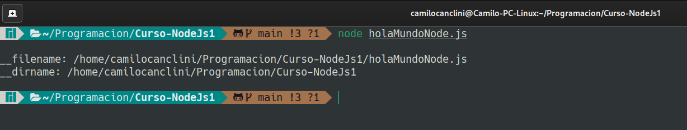
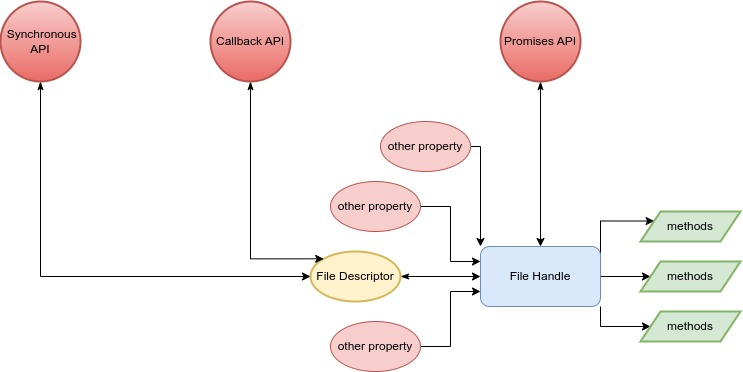

# Curso de NodeJs 

## Por Camilo Canclini

___

Este "curso" refleja mi propio aprendizaje con respecto a NodeJs. Ire recopilando todo lo que vaya aprendiendo y lo iré guardando en este repositorio. Me parece que es una forma interesante de estudiar y de demostrar como estudio. Sin mencionar que, por un lado, me sirve tener esta informacion guardada y documentada en un servicio online como github. Y, por otro lado, tambien soy consciente de que esto puede contruibuirle a alguna persona en el futuro.
Por eso ten en cuenta que los siguientes "apuntes" provienen de alguien autodidacta que solo esta estudiando y que quiere compartir el conocimiento que obtenido.
___

## Documentación Utilizada

Obviamente necesitamos tener algun tipo de documentación o trabajo previo sobre el cual basarnos a la hora de estudiar. En mi caso voy a recomendar, un video de YT, un roadmap y un libro. **Toda la información es gratuita y pública**

[](https://openlibra.com/es/book/node-js-notes-for-professionals)

[](https://www.youtube.com/watch?v=BhvLIzVL8_o)

[](https://www.youtube.com/watch?v=i3OdKwuBjeM&t=6027s)

[](https://roadmap.sh/nodejs/)

[](https://chat.openai.com/chat)

___

## Conceptos Previos

En mi caso ya tengo conocimientos, redes informaticas, modelo OSI, modelo cliente-servidor, hardware, funcionamiento interno de la pc, etc. Para empezar a trabajar con Node se recomienda tener un minimo de conocimiento en estos temas ya que, al ser una tecnología que trabaja en el backend, todo estos conocimientos son fundamentales para entender la manera en la cual opera y como trabaja Node. Tampóco me centraré en explicar conceptos propios de javascript, ya qué, se supone que se debe tener conocimientos minimos en js para empezar a ver Node.
___

## Introducción A NodeJS

> ### NodeJs es un entorno de ejecución para Javascript y un manejador de eventos asíncronos

Vamos a empezar a desglozar esto.

* **Entorno de ejecución**: Significa que haremos uso de un script o programa para poder ejecutar Javascript, esto quiere decir que no haremos uso del navegador para correr el codigo, este correra en nuestra maquina o servidor.
* **Manejador de eventos asíncronos:** Significa que esté será capaz de escuchar, eventos del sistema y peticiones de usuarios. Los eventos son instancias en las que el estado de algun componente que esta siendo "escuchado" cambia o "dispara" una alerta al servidor. Con asíncronos se refiere a que pueden ocurrir en cualquier momento de la ejeccución, no existe un tiempo que marque cuando puede dispararse un evento.

## ¿ Para que se usa Node ?

Node es utilizado para crear **aplicaciones web escalables**, esto quiere decir que estaremos creando un programa que pueda ser corrido desde nuestra propia pc o servidor y que ademas tendrá funcionalidades web. Con escalables se refiere a que la sintaxis y la forma en la que se construyen estas aplicaciones pueden cubrir necesidades basicas o mas complejas, ya que, el entorno se ajusta dependiendo de la complejidad de sus funciones. Ademas otra ventaja es que, gracias a la asincronía, el sistema no se bloquea, por lo que es mas facil trabajar con este tipo de aplicaciones.

## Requerimientos

Para empezar a trabajar con NodeJs primero necesitamos descargarlo desde la pagina oficial. [NodeJs.org](https://nodejs.org/en/)
La instalación realizará 2 cosas importantes que deberemos que tener en cuenta, la primera es que al instalar Node tambien estaremos instalando npm, y la segunda es que se integrará el comando "node" a nuestro PATH.

### ¿Qué es NPM?

NPM significa Node Package Manager o en español Gestor de Paquetes de Node. Este es un herramienta que permite la instalación de paquetes para nuestro entorno de ejecución. Los paquetes son, un conjunto de modulos o archivos javascript los cuales cumplen funcionalidades específicas, y pueden ser llamados desde nuestra aplicación de manera sencilla y práctica. Frameworks como React pueden ser integrados a traves de esta herramienta.

### ¿Qué es PATH?

El Path es el listado de las rutas a programas que pueden ser llamados desde nuestra terminal, o sea, en este caso, el programa o script "node" se utilizara desde la terminal.

___

## Hola Mundo en NodeJs

Recomiendo que para la proxima lección
Guardamos el siguiente codigo en un archivo holaMundoNode.js

```js

const http = require('http');

const hostname = '127.0.0.1';
const port = 3000;

const server = http.createServer((req, res) => {
    res.statusCode = 200;
  res.setHeader('Content-Type', 'text/plain');
  res.end('Hello World');
});

server.listen(port, hostname, () => {
    `Server running at http://${hostname}:${port}/`);
});

```

Desde la terminal nos dirigimos a la carpeta donde guardamos el script anterior (`cd Curso-Nodejs`) y ejecutamos el comando `node holaMundoNode.js`

Luego nos dirigimos a la ruta que nos indica la aplicación en mi caso, `http://127.0.0.1:3000/`.

Deberiamos ver algo como esto...


## Desglozando el Hola Mundo

En este caso se hace uso del modulo `http`, es se utiliza para montar el servidor en nuestra pc y es el que permite responder a los usuarios con información.
`
Con respecto a los modulos hay algo que tenemos que remarcar y es el tipo de modulo al que se esta haciendo referencia, en este caso, el modulo `http` es un modulo que ya viene instalado con Node por lo que no es necesario hacer ningun llamado "especial" o descargarlo de npm por ejemplo. Este tipo de modulos se los conoce como **Modulos Core**, ya que vienen preinstalados. (Un poco más adelante veremos sobre módulos)

Una vez importado en la linea uno, se guardan en variables constantes los datos para configurar el servidor (`const hostname = '127.0.0.1';` y `const port = 3000;`)

Ahora bien, a continuación podemos ver uno de los conceptos mas importantes que se mencionaron anteriormente. Vease el siguiente fragmento...

```js

const server = http.createServer((req, res) => {
    res.statusCode = 200;
    res.setHeader('Content-Type', 'text/plain');
    res.end('Hello World');
});

```

Lo que esta ocurriendo aquí es que se esta guardando el resultado de un metodo del objeto `http` que importamos antes. Fijese como, por parametros estamos pasando una **función flecha**. Esto es fundamental, ya que, permite que el código siga ejecutandoce a pesar de que el proceso dentro del bloque de la función no haya terminado.

Esto es lo que hablamos antes, famosa **asincronía** de tareas o procesos,  evita que el programa se bloqueé y no pueda continuar. Si bien es un ejemplo sencillo, gracias a el podemos entender muchos otros conceptos y modulos.

Despues vemos como por parametros le pasamos a la función flecha 2 variables, que despues se transforman en objetos:

* `req` : es el objeto que permite manejar los mensajes entrantes (En este caso no se usa).

* `res` : es el objeto que permite manejar la respuesta que da el servidor al cliente que hace una petición. Este es el importante ya que setea el tipo de respuesta, el codigo de esta HTTP, y el mensaje (en este caso, hello world).

Para mas informacion, visita [NodeJs.Org | http.methods](https://nodejs.org/dist/latest-v18.x/docs/api/http.html#httpcreateserveroptions-requestlistener)

Por otro lado tenemos...

```js

server.listen(port, hostname, () => {
    `Server running at http://${hostname}:${port}/`);
});

```

Este metodo `server.listen()` es el que setea donde se esta ejecutando la aplicación web, en que dirección y que puerto. Y ademas nos permite realizar operaciones mietras que se incia. Ya qué, al igual que el anterior, esté acepta una función asíncrona, que en este caso arroja un mensaje por terminal que nos indica en que dirección se encuentra corriendo el servidor.
___

## Modularización

La modularización es un concepto de la programación que hace referencia al hecho de dividir el código en disntintos fragmentos y cada uno realice una tarea específica. Las ventajas de esta metodología son:

* Mejor organización
* Mejor mantenimiento
* Mejor rendimiento
* Reutilización de codigo

Hasta ahora vimos la utilización del modulo `http`, el cual es un fragmento de codigo que permite gestionar las peticiones por el protocolo http. Esto nos facilita esa tarea en concreto y hace que no tengamos que preocuparnos por crear nosotros esa funcionalidad.

Otra ventaja, es que si pensamos los modulos como piezas que encastran entre si, podemos decir que a la hora de construir un proyecto seremos capaces de elegir que piezas utilizar en nuestro proyecto y cuales no.

### El objeto `module` En NodeJS

El objeto `module` es un objeto que se comparte entre modulos, este guarda atributos y metodos que se mantienen durante la ejecución del programa.

Veamos como se compone:

```js
Module {
  id: '.',
  path: '/home/camilocanclini/Programacion/Curso-NodeJs1',
  exports: {},
  filename: '/home/camilocanclini/Programacion/Curso-NodeJs1/holaMundoNode.js',
  loaded: false,
  children: [],
  paths: [
    '/home/camilocanclini/Programacion/Curso-NodeJs1/node_modules',
    '/home/camilocanclini/Programacion/node_modules',
    '/home/camilocanclini/node_modules',
    '/home/node_modules',
    '/node_modules'
  ]
}
```

Entre las propiedades mas importantes que guarda se encuentra `exports`, que guarda un objeto. A continuación veremos para que se utiliza...

### Tipos de módulos en JS

#### CommonJS modules

Es la forma original en la cual el modulo se preparaba para ser importado, es el que viene por defecto integrado en el lenguaje de JS.

Vease el siguiente ejemplo:

Supongamos que el siguiente modulo es un archivo llamado `foo.js`

```js
module.exports.add = function(a, b) {
        return a + b;
} 

module.exports.subtract = function(a, b) {
        return a - b;
} 
```

Lo que esta ocurriendo aqui es que se esta haciendo uso del objeto global `module`. Debido a la característica ya mencionada este permite que se "comparta" su propiedad `exports` entre modulos. Por ejemplo, el siguiente modulo, que denominaremos `main.js`

```js
const {add, subtract} = require('./foo')

add(5, 5)) // 10
subtract(10, 5)) // 5
```

Resaltemos algo importante, notece como en la declaración de `const {add, subtract} = require('./foo')` las constantes estan encerradas entre `{}`, esto es una funcionalidad que se agregó en ES6 llamada "destructuring assignment".

Lo que permite la "asignación de destructuración" es acceder directamente a las propiedades o metodos de una objeto (en este caso) ignorando todas las que no sean especificadas. En el código dado anteriormente el objeto es `module`, el cual, *solo* contiene las 2 funciones que importamos desde `./foo.js`, entonces si yo al momento de declarar las constantes las declaro entre { } lo que va a ocurrir es que solo se hará uso de esas 2 funciones. En el caso de que el objeto `module` contenga mas funciones ademas de `add()` y `subtract()`, estas seran **"ignoradas"** y solo se importaran las que especifiquemos.

Ademas notece una última cosa, fijese que al momento de pasar por parametro en `require()` la ubicación del modulo que queremos importar, este comienza con un `./`

Esto significa que estamos buscando el modulo **desde la misma carpeta** que el "archivo llamador", en este caso seria desde la carpeta o directorio donde se encuentra `main.js`

#### EMACASript modules (ES Modules)

Por otro lado tenemos los ES Modules, que son modulos de javascript que se encuentran estandarizados. Esto quiere decir que estos tienen una estructura o sintaxis diferentes que los hace poseer mejores ventajas que los CommonJS Modules. Vease el anterior codigo pero esta vez como la metodologia de un ES Module...

```js
export function add(a, b) {
        return a + b;
}

export function subtract(a, b) {
        return a - b;
}
```

Fijese que ahora la sintaxis es mucho mas limpia y agradable a la vista.
Algo que tenemos que aclarar es que el codigo de arriba **NO** lo guardaremos como `foo.js` **SINO** como `foo.mjs`.

Esto permite que Node identifique que el modulo se trata del tipo estandarizado. Pero ahora bien, como seria el archivo `main.js`?, vease el siguiente codigo...

```js
import {add, subtract} from './foo.mjs'

add(5, 5)) // 10
subtract(10, 5)) // 5
```

Vease que la forma de importar tambien cambia.

### Diferencias (import and require)

* Los `import` solo pueden ser llamados desde el principio del archivo (`main.js`), mientras que los `require()` pueden ser llamados en cualquier momento, por ejemplo.

```js
if(user.length > 0){
   const userDetails = require(‘./userDetails.js’);
  // Do something ..
}
```

* Los `import` son **ASINCRONOS** y los `require()` son **SINCRONOS**, lo que quiere decir que, los `require()` esperan a que se terminen de cargar todas las funciones para poder continuar la ejecución. Esto puede perjudicar al rendimiento en grandes aplicaciones.

### El objeto `global` En NodeJS

El objeto `global`, es similar al objeto window, los 2 almacenan los objetos y metodos que comunmente usamos cuando trabajos con JS, por ejemplo:

* `console`

* `setInterval()`

* `setTimeout()`

La diferencia es que `window` se usa cuando js se esta ejecutando en el navegador y el otro se utliza en Node.

### Los tipos de variables `var` en Node

Algo importante a tener en cuenta cuando hablamos de módulos es que el comportamiento que toman las variables del tipo `var` cambia, ya que en node, su **scope** es el modulo desde donde se declaran. A diferencia del navegador que se comparte entre archivos porque se almacena en el objeto `window`.
___

## NPM ( Node Package Manager )

Ahora vamos a ver en mayor profundidad NPM. Como digimos anteriormente, este sirve para instalar paquetes que son consumidos por nuestra aplicación para realizar tareas especificas.

### Preparando proyecto

Para empezar a utilizar NPM se recomienda que empecemos con el siguiente comando.

```bash
npm init
```

Este comando lo que hará sera hacernos una serie de preguntas relacionadas con los metadatos del proyecto entero, posteriora esto creará un primer archivo para mantener esta configuración, llamado `package.json`.

### Como instalar paquetes

Una vez instalado nodejs y npm, tan solo bastaria con abrir la terminal y navegar hasta la carpeta del proyecto para escribir el siguiente comando

```bash
npm install <NombreDelPaquete>
```

Este comando instalara el paquete indicado, creando una carpeta en la raiz de nuestro proyecto llamada `node_modules`. Aquí se almacenaran todos los paquetes.

#### package.json y package-lock.json


Estos 2 se crean al momento de empezar a instalar paquetes o dependencias, como dijimos `package.json` es el archivo donde se guarda la configuración de la carpeta raiz, en mi caso Proyecto1. Mientras que el `package-lock.json` es el archivo donde se va a guardar el listado de módulos descargados, asi como un historial de versiones de los mismos.

### Como instalar dependencias

Si nosotros bajamos un proyecto y necesitamos instalar *todos* los paquetes necesarios para que este funcione, tan solo bsataria, ir a la terminal, dirigirnos al directorio raiz del mismo proyecto y escribir el siguiente comando:

```bash
npm install
```

Esto lo que hara sera descargar todos los paquetes listados en el directorio (Que se supone que existe)

### Como actualizar paquetes

Para un actualizar paquete usamos

```bash
npm update <NombreDelPaquete>
```

Para actualizar **TODOS** los paquetes

```bash
npm update 
```

### Como importar paquetes

```js
require(<NombreDelPaquete>)
```

Con el metodo `require()` podemos hacer uso de los paquetes instalados en el proyecto. **No es necesario especificar ninguna ruta, solo indicar el nombre.**

> Al integrar estos paquetes estos pasan a convertirse en **dependencias** que nuestra aplicación necesita para funcionar.

### NPM Tasks

Si miramos el archivo `package.json` deberiamos ver algo parecido a lo siguiente:

```json
{
  "name": "proyecto-1",
  "version": "1.0.0",
  "description": "Este es el primer proyecto del curso",
  "main": "main.js",
  "scripts": {
    "test": "echo \"Error: no test specified\" && exit 1"
  },
  "keywords": [
    "curso"
  ],
  "author": "Camilo Canclini Stephano",
  "license": "ISC",
  "dependencies": {
    "colors": "^1.4.0"
  }
}
```

Si nos fijamos en la parte de `scripts` podremos ver que se esta almacenando un objeto (keys y values). Este objeto, en mi caso, se encuentra guardando la siguiente entrada: `"test": "echo \"Error: ..."`.

Gracias a la estructura que brinda este archivo para el apartado de `"scripts"` es que somos capaces de guardar diferentes scripts, y **personalizados**. Esto nos permite generar una serie de comandos predefinidos que pueden ser leidos y ejecutados a traves de npm con la finalidad de poder ejecutar ciertas acciones en nuestro paquete o proyecto que estemos creando, como por ejemplo: configurar e iniciar el servidor, crear archivos iniciales, ejecutar testeos, entre otras cosas.

#### Ejecutar Scripts con NPM

Con el siguiente comando seremos capaces de ejecutar los scripts que esten definidos en nuestro `package.json`.

```bash
npm run <NombreDelScript>
```

___

### NPX

npx es un comando que se integró con npm para poder realizar la ejecución de comandos basandoce en el **contexto de los paquetes**. Con contexto nos referimos a la **forma** en la que **tienen** que ser **accedidos** estos paquetes para funcionar.

Hay veces que los paquetes requieren estar instalados de manera **global** en el equipo, pueden requerir **privilegios de administrador** para ejecutar cierta función, o bien pueden necesitar ser ejecutados mediante la aplicación que estemos desarrollando directamente. NPX surge para solucionar todo esto.

NPX lo que hace es realizar todas las operaciones necesarias en un segundo plano para poder cumplir con el comando que queramos ejecutar. Un ejemplo muy sencillo podria ser el siguiente.

```bash
npx create-react-app prueba
```

`create-react-app` es un comando propio del framework de **React** que lo que hace es realizar las operaciones internas de la libreria para crear la estructura de una app con React. Obviamente para que funcione requiero tener instalado React en mi proyecto, pero si uso npx, esto no es necesario. Al ejecutarlo nos preguntará si queremos instalar React, y si seleccionamos que si, entonces npx lo instalará de forma temporal y lo posicionara basandose en el contexto de nuestro proyecto. Lo "instalará" manera local, en otras palabras.

Podemos concluir con que NPX es un comando que permite saltarse ciertos requerimientos como, por ejemplo, tener que declarar un comando en especifico en el `package.json` para ejecutar cierto modulo.
___

## Errors Handling

Tambien conocidos como manejadores de errores, son las formas en las cuales se tratan los errores. Como dijimos antes, nuestra aplicación podrá ser accedida por muchos usuarios, y si esta escala requerirá de mas archivos y funcionalidades.

Este tipo de aplicaciones no deberian ser detenidas por un simple error de codigo, esta tiene que poder responder siempre, aunque sea arrojando un mensaje de error. Se tiene que evitar detener la ejecución e impedir que los usuarios que disparen algun error sigan repercutiendo en el resto del sistema.

### Tipos de errores

Existen 2 grandes tipos de errores:

#### Errores de Programador

Estos son el tipo de errores que se encuentran en el codigo y que dependen exclusivamente de la forma en la cual se programó la aplicación. Estos pueden ser manejados simplemente optimizando y depurando el codigo.

#### Errores Operacionales

Estos son los mas complejos, ya que, dependen de **factores externos** a la programación de la aplicación. Son inesperados y se disparan a gracias a las operaciones que realizan los usuarios con nuestra aplicación o tambien debido a la forma en la que las disitintas partes de nuestra aplicación se comunican entre si.

Por ejemplo, un usuario podria estar intentando leer un archivo que se encuentra vacio, podria ingresar información que puede generar vulnerabilidades en el sistema, o un script podria ejecutar alguna operación sobre un archivo que no existe aun.

### El objeto `Error`

En Nodejs existe el objeto `Error`, el cual permite crear instancias para "lanzar" errores en la aplicación.

```js
new Error("Aquí va el mensaje personalizado")
```

Algunos de sus priopiedades son:

* `name`: Guarda el nombre del error
* `message`: Guarda un texto que describé el error que a ocurrido
* `stack`: Guarda el camino que a recorrido el error hasta ser arrojado, esto es sumamente útil, porque permite analizar función por función y bloque por bloque lo que se estaba ejecutando al momento de dispararse el error, esto tambien es conocido como **stack trace**.

### Formas de manejar Errores

A continuación vamos a presentar algunas formas de manejar errores:

#### Bloque Try and Catch

Los bloques `try`, `catch` y `finally` son sentencias muy parecidas a los `if` de la toda la vida, la diferencia radica en que son especiales para errores y evitan que se termine la ejecución del proceso actual.

Veamos un ejemplo:

```js
var fs = require('fs')

try {
const data = fs.readFileSync('/Users/user/file.txt')
} catch (err) {
  err)
}
finally{
  'Finally will execute every time')
}
```

Vamos por partes:

* `try`: va a ejecutar un fragmento del código, si este arroja cualquier tipo de error, **no detiene la ejecución** y en cambio "le pasa" el error a la sentencia `catch`, si no occurre un error no arroga nada.
En este caso hace uso del modulo `fs` para leer un archivo(la veremos mas adelante). Como es evidente la lectura puede fallar por causas externas a la aplicación, por esa razon se coloca dentro de `try` para ser "evaluada".

* `catch (err)`: Esta sentencia recibe el error arrojado por la sentencia `try`, y realiza algun tipo de operación en consecuencia del mismo. En este caso devuelve el error por consola (Pero no se detiene la aplicación).

* `finally`: Este bloque se ejecutará **independientemente del resultado anterior**, no es necesario agregarlo.

Recordemos que en este caso tenemos que evitar a toda costa que la aplicación se bloqueé, ya que, necesitamos que, este disponible siempre para los usuarios, y que opere de manera autónoma.

___

## Programación Asíncrona

### Funciones Callbacks

Las funciones callbacks son aquellas que pueden ser pasadas como argumentos de otra función.
En este caso, las usaremos para realizar operaciones si aparece un error.

Generalmente estas se pasan como argumento *final* de la función principal, estas son llamadas cuando la funcion desde la que se llama a la callback espera necesita un resultado, o cuando se dispara un error. Actuan como manejadores de errores porque permiten ejecutar operaciones si existe un error. Por ejemplo:

```js
function operacionLargaConError(callback) {
  setTimeout(() => {
    const error = Math.random() < 0.5;
    if(error){
        callback(new Error('Ocurrio un error!'));
    }else{
        callback();
    }
  }, 1000);
}

function manejarError(error) {
  if (error) {
    console.error(error);
  } else {
    'La operacion finalizo correctamente');
  }
}

operacionLargaConError(manejarError);
```

En el codigo anterior se le pasa a la función `operacionLargaConError()` como argumento la funcion `manejarError(error)` que a su vez tambien recibe un parametro  que es el error disparado, en la función anterior.

Esta forma de operación permite separar la logica de principal del manejo de errores. Haciendo que el código sea modular y mas legible a la vista.

> Las callbacks son utilizados para seguir con la ejecución del codigo y tener que esperar al resultado de una función o metodo que tiene que devolver algo. Ya qué, en NodeJs y JS la mayoría de procesos son asíncronos, necesitamos realizar varios procesos en simultaneo y que el codigo siga ejecución.


Como podemos ve en el dibujo anterior al momento de ejecutar el `main.js`, se guarda en `var1` el resultado de una función, y esta tiene un callback que va a ejecutar operaciones en segundo plano (sector rojo).

Por otro lado, mientras el `callback1` ejecuta sus operaciones, se estara definiendo, `var2`, la cual tambien depende del resultado de una función, y esta a su vez tambien posee un callback que estara ejecutando operaciones en segundo plano.

Alfinal las 2 variables se definiran casi a la par. Antes hubiesemos tenido que esperar a que se defina completamente `var1` para poder empezar a definir `var2`, con las callbacks esto ya no representa un problema.

### Promesas - Promises

Una promesa es un objeto que representa la terminación de una operación asíncrona, se utilizan para manejar tareas asincrónicas como las que venimos viendo, a diferencia de las callbacks estas son mas sencilla de entender y de visualizar. La promesa tiene 3 estados:

* pending (pendiente)

* fulfilled (cumplida)

* rejected (fallida)


Una vez que cambia su estado a fulfilled o rejected no se puede volver para atras.

El objeto promesa tiene dos métodos que se usan para manejar los resultados de una promesa:

* `.then`: este método recibe una función que se ejecuta si la promesa se cumple.
* `.catch`: este método recibe una función que se ejecuta si la promesa falla.

Veamos un ejemplo:

```js
const promesa = new Promise((resolve, reject) => {
  setTimeout(() => {
    if (Math.random() < 0.5) {
      resolve("Todo bien");
    } else {
      reject(new Error("Algo salió mal"));
    }
  }, 1000);
});

promesa.then(response => response))
promesa.catch(error => console.error(error));
```

Como podemos apreciar, primero se instancia el objeto promesa con `new Promise((resolve, reject) => {});`, la función que ejecuta la promesa se llama `executor` y sus argumento son los objetos: `resolve` y `reject`. Estos se asocian con los 2 metodos que mencionamos arriba.

Luego se empieza una función flecha y adentro un `setTimeout` en el cual vuelven a aparecer `resolve` y `reject`. Aqui es donde se hacen las operaciones para resolver la promesa. Recordemos que la promesa tiene solo 2 resultados posibles, `resolve(response)` para cuando todo sale bien y se pasa algun valor como parametro, y `reject(Error)` cuando ocurré algo que pueda ser considerado un error, en este último se pasa por parametro un objeto `Error`.

Dependiendo de lo ocurrido en el bloque del `setTimeout` se ejecutan los metodos `.then` y `.catch`, para cuando todo sale bien y para cuando ocurrió un error respectivamente.

Por último, tambien existe el método .finally, que al igual que con `try` y `catch`, se ejecuta, independientemente del la resolución de la promesa. Aqui un ejemplo:

```js
let promise = new Promise((resolve, reject) => {
    setTimeout(() => {
        resolve('La operación ha sido completada');
    }, 1000);
});

promise
    .then((result) => {
        result);
    })
    .catch((error) => {
        error);
    })
    .finally(() => {
        'Se ha completado la promesa INDEPENDIENTEMENTE del resultado');
    });
```

#### Ventajas de usar promesas

* A la hora de manejar errores el codigo se vuelven mas legible. Evitamos los "callbacks hell"

* Se pueden concatenar varias promesas, vease el siguiente ejemplo:

```js
let promise1 = new Promise((resolve, reject) => {
    setTimeout(() => {
        resolve('Resultado de la operación 1');
    }, 1000);
});

let promise2 = new Promise((resolve, reject) => {
    setTimeout(() => {
        resolve('Resultado de la operación 2');
    }, 2000);
});

promise1.then((result) => {
    result);
    return promise2;
}).then((result) => {
    result);
});
```

Podemos ver como se resuelve la segunda promesa solo si antes se resolvió la primera.

* Realizar varias operaciones asincronas en paralelo, vease el siguiente ejemplo:

```js
let promise1 = new Promise((resolve, reject) => {
    setTimeout(() => {
        resolve('Resultado de la operación 1');
    }, 1000);
});

let promise2 = new Promise((resolve, reject) => {
    setTimeout(() => {
        resolve('Resultado de la operación 2');
    }, 2000);
});

Promise.all([promise1, promise2]).then((results) => {
    results);
});
```

Aquí hacemos uso del metodo `.all` del objeto `Promise`, este recibe como parametro un arreglo con las promesas y si todas se realizaron correctamente, entonces se continua con la ejecución con `.then`. Recordemos que esto no detiene la aplicación en ningun momento, ya que son procesos asíncronos.

* Concatenar varios `.then`, Utilización del metodo `fetch()`

```js
fetch('https://api.example.com/data')
    .then((response) => {
        return response.json();
    })
    .then((data) => {
        data);
    });
```

En este ejemplo, utilizamos la función `fetch` para realizar una solicitud HTTP asíncrona a una URL específica. El resultado de la solicitud se devuelve como un objeto llamado `response`. y a su vez el metodo devuelve una promesa, por lo que podemos hacer uso de los metodos propios de las promesas.

Como podemos ver, la lógica detras de esto esta en que, al resolver el primer `.then` se devuelve un promesa, y esa es sobre la que trabaja el segundo `.then`, con la promesa resuelta del primero.

### Async y Await

La palabra reservada `async` se utiliza para definir funciones asíncronas, estas son, bloques de código que se ejecutan en "segundo plano", que no traban la ejecución del programa entero, y que **siempre** retornan una promesa. Al retornar una promesa se pueden aprovechar todas las ventajas mencionadas anteriormente. He aquí un ejemplo:

```js
async function getData() {
    return new Promise((resolve) => {
        setTimeout(() => {
            resolve('Datos obtenidos');
        }, 1000);
    });
}

getData().then((result) => {
    result);
});

'Esto se ejecuta primero')
```

En este ejemplo podemos ver que la palabra `async` se pone antes de `function`, lo que convierte al bloque de codigo en una función asíncrona. Ademas vemos que cuando se llama a la función, inmediatamente se accede a la promesa (una vez que se resuelva en 1000ms) con `.then`.
Por último, fijemonos que la ultima línea es un `)`, esta linea se ejecutará **antes** que la función, por mas que la funcion haya sido llamada antes. Como sabemos que la función devuelve una promesa, podemos ejecutar todo el codigo que queramos sin necesidad a espera a que la función entregue un resultado.

Por otro lado tenemos al `await`. Este lo que hace es **detener la ejecución de la función asíncrona** hasta qeu se resuelva una promesa, vease el siguiente ejemplo:

```js
async function getData() {
    let result = await fetch('https://api.example.com/data');
    let json = await result.json();
    return json;
}

getData().then((data) => {
    data);
});
```

Miremos que el `await`, en este caso, va a esperar a que el método `fetch` retorne una promesa como respuesta, hasta que esto no ocurrá no se realizara la linea siguiente.
Vuelvo a recalcar, solo detiene la ejecucion **de la función**, lo que quiere decir que todo el codigo que se encuentré afuera de la misma seguirá su ejecución normalmente.

> El `await` solo esta habilitado en funciones asíncronas.

### setImmediate y process.nextTick

Para entender el funcionamiento de setImmediate() y process.nextTick(), primero necesitamos conocer bien que es el event loop en javascript.

#### Event Loop de JS

El event loop es la forma en la cual Javascript ejecuta y da orden a las tareas asíncronas. Además este consta de varias "fases" o "ciclos" que se repiten de forma continua, cada una de las cuales se encarga de procesar un conjunto específico de tareas. Algunas de estas fases son:

* Fase de Entrada: en esta fase, el event loop revisa las colas de eventos para ver si hay algún evento nuevo para procesar, como por ejemplo, un evento de click en un botón.

* Fase de Ejecución: en esta fase, el event loop ejecuta las tareas correspondientes al evento detectado en la fase anterior. Por ejemplo, ejecutar la función asociada a un evento de click en un botón.

* Fase de Salida: en esta fase, el event loop limpia cualquier información o estado de las tareas ejecutadas en la fase anterior, para estar preparado para el próximo ciclo del event loop.

JavaScript es un lenguaje single-threaded, esto significa que solo puede ejecutar una tarea a la vez. Sin embargo, al usar el event loop, se logra simular la concurrencia permitiendo ejecutar varias tareas al mismo tiempo sin bloquear el hilo principal de ejecución, esto es el famoso 'paralelismo'.


* Call Stack: Es una estructura de datos que almacena las funciones y las variables en ejecución. Cada vez que se llama a una función, se añade una entrada al call stack, y cada vez que se regresa de una función, se elimina una entrada del call stack. El call stack es el lugar donde **se lleva a cabo la ejecución de las instrucciones del programa**.

* Event queue: es una estructura de datos que contiene los eventos y tareas que deben ser procesadas por el event loop. Por ejemplo, un evento de click en un botón o una petición HTTP. Cada vez que un evento ocurre, se agrega a la cola de eventos. El event loop revisa esta cola de forma continua y ejecuta las tareas correspondientes.

* Web API: Son las funciones y objetos proporcionados por el navegador (como el objeto setTimeout, setInterval, el objeto XMLHttpRequest). Cada vez que una función de la Web API es llamada, se ejecuta de manera asíncrona y una vez completada, agrega una tarea a la cola de eventos, para ser ejecutada por el event loop.

Ahora bien, `setImmediate()` y `process.nextTick()` son dos funciones que se utilizan para programar la ejecución de tareas en el futuro en Node.js. Sin embargo, existen algunas diferencias importantes entre ellas:

* setImmediate(): La función setImmediate() programa una tarea para ser ejecutada inmediatamente después de que todas las operaciones pendientes en el event loop actual hayan sido completadas. Es decir, setImmediate() se ejecuta en el siguiente ciclo del bucle de eventos.

* process.nextTick(): La función process.nextTick() programa una tarea para ser ejecutada en el siguiente ciclo del bucle de eventos, antes de que se ejecuten cualquier otra tarea programada con setImmediate(). **Es decir, process.nextTick() se ejecuta antes de que setImmediate() se ejecute.**

Un ejemplo sería:

```js
"Ejecutando tarea 1");

setImmediate(() => {
  "Ejecutando tarea 2 (setImmediate)");
});

process.nextTick(() => {
  "Ejecutando tarea 3 (process.nextTick)");
});

"Ejecutando tarea 4");

//SALIDA

// Ejecutando tarea 1
// Ejecutando tarea 4
// Ejecutando tarea 3 (process.nextTick)
// Ejecutando tarea 2 (setImmediate)

```

___

## Core Modules NodeJS

Ahora vamos a ver los modulos principales que vienen integrados con Node, estos son las bases de lso frameworks y demas librerías que se utilizan hoy en dia. Estos nos van a permitir, acceder a los recursos del sistema directamente desde JS.
**De cada módulo se mostraran los métodos mas relevantes y ademas habrá en la carpeta 'Core Modules' un ejemplo de uso de cada uno**

### OS Module

Este modulo nos permite obtener datos del hardware y software del equipo que esta ejecutando nuestro script:

#### Documentación Oficial OS

Aquí se encuentra toda la información del módulo: [](https://nodejs.org/docs/latest-v17.x/api/os.html)

#### Importación OS

```js
const os = require('os');
```

#### Métodos OS

```js

os.totalmem() //Devuelve INT de la memoria total
os.freemem() // Devuelve INT de la memoria libre
os.getPriority() // Devuelve un INT con el valor de PRIORIDAD del proceso actual
os.homedir() //Devuelve un STRING de la ruta del directorio del usuario 
os.tmpdir() //Devuelve un STRING de la ruta del directorio temporal 
os.hostname() //Devuelve un STRING con el nombre del equipo
os.platform() //Devuelve un STRING con el nombre del sistema operativo
os.uptime() //Devuelve un ENTERO del tiempo que a estado corriendo la maquina desde que se encendió
os.networkInterfaces() //Devuelve un OBJETO con la informaciónd del adaptador de red
os.userInfo() //Devuelve un OBJETO con la información del usuario actual
```

### PATH Module

Este módulo permite trabajar con las rutas de directorios y archivos del sistema operativo en el que nos encontremos. Recordemos que NodeJS, es multiplataforma, puede estarce ejecutando tanto en un windows como en un linux, por lo que, las formas y privilegios para acceder a los disntintos recursos del SO cambian, entre uno y otro.

#### Documentación Oficial PATH

Aquí se encuentra toda la información del módulo: [](https://nodejs.org/docs/latest-v17.x/api/path.html)

#### Importación PATH

```js
const path = require('path');
```

#### Métodos PATH

```js
const path = require('path');

//Devuelve un STRING con el separador que utiliza el SO para los PATHS
// WINDOWS --> \
// LINUX --> /
path.sep;

//Retorna un STRING de la última parte de un path
path.basename('/home/camilocanclini/Documents/hola.txt'); 
//Retorna un STRING pero recortando lo que indiquemos en el segundo argumento
path.basename('/home/camilocanclini/Documents/hola.txt', '.txt');
//Devuelve un STRING del path sin la ultima parte
path.dirname('/home/camilocanclini/Documents/hola.txt');


//Devuelve un STRING con el separador que usa el OS para separar los paths 
// WINDOWS --> ;
// LINUX --> :
path.delimiter;

//Devuelve un STRING  que indica la extensión del path 
path.extname('hola.txt');

//Devuelve un STRING, este genera un PATH haciendo uso de los argumentos que pasemos
path.join('/foo', 'bar', 'baz/asdf', 'quux', '..'); 

//Devuelve un STRING, este genera un PATH NORMALIZADO para el SO en que nos enconetremos
//Que este normalizado quiere decir que es valido, que puede ser reconocido por nuestro SO
path.normalize('/foo/bar//baz///asdf/quux/..');

//Devuelve un OBJETO con las propiedades del PATH que pasemos como argumento
path.parse('/home/user/dir/file.txt');
const pathObj = path.parse('/home/user/dir/file.txt');

//Hace la operacion opuesta que path.parse
path.format(pathObj);

/*
Hace lo mismo que path.join pero ademas tienen en cuenta
si los argumentos pasados son PATHS ABSOLUTOS o RELATIVOS

PATH ABSOLUTO --> /hola/como/estas
PATH RELATIVO --> hola/como/estas ó ./hola/como/estas

Este metodo analiza de derecha a izquierda
Si es absoluto se toma  ese path y desde ahi, hacia la derecha se unen los demas paths
Si NO HAY PATHS ABSOLUTOS se agrega el PATH total y se unifica con los pasados por Argumentos
*/ 
path.resolve('hola/pepe','argentina/moni');
path.resolve('/hola/pepe','argentina/moni');
path.resolve('hola/pepe','/argentina/moni');
```

### Constantes del modulo: `__filename` y `__dirname`

La constantes del modulo son parecidas a los `global objects`, ya que cada modulo o script puede llamarlas, pero el valor dependera del script que la llame.

En concreto, las que presentaremos a continuación, son para trabajar con los PATHs del script en cuestion.

* `__filename`: Esta devuelve el PATH ABSOLUTO o RUTA ABSOLUTA del archivo.
* `__dirname`: Esta devuelve el PATH ABSOLUTO o RUTA ABSOLUTA del directorio que contiene al archivo

Ejemplos:

Codigo:

```js
console.log('\n__filename:', __filename);
console.log('__dirname:', __dirname,'\n');
```

Resultado:



Estas costantes se suelen utilizar a la hora de confeccionar PATHS o para el manejo de archivos.

### FS Module

Este módulo nos permite interactuar con los archivos del sistema, nos da las herramientas para modificarlos. Para comenzar tenemos que saber que este módulo nos pertmite interactuar con los archivos de 3 formas diferentes, dentro del entorno se las conoce como API (Aplication Program Interface | Interfaz de Programacion de la Aplicación), estas no son como las APIs WEB que comunmente se utilizan hoy en dia. Simplemente pensemos que son las **formas en las cuales podemos interactuar con los archivos**

A continuación vamos a presentar 3 ejemplos en los cuales se importa la misma función con la forma de EMACScript6(`import { unlinkSync } from 'node:fs';`). En el primero vamos a trabajar de forma sincrona(la mas simple, pero tambien la mas vulnerable), en la segunda, vamos a usar callbacks y en la tercera vamos a usar promesas. De estas 2 últimas ya hemos hablado en profundidad anteriormente.

API para Sincronía

```js
import { unlinkSync } from 'node:fs';

try {
  unlinkSync('/tmp/hello');
  console.log('successfully deleted /tmp/hello');
} catch (err) {
  // handle the error
}
```

API para Callbacks (Asincronía)

```js
import { unlink } from 'node:fs';

unlink('/tmp/hello', (err) => {
  if (err) throw err;
  console.log('successfully deleted /tmp/hello');
});
```

API para Promesas (Asincronía)

```js
import { unlink } from 'node:fs/promises';

try {
  await unlink('/tmp/hello');
  console.log('successfully deleted /tmp/hello');
} catch (error) {
  console.error('there was an error:', error.message);
}
```

Como podemos apreciar este módulo nos permite elegir si el método se ejecutará de manera asíncrona o síncrona. Como ya vimos, si trabaja de forma síncrona las lineas de código siguiente no se ejecutarán hasta que hayamos terminado la operación con el método indicado.

Por último algo a tener en cuenta es que cuando definimos la rutas de los archivos con los que interactuamos tenemos que saber que las rutas son relativas con respecto al **Working Directory** y no con respecto al archivo desde el cual estamos ejecutando. Por ejemplo, vease la siguiente estructura:


y ahora vea el siguiente codigo del archivo llamado `fs.js`

```js
const fs = require('fs');
console.log(fs.readFileSync('data/p.txt'));
```

Si yo ejecuto el script `fs.js` de la siguiente forma, voy a recibir un error:


¿Por qué ocurre esto?, porque al momento de yo ejecutar con `node ./CoreModules/fs.js` mi "Working Directory" es `.../Curso-NodeJS1/` por lo que cuando el script `fs.js` ejecuta la linea 2 (`console.log(fs.readFileSync('data/p.txt'));`) busca de la siguiente manera --> `/Curso-NodeJS1/data/p.txt` y esa ruta no existe, porque no pasa por la carpeta `CoreModules`. ¿Como se soluciona?, tenemos 2 formas:

1. O bien cambiamos la ruta del script quedandonos: `console.log(fs.readFileSync('CoreModules/data/p.txt'));`

2. O cambiamos el **Working Directory**: haciendo `cd CoreModules/` y despues ejecutamos node fs.js

En el caso del segundo ya se volveria valida la ruta que especificamos en la segunda linea.

#### File Descriptors y  El objeto `FileHandle`

Antes de empezar a explicar los metodos del módulo necesitamos aclarar los algunos conceptos. Al momento de interactuar con archivos se recurrirá a los binarios (programas) que ofrece el sistema operativo donde nos encontramos, ya qué en realidad, al momento de acceder a los archivos, necesitamos comunicarnos con el SO.

Cosas a tener en cuenta:

* Nuestra aplicación de NodeJs es tomada como un proceso para el sistema

* Cada proceso es administrado por el sistema opertivo, y este determina la distribución y acceso que este tendrá a los recursos del sistema.

* Cada vez que un proceso interactua con algun recurso, ya sea: hardware, software, perifericos u archivos(en este caso), el sistema reconocerá este consumo y limitará a nuestro proceso, para que no trabé a los demas.

* Es importante administrar nosotros mismos nuestra aplicación para que no abusé del consumo de los recursos que el sistema provee.

**File Descriptors:** Los descriptores de archivos son un **identificador único numérico** que el sistema operativo le determina a los recursos del tipo que estan siendo utilizados por un proceso. En otras palabras, son indices que le da el SO al proceso, para que este último pueda realizar sus tareas internas.

**FileHandle:** Es un objeto de NodeJs que se utiliza como representación del archivo que estamos operando y este guarda el **File Descriptor**. Al ser tratado como objeto este nos permite hacer uso de metodos. Ademas tambien permite, abrir un archivo, "guardarlo" en un objeto `FileHandle` y para luego pasarlo a otra función como parametro o argumento.

> El objeto FileHandle **Solo se crea y se utiliza** cuando usamos la **API de promesas** de Fs Módule

Por lo que, tenemos que tener en cuenta cuando estamos trabajando con FileDescriptor y un FileHandle, ya qué, si bien estan relacionados, tienen muchas diferencias.



#### Buffers y Streams

Cuando hablamos de archivos y servidores, en nodejs, aparecen terminos como "buffer", "chunks" y "streams". En este curso no vamos a entrar en muchos detalles, porque son temas que se relacionan directamente con la electronica, la comunicacion y la logica computacional. Pero vamos a explicar lo necesario para entender como se aplican en el entorno de Node.

#### Buffer

Un buffer es un **espacio fijo** en la memoria que almacena **datos binarios**. Es similar a un array o matriz. Con datos binarios nos referimos a que guarda los datos en "crudo" o mas básicos que puede entender la PC. Estos se utilizan para **representar** información como, texto o imágenes. Si hablamos de Node, podemos manejar esta estructura de datos con la clase `Buffer` que proporciona el lenguaje JS.

Documentacion de la Clase Buffer:

[](https://nodejs.org/api/buffer.html#class-fileF)

Si bien, el buffer, almacena datos binarios, estos se encuentran representados en hexadecimal. Esto para mejorar el rendimiento y visualización (Binario <==> Hexadecimal <==> Decimal)

En el caso de la módulo `fs`, al momento de leer los archivos, los datos llegan como un buffer en formato hexadecimal, esto podriamos tomarlo como datos en formato **RAW**.

```js
const fs = require('fs');

const dataRaw = fs.readFileSync('data/datos.txt');
console.log('dataRaw: ', dataRaw);
```


Siguiendo, una vez que llegan, tenemos que decodificar esta información a un sistema que nosotros entendemos (El Usuario / Programador), Aqui aparecen los formatos de códificacion, como **UTF-8**.

```js
const fs = require('fs');

const dataRaw = fs.readFileSync('data/datos.txt');
console.log('dataRaw: ', dataRaw);

const dataConverted = dataRaw.toString('utf-8');
console.log(dataConverted);
```


Los formatos de codificación son los que convierten los datos del binario a las letras de nuestros respectivos lenguajes, dependiendo del lenguaje que hablemos deberemos traducirlos para un formato u otro. En Occidente el estandar es UTF-8. Siempre se recomienda establecer un formato en común para facilitar el trabajo.


#### Streams Y Chunks

Al momento de leer y escribir tenemos que ser conscientes del tamaño de los datos que estamos manejando, ya qué, si los datos son demasiado grandes, la aplicación del servidor tenderá a ir mas lento. La forma de solucionar esto es haciendo uso de 'Streams'.

Los 'Streams' son flujos de datos, pueden ser de entrada, de salida o ambos, estos permiten recibir y enviar información en fragmentos de datos, o comunmente llamados, 'Chunks'.

Los Streams tambien tienen una clase que los representa dentro de NodeJS y nos permite operar con ellos

Documentacion de la Clase Stream:

[](https://nodejs.org/api/stream.html)


Debido a cuestiones de rendimiento, no sería eficiente enviar toda la información de un archivo grande ni tampoco procesarla toda de un tiron. Por eso nos conviene fragmentar el archivo total en 'Chunks' e ir procesando de a poco. Un ejemplo super claro es el de YT.

Al momento de reproducir videos, YT nos envia el video de a poco para que ya podamos ir visualizandolo


> Estos conceptos seran vistos en mas detenimiento mas adelante


#### Documentación Oficial FS

Aquí se encuentra toda la información del módulo: [](https://nodejs.org/api/fs.html)

#### Importación FS

```js
const fs = require('fs');
const fsPromise = require('fs/promises');
```

#### Abrir y Cerrar Archivos

Siguiendo con temas de optimización, al momento de abrir y cerrar archivos tenemos que ser conscientes que, la misma acción de abrir y cerrar, consume recursos. Por lo que cuando veamos a continuación los métodos, vamos a divirdirlos en 2 grupos:

* Los métodos del primer grupo son todos aquellos que abren y cierran el archivo al terminar de ejecutarse

* Y los metodos del segundo grupo, corresponden a los que necesitan que el archivo se encuentre abierto manualmente con el método `fs.open()`.

Los del segundo grupo serán mas eficientes, ya que nos permiten ejecutar varias operaciones en un archivo sin al necesidad de estar abriendo y cerrando cada vez que ejecutamos una operación.

En otras palabras, **solo se abre y se cierra una vez**. La unica contra es que, no debemos olvidar cerra el archivo con `fs.close()`

#### Métodos FS

Recordemos que las 3 maneras de programar con FS (Synchrounous, Callbacks y Promises) comparten la mayoría de los metodos y lo unico que cambia es la forma de llamar a ese método.

Para este caso vamos a presentar todos los métodos con la forma de callback:

Grupo de Metodos 1 (Abren y Cierran el archivo cada vez que se ejecutan)

```js
const fs = require('fs');
const { exit } = require('process');

// +-- " G R U P O 1 " --+

// Leer
fs.readFile('./data/elArchivo.txt', (err,data) => {
    if (err) console.log('Ocurrió un error al leer');
    console.log('1:',data);
    console.log('2:',data.toString());
    // Leer Archivos y convertirlos antes (UTF-8)
});


// Crear y Editar

// Se modifica el archivo entero
fs.writeFile('./data/nuevoArchivo.txt','Hola! Soy un archivo nuevo', (err)=>{
    if (err) throw Error('Hola che');
    console.log('3: el archivo fue creado si no existia, y se editó');
});

//Se agrega información nueva
fs.appendFile('./data/nuevoArchivo.txt', '\nHola!', (err)=>{
    if (err) console.log('Hola che');
    console.log('4: el archivo fue creado si no existia, y se agregó info nueva');
});

// Chequea si el archivo es accesible 
// (Si existe, si puede ser leido, escrito o ejecutado
// Se usan constants:
// F_OK: Verifica si el archivo existe
// R_OK: Verifica si el archivo puede leerse
// W_OK: Verifica si el archivo puede escribirse
// X_OK: Verifica si el archivo puede ejecutarse
fs.access('./data/datos.txt',fs.constants.F_OK, (err) =>{
if (err) {
    console.log('Ocurrió un error al verificar el acceso al archivo')
}else{
    console.log(' 5: El archivo existe (En este caso [F_OK])');
}
})

// Permite copiar archivos
// Este método tambien acepta constantes para cambiar el comportamiento del método
// (Ver las constantes en la documentacion oficial)
fs.copyFile('./data/elArchivo.txt','./data/elArchivoCopiado.txt', fs.constants.COPYFILE_EXCL,(err) => {
    if (err) {
        console.log('Ocurrió un error al copiar el archivo');
    } else {
        console.log('6: El archivo se copió');
    }
})

//Devuelve información (Metadatos) del archivo
fs.stat('./data/datos.txt',(err, stats)=>{
    if (err) {
        console.log('Ocurrio un error al obtener metadatos');
    } else {
        console.log('7: metadatos: ', stats);
        console.log('7: Tamaño del Archivo: ', stats.size, 'bytes');
    }
})

//Crea un directorio
fs.mkdir('./data/nuevoDirectorio',(err)=>{
    if (err) {
        console.log('Ocurrió un error al crear directorio');
    } else {
        console.log('8: El directorio se creó correctamente');
    }
})

// Abre un directorio
fs.opendir('./data',(err,dir)=>{
    if (err) {
        console.log('Ocurrió un error al abrir el directorio');
    } else {
        console.log('9: dir: ', dir);
    }
})

// Borra un archivo o un directorio
fs.rm('./data/nuevoArchivo.txt',(err)=>{
    if (err) {
        console.log('Ocurrió un error al borrar el directorio');
    } else {
        console.log('10: Se borró el directorio (nuevoArchivo)');
    }
})

// Trunca un archivo (Vacia el archivo, borra todo el contenido)
fs.truncate('./data/nuevoDirectorio/archivoTruncado.txt', (err)=>{
    if (err) {
        console.log('Ocurrió un error al truncar el archivo');
    } else {
        console.log('11: Archivo Truncado exitosamente');
    }
})

setTimeout(()=>{
    console.log('Empezando a observar el archivo');
    console.log('Realice algun cambio en el archivo (Tiene 10 seg)');


    // Dispara un evento cuando el archivo es alterado 
    // Es un loop, se queda escuchando si ocurren cambios en el archivo y ejecuta el callback
    fs.watch('./data/nuevoDirectorio/archivoObservado.txt', (event, file) =>{
        console.log('12: El archivo: ', file, 'Fué modificado');
        console.log('12: El evento que se disparó fue: ', event);

        console.log('Cerrando programa');
        process.exit();
    })


    setTimeout(()=>{
        console.log('\n\nNo se realizaron cambios en el archivo');
        console.log('Cerrando programa');
        process.exit();
    },10000);
},4000);
```

Grupo de metodos 2 ( `fs.open()`, se habren y se cierran 1 sola vez )

```js
// +-- " G R U P O 2 " --+

const fs = require('fs');

// Abriendo el Archivo
fs.open('./data/elArchivo.txt','r+',(err,fd)=>{
    if (err) {
        console.log('Fallo al abrir archivo: ',err.message)
    } else {

        // Leyendo el archivo abierto previamente
        fs.read(fd, (err,br,bufferobj)=>{
            if (err) {
                console.log('Fallo al leer archivo: ',err.message)
            } else {
                console.log(`\nSe leyeron ${br} bytes del buffer\n`);
                console.log(`El buffer traducido:\n${bufferobj}\n`);
                console.log(bufferobj.byteLength);
                
                // Una vez leido se escribe el archivo
                fs.write(fd, 'Escribiendo...',(err,bw,buffer)=>{
                    if (err) {
                        console.log('Fallo al escribir archivo: ',err.message)
                    } else {
                        console.log(`\nSe escribieron ${bw} bytes del buffer\n`);
                        console.log(`El buffer traducido:\n${buffer}\n`);

                        // Una vez que se terminó de escribir se cierra el archivo
                        fs.close(fd, ()=>{
                            console.log('El archivo se cerró');
                        });

                    }
                });


            }
        });

        
    }
});
```

Miremos que en el segundo grupo de métodos se esta haciendo uso del fileDescriptor (`fd`). Ademas miremos que al momento de abrir el archivo con `fs.open(path, options[flag, ...], callback)`, podemos pasar como argumento una `flag` o `mode` de apertura.

Esto lo que indica es el tipo de operaciones o el alcance de las mismas, que tenemos para realizar las operaciones una vez abierto el archivo, vease la siguiente tabla:


### PROCESS MODULE

Este módulo permite obtener información y controlar el proceso actual que genera nuestra aplicación en el sistema operativo.

#### Que es CLI y Command Line Apps

El concepto CLI significa Command Line Interface, esta es simplemente la forma mediante la cual el usuario se comunica con el sistema operativo vía la linea de comandos. Dependiendo del Sistema Operativo estas varian, por ejemplo en Windows se utilza powershell y en linux bash, aunque estas pueden cambiar.

Gracias a CLI es que podemos ejecutar comandos como `node app.js`, lo que ocurre aqui es que, le estamos diciendo a la consola de comandos que queremos usar el programa `node` y le pasamos un argumento que es la ruta del script que va a procesar.

Esta forma simple de trabajar e interactuar con el sistema permite la crear aplicaciones que trabajen haciendo uso de la consola. Aqui aparecen las Command Line Apps, que basicamente son, aplicaciones que reciben instrucciones o argumentos desde la consola y ejecutan alguna tarea en base a esos parametros, o pueden responder con texto via la misma interfaz de comandos.

NodeJS permite la creación de este tipo de aplicaciones. El siguiente módulo permitira tener un acercamiento con este concepto.

> Este módulo permite manejar eventos que ocurren durante la ejecución del proceso, vea la sección de métodos

#### El objeto Stream en Nodejs

Debido a que el módulo process hace uso de este objeto es que debemos explicarlo. Como dijimos anteriormente, un stream es

#### Documentación Oficial PROCESS

Aquí se encuentra toda la información del módulo: [](https://nodejs.org/docs/latest-v17.x/api/process.html)

#### Importación PROCESS

```js
const process = require('process');
```

#### Métodos PROCESS

